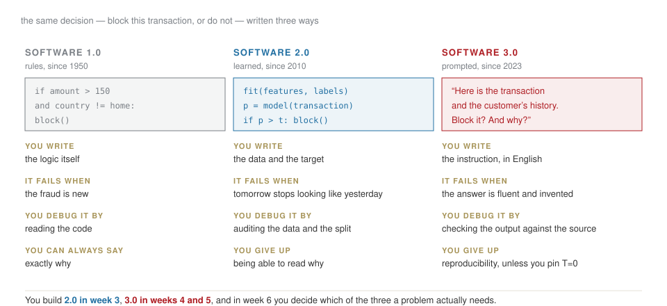
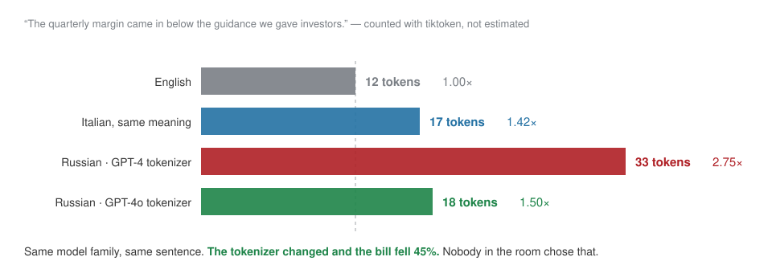
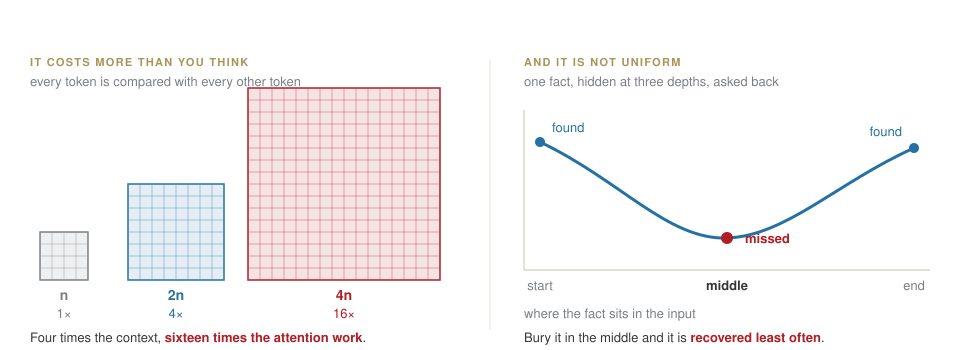
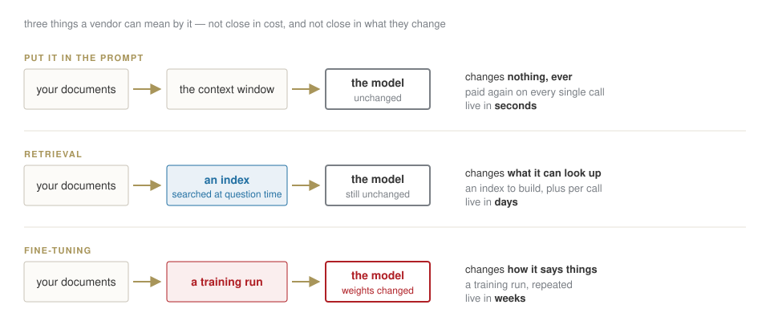
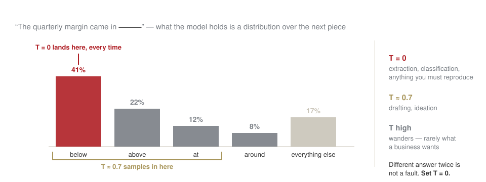
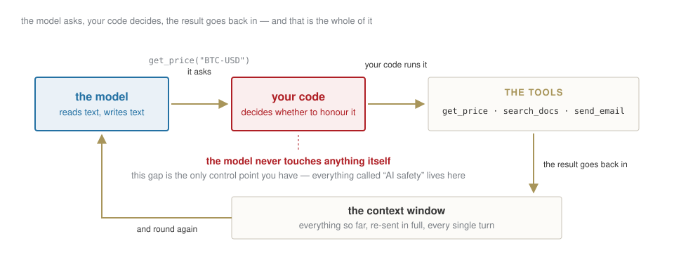

## Ten weeks, one thing built each time

| | | |
|---|---|---|
| **1–3** | 23 Sep – 7 Oct | a data pipeline, and a model evaluated honestly |
| **4–5** | 14 – 21 Oct | an LLM application: retrieval, tools, evaluations |
| — | 26 Oct | reading week — **case brief, 40%** |
| **6–8** | 4 – 18 Nov | fintech cases, a backtest, a DeFi analysis |
| **9–10** | 25 Nov – 2 Dec | red-team, and finish the capstone — **portfolio, 60%** |
| Rev. | 9 Dec | you present it |

[Every artefact you build stays in your repository and becomes part of the next one. Nothing here is thrown away.]{.red}

## The deal, said once

- **This is a lab.** You write code from today, with an assistant beside you. You do not need to know Python. You need to be able to **judge what the assistant produces**.
- **The rule of the course:** anything an AI produced and you submit, you must be able to explain line by line. I will ask.
- **Nothing confidential** goes into an AI tool. Ever.
- Markets, crypto and DeFi here are **educational simulations**. Nothing in this course is investment advice.

::: {.callout-tip title="What you actually leave with"}
Not "an overview of AI tools". The ability to build a thing, test it, find where it is wrong, and defend it to people who will not read your appendix.
:::

## Three sentences from three pitch decks {.statement}

## Two of these are impossible. One is unanswerable as written.

[Write down which is which. We come back to this at 12:55.]{.muted}

## The three claims

::: {.callout-important title="Bet before we start"}
1. *"Our assistant **remembers** every conversation it has had with your customers."*
2. *"It **learns from your corrections in real time**."*
3. *"**99.2% accuracy** on invoice extraction."*
:::

. . .

You will meet a version of all three in a data room. By the end of today you will know which part of the machine each one is lying about — and, more useful, **the one question that collapses each claim**.

[This is the actual product of the course: not enthusiasm, and not scepticism. A short list of questions that separate a system from a demo.]{.red}

## Three ways to write the same decision

{fig-align="center" width="95%"}

[The frame is Andrej Karpathy's. It is the most useful map I know, because it makes "should we use AI for this?" into a question with three named answers instead of a mood.]{.muted}

## And 3.0 does not replace the other two {.statement}

## A rule you can write down beats a model that guesses it.

[Most of what gets pitched as AI is a 1.0 problem with a 3.0 budget. Knowing which is which is worth more than anything else in these ten weeks.]{.muted}

## [Block A]{.section-kicker} The model does not read {.section-slide background-color="#AF1F25"}

## It never sees a word

::: {.callout-important title="Bet before we look"}
`"Il margine è insostenibile"` — four words. How many pieces does the model cut that into? Write a number.
:::

. . .

{fig-align="center" width="95%"}

## A **tokenizer** is trained, and it has a native language

The vocabulary is learned from a corpus, by merging the pairs of characters that occur most often. A corpus that is mostly English learns mostly English pieces.

Everything else gets spelled out in fragments: **Italian, Russian, a ticker, a surname, a number.**

. . .

[Which means the price of a document depends on a design decision taken before your document existed.]{.red}

## The same sentence, twice, one tokenizer apart {.clip background-color="#000000"}

<video class="clipvideo" width="1000" height="562" controls muted loop playsinline data-autoplay preload="auto" poster="media/w01_tokens_poster.png"><source src="media/w01_tokens.mp4" type="video/mp4"></video>

Same model family, same sentence. 33 pieces became 18.

## Read that clip as a line in a budget

{fig-align="center" width="95%"}

[A pilot priced on one tokenizer and delivered on the other moves by **45% of its unit cost**. That is the sort of thing that decides whether it clears its business case.]{.red}

## Take it apart yourself {.lab background-color="#2471a3"}

[LAB · session.ipynb § B1 — `tiktoken`]{.kicker}

Type your own text and watch the count. Try, in this order:

1. the same sentence in **English**, then **Italian**, then **Russian**
2. a **number**: `1,234,567.89` — count the pieces before you look
3. **your own surname**, then a listed company, then a company founded last year
4. a line of **Python**

[Then answer, from what you saw: which of those four is the model **least** equipped to reason about, and why?]{.red}

## What follows from it, in a business

| what you saw | what it costs you |
|---|---|
| tokens, not words | you are billed per token, in **and** out |
| non-English fragments more | the same document costs 1.4–2.8× depending on language **and** tokenizer |
| `1,234,567.89` is **7 tokens**, not one number | arithmetic is weak by construction — never trust a total it computed |
| a new company name shatters; an old one does not | the model is systematically more fluent about the past |
| the window is counted in tokens | long conversations silently become expensive |

::: {.callout-tip title="The sentence to remember"}
The unit the system counts in is not the unit you think in, and the exchange rate between them is not stable.
:::

## [Block B]{.section-kicker} Its only memory is what you just sent {.section-slide background-color="#AF1F25"}

## Everything it knows, every time

{fig-align="center" width="95%"}

## Which disposes of claim one {.statement}

## The model remembers nothing. Something else is storing and re-sending.

[That something is a database, it has an owner, and every turn you pay to send it again. "It remembers" is not an AI capability. It is an infrastructure invoice.]{.muted}

## And a longer window is not a free upgrade

{fig-align="center" width="95%"}

::: {.callout-tip title="What this rules out"}
"Just paste the whole thing in and ask" fails twice — on the bill, and on the answer. Retrieval is not a cost optimisation. It is what makes the answer **correct**. That is week 4.
:::

## So where do hallucinations come from?

::: {.callout-important title="Bet before we look"}
The model invents a plausible figure for a company's 2025 revenue. Is that a bug, a lie, or the machine working exactly as designed?
:::

. . .

**Working as designed.** It completes patterns. When the pattern needs a number that was never in the box, it produces the *shape* of a number that would fit.

It has no way to feel the difference between recalling and inventing. **That is your job**, and it is the habit this whole course builds.

## "We will train it on your data" is three different products

{fig-align="center" width="95%"}

[A fact you fine-tuned in cannot be updated, cited, or withdrawn. Name the three, or you will not get a straight answer about which one you are buying.]{.red}

## And it disposes of claim two

**"It learns from your corrections in real time."**

The weights are frozen when you call it. Nothing you type changes them.

. . .

What can honestly be meant is one of two things: your correction was **written to a store and re-sent next time** (fast, cheap, and not learning), or it entered a **retraining queue** (real, and measured in weeks).

[Ask which. The answer tells you whether you are buying a model or a database, and they have very different prices.]{.red}

## Watch a conversation get expensive {.lab background-color="#2471a3"}

[LAB · session.ipynb § B2 — the cost cell]{.kicker}

1. Price one 10-K at today's rates. Then a thousand a day, for a year.
2. Now the part nobody expects: a **twenty-turn conversation** re-sends the whole history every turn. Compute what turn twenty costs against turn one.
3. Re-price the whole thing with the Russian multiplier from the clip.

[Three numbers, and you can argue about a pilot's unit economics with the people who sold it.]{.red}

## [Block C]{.section-kicker} Why the same question gives different answers {.section-slide background-color="#AF1F25"}

## It is choosing, not looking up

{fig-align="center" width="95%"}

[**Temperature** decides how much it respects those odds — and nothing else about the model changes.]{.red}

## And write that into the procedure, not the folklore

A process that an auditor will look at cannot say *"we asked the AI"*.

- the **exact prompt**, versioned like code
- `T = 0`, and the model **name and version** recorded with the output
- the **input** stored next to the answer

::: {.callout-tip title="Why this matters more here than anywhere else"}
In a regulated process, "we cannot reproduce last quarter's output" is not an inconvenience. It is the finding.
:::

## The habit this course is really about {.lab background-color="#2471a3"}

[LAB · session.ipynb § B3 — 🔍 CHECK]{.kicker}

Run the model on a question about a real firm. Then take its answer apart, sentence by sentence, into two piles:

:::: {.columns}
::: {.column width="50%"}
**Verifiable**
a number you can look up, a date, a name, a claim with a source
:::
::: {.column width="50%"}
**Plausible but unverifiable**
fluent, confident, no way to check it, and quite possibly invented
:::
::::

[Do this on every answer, all term, until it is automatic. It is the single habit that separates someone who uses these tools from someone who is used by them.]{.red}

## [Block D]{.section-kicker} How a machine measures meaning {.section-slide background-color="#AF1F25"}

## Words become directions

An **embedding** turns text into a list of numbers, arranged so that **similar meanings land near each other**.

$$\text{"the margin fell"} \;\longrightarrow\; [0.21,\, -0.04,\, 0.88,\, \ldots]$$

Once meaning is a position, "similar" becomes a distance, and a computer can sort by it.

. . .

That is the whole of how search over your own documents works — which is week 4.

## Find out why word-matching is not enough {.lab background-color="#2471a3"}

[LAB · session.ipynb § B4 — TF-IDF]{.kicker}

Two sentences that mean the same thing, with **no words in common**:

> "Revenue declined sharply in the third quarter."
> "Q3 takings were well down."

1. Score them by shared words. The answer will be about zero.
2. Now say what a search box built that way would do to a user who phrased it differently.

[That gap is exactly what neural embeddings close, and why week 4 works at all.]{.red}

## [Block E]{.section-kicker} And then it can act {.section-slide background-color="#AF1F25"}

## The loop behind every "agent"

{fig-align="center" width="95%"}

## Which is also where they fail {.statement}

## Every agent failure is a failure of that loop.

Wrong tool. Loop that never ends. Cost that runs away. A document that contains instructions and the model obeys them.

[Weeks 4 and 5 are this loop, built and then broken on purpose.]{.muted}

## [Block F]{.section-kicker} Your turn — the first notebook {.section-slide background-color="#AF1F25"}

## Three assets, and one number that is wrong {.lab background-color="#2471a3"}

[LAB · session.ipynb § C — 80 minutes, you drive]{.kicker}

1. Pull daily prices for BTC, an equity and an index.
2. Returns, summary statistics, one chart that answers a question.
3. **🔍 CHECK** — the volatility cell was written by an assistant. It contains two errors. Find them.

[I will not touch the keyboard. When it breaks, read the error before asking me.]{.muted}

## The two planted errors, and why they matter

:::: {.columns}
::: {.column width="50%"}
**√252 applied to crypto**
Markets trade 252 days a year. Bitcoin trades 365. The formula is right, the constant is wrong, and the output looks perfectly reasonable.
:::
::: {.column width="50%"}
**Returns added up**
Cumulative return is not the sum of daily returns. Compounding is a product. Close enough to look right, wrong enough to matter.
:::
::::

::: {.callout-tip title="The sentence to remember"}
The assistant is fluent, not correct. It fails silently on constants and conventions — precisely where you would not think to look.
:::

## Back to the three claims

| the claim | the one question |
|---|---|
| *"it remembers every conversation"* | **what stores it, and who pays to re-send it every turn?** |
| *"it learns from corrections in real time"* | **does that change the weights, or write a row in a database?** |
| *"99.2% accuracy"* | **on whose test set, of what size, against what baseline?** |

. . .

[The first two you can now answer yourself. The third you cannot — not because it is complicated, but because the number is meaningless without the base rate. That is week 3, and it is the one that costs people money.]{.red}

## Close

**Homework 1** — three assets of your own, an honest table, one chart that answers a stated question, and a section titled *"What the assistant got wrong"*.

Due Tuesday 29 September, 23:59, in your repository.

. . .

**Before you leave:** Colab runs, GitHub repository created, and one notebook saved to it.

[Next week: the same loop on real data, and the first thing you will show someone.]{.muted}
