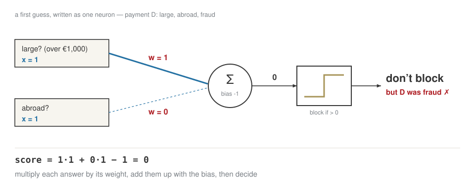
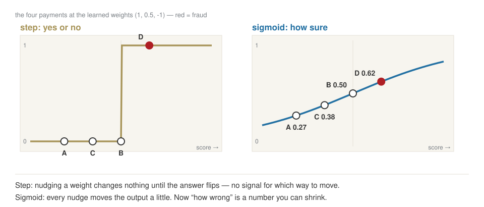
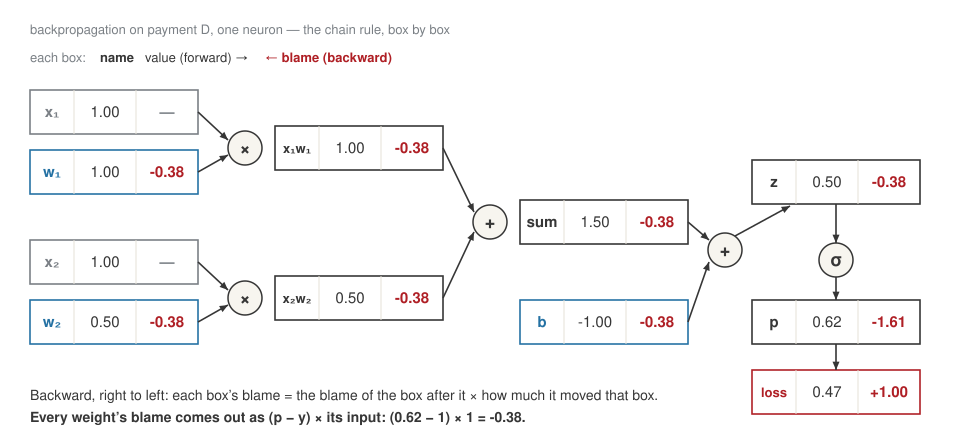

## Today

| | |
|---|---|
| **10:00** | who I am, and who you are |
| **10:25** | what this course is for |
| **10:43** | open your notebook |
| **10:50** | break |
| **11:00** | a real model release — and the neuron that explains it |
| **11:35** | what the model reads: tokens, attention, the box |
| **11:50** | back to the release · close |

## [Part 1]{.section-kicker} Two people, one room {.section-slide background-color="#AF1F25"}

## Who I am

:::: {.columns}
::: {.column width="28%"}
{width="100%"}
:::
::: {.column width="72%"}
**Niccolò Salvini, PhD** · Adjunct Professor

::: {.incremental}
- **Economics**, Florence
- **MSc, Statistical and Actuarial Sciences**, Milan
- **PhD, Healthcare Data Science**, Rome
- **Founder, Intuo** — data pipelines and AI for companies
- **Adjunct Professor** — Università Cattolica, and ESE
:::
:::
::::

## [Part 2]{.section-kicker} What this course is for {.section-slide background-color="#AF1F25"}

## What you leave with in December

1. **Build** — a working pipeline in Python, reproducible.
2. **Check** — what an assistant or a vendor tells you, with a number.
3. **Decide** — turn a model's output into a decision with a cost.
4. **Defend** — to people who will not read your notebook.

## Ten weeks, one thing built each time

| | | |
|---|---|---|
| **1–3** | 23 Sep – 7 Oct | a data pipeline, and a model evaluated honestly |
| **4–5** | 14 – 21 Oct | an LLM application: retrieval, tools, evaluations |
| — | 26 Oct | reading week — **case brief, 40%** |
| **6–8** | 4 – 18 Nov | fintech cases, a backtest, a DeFi analysis |
| **9–10** | 25 Nov – 2 Dec | red-team, and finish the capstone — **portfolio, 60%** |
| Rev. | 9 Dec | you present it |

## One thread through it: you build a tiny LLM

| week | the piece |
|---|---|
| **2** | a tokenizer, trained on your own texts |
| **3** | a model that guesses the next character |
| **4** | embeddings it learns by itself |
| **5** | attention, and a tiny GPT trained on central-bank statements |

[Small, badly trained on purpose. The point is how, not a good model.]{.muted}

## What you wrote in your application

| you wrote | where it lands |
|---|---|
| **product and project work** | weeks 5 and 10 — and the lens every week |
| **data and decisions** | weeks 2 and 3 |
| **trading** | week 7 — market data from week 2 |
| **crypto and DeFi** | week 8 — on-chain data from week 2 |

. . .

**Is this still true? What is missing?**

## How we work

- **A lab.** You write code from today, with an assistant. You judge what it produces.
- **Bets, not quizzes.** Write a number before the cell runs.
- **Your keyboard.** I do not touch it.
- **Wednesdays start with you** — twenty minutes on your homework.
- **Feedback both ways**, every week.

## The deal

- Anything an AI produced that you submit, you **explain line by line**.
- **Nothing confidential** goes into an AI tool.
- Markets and crypto here are **simulations**, not investment advice.

| | weight | due |
|---|---|---|
| **Case brief** | 40% | Sun 1 Nov |
| **Portfolio** | 60% | Sun 6 Dec |

## Open your notebook: one click {.lab background-color="#2471a3"}

:::: {.columns}
::: {.column width="62%"}
1. **Click, or scan.**
2. `File ▸ Save a copy in Drive`
3. Run the first two cells.

**[Open in Colab ↗](https://colab.research.google.com/github/NiccoloSalvini/ese-ai/blob/main/week-01/session.ipynb)**
:::
::: {.column width="38%"}
{width="80%" fig-align="center"}
:::
::::

## Break — ten minutes. {.statement}

## [Part 3]{.section-kicker} From one neuron to an LLM {.section-slide background-color="#AF1F25"}

## OpenAI, gpt-oss, August 2025

::: {style="font-size:0.78em; line-height:1.45; border-left:4px solid #CDBA80; padding:0.4em 0 0.4em 0.9em; background:#f7f5ef"}
"Each model is a **Transformer** which leverages **mixture-of-experts** to reduce the number of **active parameters** needed to process input. gpt-oss-120b activates **5.1B parameters per token** … The models have **117b** and 21b **total parameters** …

We **tokenized** the data using … **o200k_harmony** … The models were **post-trained** … including a **supervised fine-tuning** stage and a high-compute **RL** stage. … The weights … are freely available … and come natively **quantized** in MXFP4. This allows for the gpt-oss-120B model to run within **80GB of memory** … Available under the flexible **Apache 2.0** license."

[Spec table: **context length 128k**.]{style="color:#7a7f85"}
:::

**Circle every word you can explain today. By 11:55 you will circle them all.**

## Three ways to write the same decision

::: {.r-stack}
{width="100%"}

{.fragment width="100%"}

{.fragment width="100%"}

{.fragment width="100%"}

{.fragment width="100%"}
:::

[**1.0** you write the rule yourself. **2.0** you give examples and the machine learns the rule — as numbers called weights. **3.0** you give an instruction in plain English to a model that has already learned from huge amounts of text. 2.0 and 3.0 are built from the same thing: neurons.]{.explain}

## Eight past payments

| payment | large? (over €1,000) | abroad? | new device? | fraud? |
|---|---|---|---|---|
| **A** | 0 | 0 | 0 | no |
| **B** | 1 | 0 | 0 | no |
| **C** | 0 | 1 | 0 | no |
| **D** | 0 | 0 | 1 | no |
| **E** | 1 | 1 | 0 | **yes** |
| **F** | 1 | 0 | 1 | **yes** |
| **G** | 0 | 1 | 1 | **yes** |
| **H** | 1 | 1 | 1 | **yes** |

::: {.callout-important title="Bet"}
A first guess: weight **1** on "large", **0** on the others, bias **−1**; block if the score is above zero. Which payments does it block?
:::

[Three red flags per payment. The hidden truth, which the model is not told: **fraud when at least two flags are on.**]{.explain}

## The first guess, as one neuron

{fig-align="center" width="78%"}

## Learning from mistakes, by hand {.clip background-color="#000000"}

<video class="clipvideo" width="1000" height="562" controls muted loop playsinline data-autoplay preload="auto" poster="media/w01_perceptron_poster.png"><source src="media/w01_perceptron.mp4" type="video/mp4"></video>

[Wrong → move each weight a little towards the right answer; right → leave it. **η**, the learning rate, is how big each move is.]{.explain}

## The rule it learned, round by round

For every weight, after every mistake:

$$w_{\text{large}} \leftarrow w_{\text{large}} + \eta\,(\text{fraud} - \text{decision})\cdot \text{large} \qquad \text{bias} \leftarrow \text{bias} + \eta\,(\text{fraud} - \text{decision})$$

::: {style="font-size:0.72em"}
| round | payment | score | decision | fraud | fraud − decision | w large | w abroad | w device | bias |
|---|---|---|---|---|---|---|---|---|---|
| start | | | | | | 1 | 0 | 0 | −1 |
| 1 | E | 0 | pass | yes | +1 | 1.5 | 0.5 | 0 | −0.5 |
| 1 | G | 0 | pass | yes | +1 | 1.5 | 1 | 0.5 | 0 |
| 2 | B | 1.5 | block | no | −1 | 1 | 1 | 0.5 | −0.5 |
| 2 | C | 0.5 | block | no | −1 | 1 | 0.5 | 0.5 | −1 |
| 2 | G | 0 | pass | yes | +1 | 1 | 1 | 1 | −0.5 |
| 3 | B | 0.5 | block | no | −1 | 0.5 | 1 | 1 | −1 |
| 4 | all 8 right | | | | | **0.5** | **1** | **1** | **−1** |
:::

[Six corrections over three rounds; round 4 makes none. Nobody wrote "two red flags" — the weights found it. And they decided "large" counts half as much as the others. This neuron is the **perceptron**, 1958.]{.explain}

## Yes or no is not enough

{fig-align="center" width="86%"}

## How wrong, as one number

The **loss** of one payment: small when the model gave the right answer a high probability. The loss of the model: the **average** over all payments.

::: {style="font-size:0.8em"}
| payment | fraud? | p(fraud) | loss = −log p(right answer) | after training: p(fraud) |
|---|---|---|---|---|
| **A** | no | 0.27 | 0.31 | 0.00 |
| **B** | no | 0.38 | 0.47 | 0.05 |
| **C** | no | 0.50 | 0.69 | 0.05 |
| **D** | no | 0.50 | 0.69 | 0.05 |
| **E** | yes | 0.62 | 0.47 | 0.96 |
| **F** | yes | 0.62 | 0.47 | 0.96 |
| **G** | yes | 0.73 | 0.31 | 0.96 |
| **H** | yes | 0.82 | 0.20 | 1.00 |
| **average** | | | **0.45** | loss **0.03** |
:::

[That average is the one number training pushes down: 0.45 at the perceptron's weights, 0.03 after 200 steps of the formula on the next slide.]{.explain}

## The formula for every weight

$$w \;\leftarrow\; w - \eta \cdot (p - y) \cdot x \qquad\qquad \text{new weight} = \text{old weight} - \text{learning rate} \times \text{blame}$$

One step on payment E (large, abroad, fraud), with η = 1:

| | w large | w abroad | w device | bias | p(fraud) for E |
|---|---|---|---|---|---|
| before | 0.5 | 1 | 1 | −1 | 0.62 |
| blame = (p − y)·answer | −0.38 | −0.38 | 0.00 | −0.38 | |
| after (η = 1) | **0.88** | **1.38** | **1.00** | **−0.62** | **0.84** |

[Same shape as the perceptron rule, with a probability instead of a yes/no. "New device" gets no blame: it was off for E, so it could not have caused the mistake.]{.explain}

## Where the blame comes from: backpropagation

{fig-align="center" width="86%"}

## The learning rate {.clip background-color="#000000"}

<video class="clipvideo" width="1000" height="562" controls muted loop playsinline data-autoplay preload="auto" poster="media/w01_lr_poster.png"><source src="media/w01_lr.mp4" type="video/mp4"></video>

[Add payment I — a customer on holiday: large, abroad, genuine — and no rule is perfect any more. Too small a step crawls; too large jumps over the best answer.]{.explain}

## How every network learns

{fig-align="center" width="80%"}

## A pattern one neuron cannot draw

{fig-align="center" width="86%"}

## More activation functions

{fig-align="center" width="86%"}

## From 4 numbers to 117 billion

{fig-align="center" width="78%"}

## An LLM is the same machine

{fig-align="center" width="86%"}

## The same nudge, on text

`The ECB left rates` → ?

| next token | before | after one step |
|---|---|---|
| **"unchanged"** ✓ | 3% | **4%** |
| "steady" | 4% | 3.8% |
| "at" | 2% | 1.9% |

[Exactly the step we took on payment E: raise the probability of the right answer, lower the others. Here the right answer is in the text itself.]{.explain}

## Pre-training is compressing the internet

{fig-align="center" width="78%"}

[Repeat that nudge on trillions of tokens and the weights end up holding a lossy summary of the text: the gist survives, exact facts do not always.]{.explain}

## Then it learns to be an assistant

:::: {.columns}
::: {.column width="50%"}
**1 · Pre-training**

internet text → a **base model** that continues documents
:::
::: {.column width="50%"}
**2 · Post-training**

~100,000 example conversations, then rewards → an **assistant**
:::
::::

[Post-training is the same loop again. Only the examples change: now the right answer is a good reply.]{.explain}

## One prediction, end to end

{fig-align="center" width="86%"}

## Every word, taken apart — with our fraud neuron

| in the release | in terms of what we just built |
|---|---|
| **Transformer** | our neurons, plus attention, stacked in 36 layers |
| **117B total parameters** | our neuron had 4 numbers (3 weights and a bias); this has 117 billion |
| **mixture-of-experts** | 128 smaller networks inside; a router picks 4 for each token |
| **5.1B active per token** | only those 4 run, so it costs like a 5-billion model |
| **tokenized, o200k_harmony** | how text becomes numbers before the first neuron |
| **post-trained** | more rounds of the same training loop, on new data |
| **supervised fine-tuning** | the loop, where the right answers are good conversations |
| **RL** | the loop, where the "right answer" is a reward score |
| **context length 128k** | how many tokens go in at once — a few hundred pages |
| **quantized, MXFP4, 80GB** | each weight stored in ~4 bits instead of 16: fits on one GPU |
| **open-weight, Apache 2.0** | you download the weights themselves, and may use them commercially |

## [Part 4]{.section-kicker} What the model reads {.section-slide background-color="#AF1F25"}

## It never sees a word

::: {.callout-important title="Bet"}
`"Il margine è insostenibile"` — four words. How many pieces?
:::

. . .

{fig-align="center" width="70%"}

[Before the network sees anything, a **tokenizer** cuts the text into pieces and turns each piece into a number. You are billed, and limited, in these pieces — not in words.]{.explain}

## The same sentence, twice {.clip background-color="#000000"}

<video class="clipvideo" width="1000" height="562" controls muted loop playsinline data-autoplay preload="auto" poster="media/w01_tokens_poster.png"><source src="media/w01_tokens.mp4" type="video/mp4"></video>

## How the tokens talk to each other: **attention**

::: {.callout-important title="Bet"}
*"The bank raised rates because **it** feared inflation."* — what is **it**?
:::

. . .

{fig-align="center" width="70%"}

[Vaswani et al., *Attention Is All You Need*, 2017 — the paper behind every model since.]{.muted}

[To process each token, the model looks at every other token in the context and decides how much each one matters — here, most of the weight goes to "bank". Every token does this with every other one, which is why long contexts get expensive.]{.explain}

## Everything it knows, every time

{fig-align="center" width="70%"}

[The **context window** is everything the model sees in one call: instructions, conversation so far, documents, its own answer. Nothing else exists for it. It has no memory between calls — any "memory" is text re-sent by the application.]{.explain}

## Back to the release {.statement}

[Read it again. Which words are still dark?]{.muted}

## Close

:::: {.columns}
::: {.column width="64%"}
**Homework 1**, due Tue 29 Sep:

- your starting point, in writing
- the question you want answered by December
- the tokenizer on five texts of yours
- ten glossary words, in your words
- three pitch-deck sentences to take apart
- a Drive folder `ese-ai-fintech`, shared with me — see [Setup](../setup.qmd)

Questions: WhatsApp or Telegram.
:::
::: {.column width="36%"}
{width="78%" fig-align="center"}
:::
::::

## [Spare]{.section-kicker} If there is time {.section-slide background-color="#7a7f85"}

## Take it apart yourself {.lab background-color="#2471a3"}

[LAB · session.ipynb § B1 — `tiktoken`]{.kicker}

1. one sentence in **English**, **Italian**, **Russian**
2. `1,234,567.89`
3. your surname, a listed company, a start-up

## A taste of DeFi

::: {.callout-important title="Bet"}
A pool holds **10 ETH** and **30,000 USDC** — 3,000 per ETH on screen. You buy **1 ETH**. What do you pay?
:::

. . .

**ETH × USDC stays constant:** 10 × 30,000 = 300,000.

9 ETH left → 300,000 ÷ 9 = 33,333 USDC → you paid **3,333**, 11% above the screen.

## Why pieces, and not letters?

| the same 5,000 characters, as | length | alphabet |
|---|---|---|
| bits | 40,000 | 2 |
| bytes | 5,000 | 256 |
| tokens | **~1,300** | **~100,000** |

[The network reads a sequence, and longer sequences cost more to process. Letters would make every text very long; whole words would need an impossible vocabulary. Pieces are the compromise: about 1,300 of them for 5,000 characters.]{.explain}

## How a tokenizer is learned

Merge the most frequent pair. Repeat.

| step | text | new symbol |
|---|---|---|
| start | `aaabdaaabac` | |
| 1 | `ZabdZabac` | Z = aa |
| 2 | `YbdYbac` | Y = Za |
| 3 | `XdXac` | X = Yb |

. . .

11 symbols → 5. Train it on English, and it learns English pieces.

[This is **byte-pair encoding**: find the pair of symbols that appears most often, give it a new name, repeat. On English text the frequent pairs are English, so English ends up with long pieces and other languages with short ones — more pieces, higher cost.]{.explain}

## Much of the weirdness is tokenization

| it struggles with | because |
|---|---|
| spelling a word backwards | the word is one token, not letters |
| Russian, Italian | more, smaller pieces |
| arithmetic | `1,234,567.89` is 7 arbitrary pieces |
| `egg` · `Egg` · `EGG` | the same word, different pieces |

[Many failures that look like stupidity come from the model seeing pieces, not letters or digits. When an answer involves spelling, counting characters or arithmetic, check it yourself.]{.explain}

