## Today

| | |
|---|---|
| **10:00** | who I am, and who you are |
| **10:25** | what this course is for |
| **10:43** | open your notebook |
| **10:50** | break |
| **11:00** | from one neuron to an LLM |
| **11:30** | what the model reads |
| **11:40** | a real model release, taken apart, word by word |
| **11:55** | close |

## [Part 1]{.section-kicker} Two people, one room {.section-slide background-color="#AF1F25"}

## Who I am

:::: {.columns}
::: {.column width="28%"}
{width="100%"}
:::
::: {.column width="72%"}
**Niccolò Salvini, PhD** · Adjunct Professor

::: {.incremental}
- **Economics**, Florence
- **MSc, Statistical and Actuarial Sciences**, Milan
- **PhD, Healthcare Data Science**, Rome
- **Founder, Intuo** — data pipelines and AI for companies
- **Adjunct Professor** — Università Cattolica, and ESE
:::
:::
::::

## [Part 2]{.section-kicker} What this course is for {.section-slide background-color="#AF1F25"}

## What you leave with in December

1. **Build** — a working pipeline in Python, reproducible.
2. **Check** — what an assistant or a vendor tells you, with a number.
3. **Decide** — turn a model's output into a decision with a cost.
4. **Defend** — to people who will not read your notebook.

## Ten weeks, one thing built each time

| | | |
|---|---|---|
| **1–3** | 23 Sep – 7 Oct | a data pipeline, and a model evaluated honestly |
| **4–5** | 14 – 21 Oct | an LLM application: retrieval, tools, evaluations |
| — | 26 Oct | reading week — **case brief, 40%** |
| **6–8** | 4 – 18 Nov | fintech cases, a backtest, a DeFi analysis |
| **9–10** | 25 Nov – 2 Dec | red-team, and finish the capstone — **portfolio, 60%** |
| Rev. | 9 Dec | you present it |

## One thread through it: you build a tiny LLM

| week | the piece |
|---|---|
| **2** | a tokenizer, trained on your own texts |
| **3** | a model that guesses the next character |
| **4** | embeddings it learns by itself |
| **5** | attention, and a tiny GPT trained on central-bank statements |

[Small, badly trained on purpose. The point is how, not a good model.]{.muted}

## What you wrote in your application

| you wrote | where it lands |
|---|---|
| **product and project work** | weeks 5 and 10 — and the lens every week |
| **data and decisions** | weeks 2 and 3 |
| **trading** | week 7 — market data from week 2 |
| **crypto and DeFi** | week 8 — on-chain data from week 2 |

. . .

**Is this still true? What is missing?**

## How we work

- **A lab.** You write code from today, with an assistant. You judge what it produces.
- **Bets, not quizzes.** Write a number before the cell runs.
- **Your keyboard.** I do not touch it.
- **Wednesdays start with you** — twenty minutes on your homework.
- **Feedback both ways**, every week.

## The deal

- Anything an AI produced that you submit, you **explain line by line**.
- **Nothing confidential** goes into an AI tool.
- Markets and crypto here are **simulations**, not investment advice.

| | weight | due |
|---|---|---|
| **Case brief** | 40% | Sun 1 Nov |
| **Portfolio** | 60% | Sun 6 Dec |

## Open your notebook: one click {.lab background-color="#2471a3"}

:::: {.columns}
::: {.column width="62%"}
1. **Click, or scan.**
2. `File ▸ Save a copy in Drive`
3. Run the first two cells.

**[Open in Colab ↗](https://colab.research.google.com/github/NiccoloSalvini/ese-ai/blob/main/week-01/session.ipynb)**
:::
::: {.column width="38%"}
{width="80%" fig-align="center"}
:::
::::

## Break — ten minutes. {.statement}

## [Part 3]{.section-kicker} From one neuron to an LLM {.section-slide background-color="#AF1F25"}

## Three ways to write the same decision

::: {.r-stack}
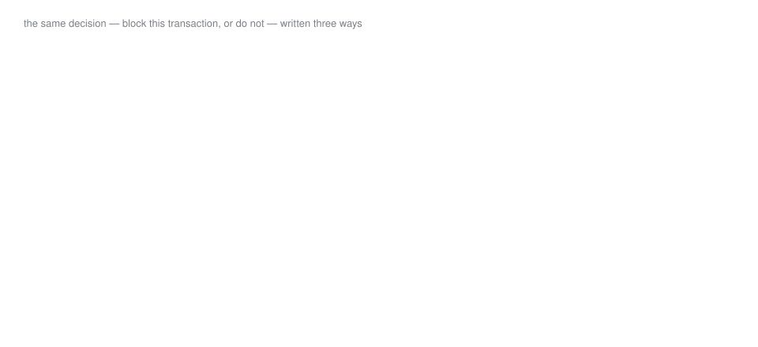{width="100%"}

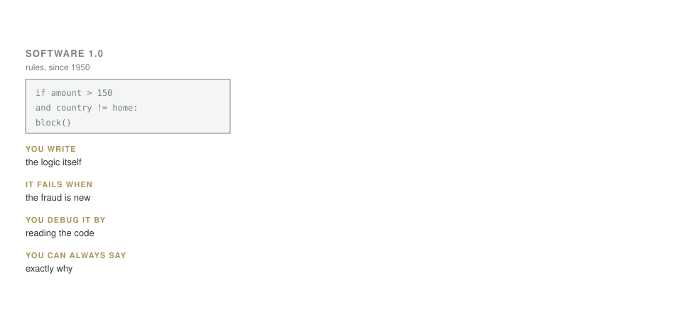{.fragment width="100%"}

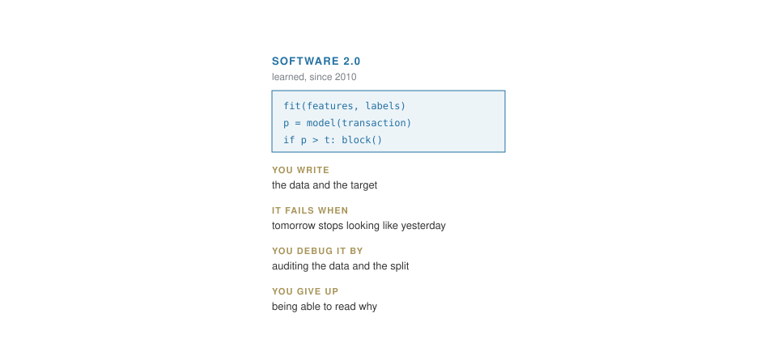{.fragment width="100%"}

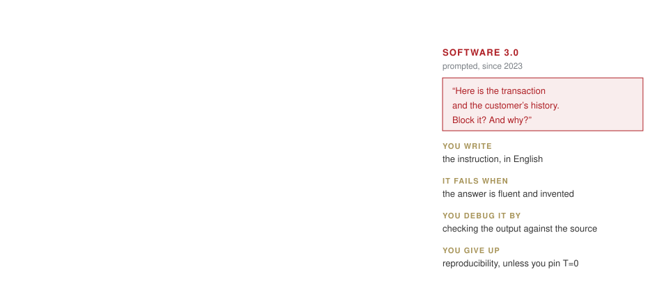{.fragment width="100%"}

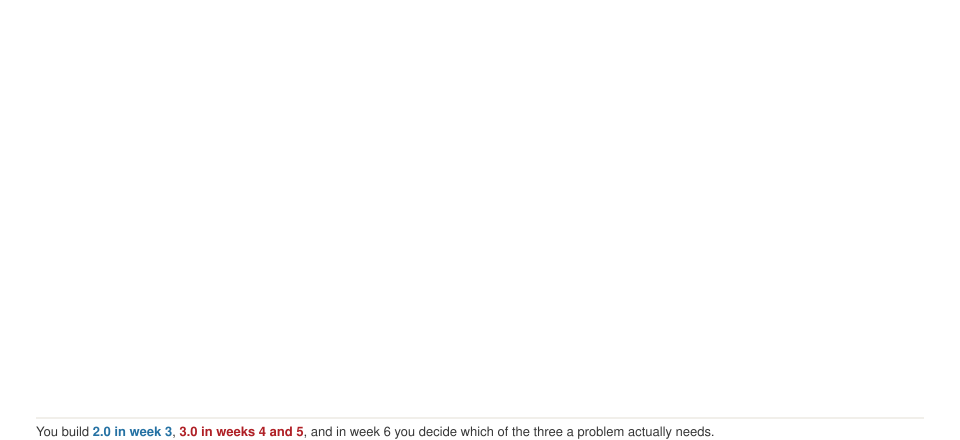{.fragment width="100%"}
:::

## One neuron

::: {.callout-important title="Bet"}
Large payment, abroad, new device. What do you do with each number before adding them up?
:::

. . .

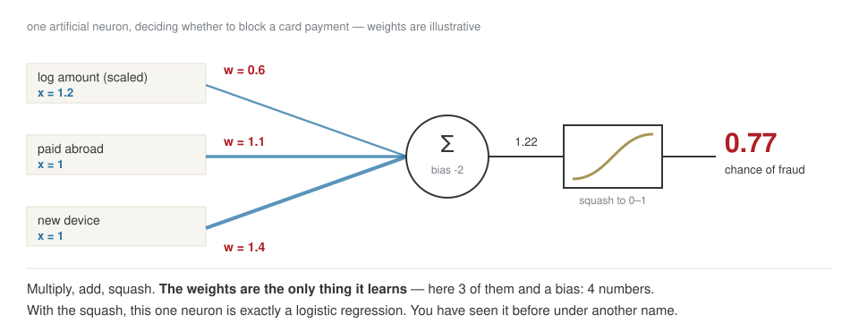{fig-align="center" width="95%"}

## The squash: the activation function

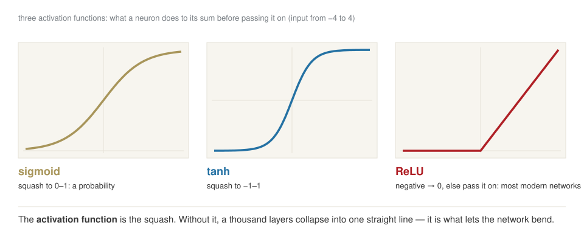{fig-align="center" width="90%"}

## Training it by hand {.clip background-color="#000000"}

<video class="clipvideo" width="1000" height="562" controls muted loop playsinline data-autoplay preload="auto" poster="media/nn_PerceptronByHand_poster.png"><source src="media/nn_PerceptronByHand.mp4" type="video/mp4"></video>

## How every network learns

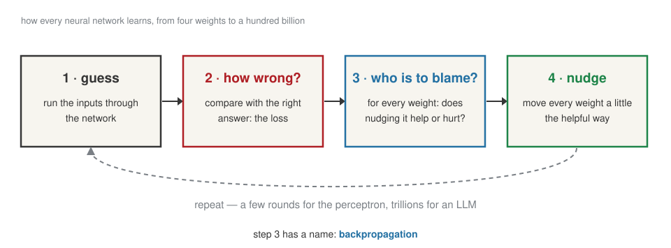{fig-align="center" width="95%"}

## Downhill {.clip background-color="#000000"}

<video class="clipvideo" width="1000" height="562" controls muted loop playsinline data-autoplay preload="auto" poster="media/nn_GradientDescent_poster.png"><source src="media/nn_GradientDescent.mp4" type="video/mp4"></video>

## More neurons: the line bends {.clip background-color="#000000"}

<video class="clipvideo" width="1000" height="562" controls muted loop playsinline data-autoplay preload="auto" poster="media/nn_HiddenLayer_poster.png"><source src="media/nn_HiddenLayer.mp4" type="video/mp4"></video>

## From 4 numbers to 117 billion

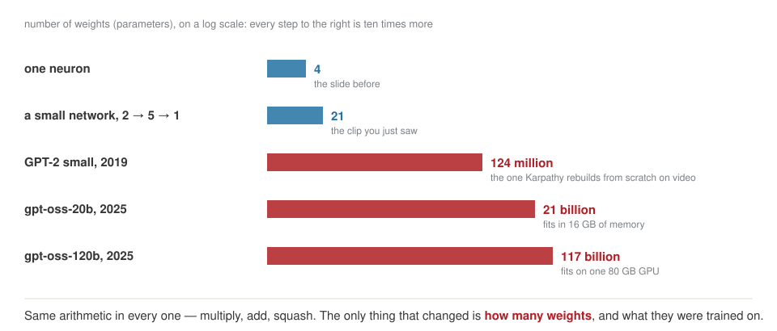{fig-align="center" width="95%"}

## An LLM is that network, with one job

::: {.callout-important appearance="simple"}
**Guess the next piece of text.** That is the whole job.
:::

:::: {.columns}
::: {.column width="33%"}
**1 · Pre-training**

trillions of tokens of web text → a **base model** that continues documents
:::
::: {.column width="33%"}
**2 · Post-training**

~100,000 example conversations, then feedback → an **assistant**
:::
::: {.column width="33%"}
**3 · What you download**

the **parameters**, and a short program that runs them
:::
::::

## Pre-training is compressing the internet

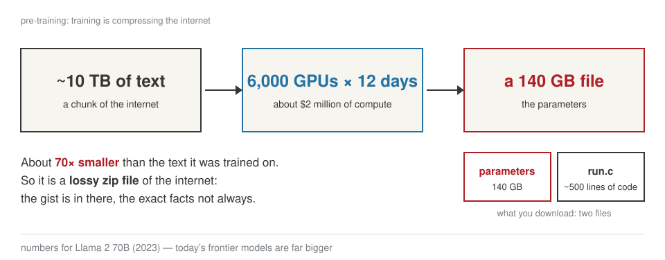{fig-align="center" width="95%"}

## The same nudge, trillions of times

`The ECB left rates` → ?

| next token | before | after |
|---|---|---|
| **"unchanged"** ✓ | 3% | **4%** |
| "steady" | 4% | 3.8% |
| "at" | 2% | 1.9% |

## One prediction, end to end

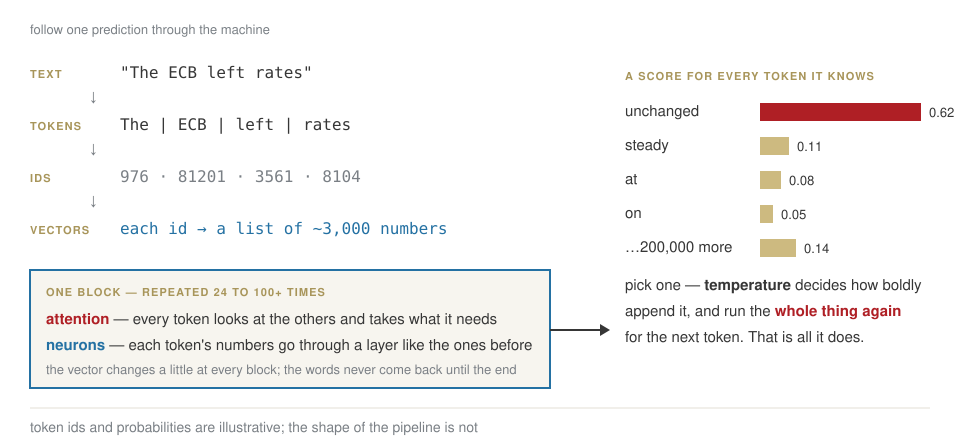{fig-align="center" width="95%"}

## [Part 4]{.section-kicker} What the model reads {.section-slide background-color="#AF1F25"}

## It never sees a word

::: {.callout-important title="Bet"}
`"Il margine è insostenibile"` — four words. How many pieces?
:::

. . .

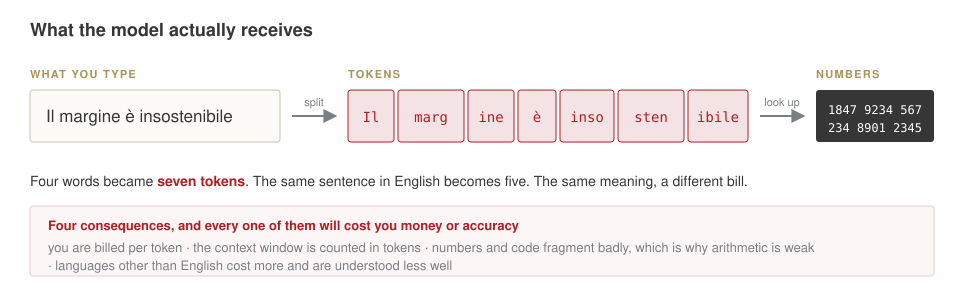{fig-align="center" width="95%"}

## Why pieces, and not letters?

| the same 5,000 characters, as | length | alphabet |
|---|---|---|
| bits | 40,000 | 2 |
| bytes | 5,000 | 256 |
| tokens | **~1,300** | **~100,000** |

## How a tokenizer is learned

Merge the most frequent pair. Repeat.

| step | text | new symbol |
|---|---|---|
| start | `aaabdaaabac` | |
| 1 | `ZabdZabac` | Z = aa |
| 2 | `YbdYbac` | Y = Za |
| 3 | `XdXac` | X = Yb |

. . .

11 symbols → 5. Train it on English, and it learns English pieces.

## The same sentence, twice {.clip background-color="#000000"}

<video class="clipvideo" width="1000" height="562" controls muted loop playsinline data-autoplay preload="auto" poster="media/w01_tokens_poster.png"><source src="media/w01_tokens.mp4" type="video/mp4"></video>

## Much of the weirdness is tokenization

| it struggles with | because |
|---|---|
| spelling a word backwards | the word is one token, not letters |
| Russian, Italian | more, smaller pieces |
| arithmetic | `1,234,567.89` is 7 arbitrary pieces |
| `egg` · `Egg` · `EGG` | the same word, different pieces |

## How the tokens talk to each other: **attention**

::: {.callout-important title="Bet"}
*"The bank raised rates because **it** feared inflation."* — what is **it**?
:::

. . .

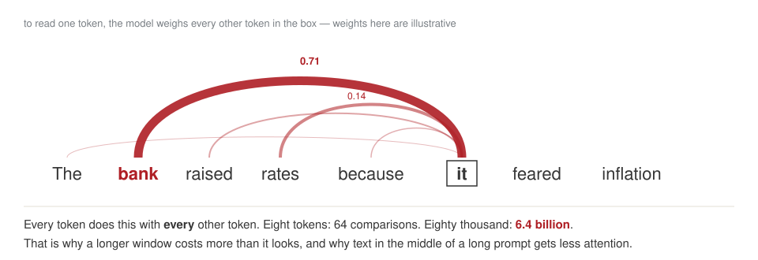{fig-align="center" width="95%"}

[Vaswani et al., *Attention Is All You Need*, 2017 — the paper behind every model since.]{.muted}

## Everything it knows, every time

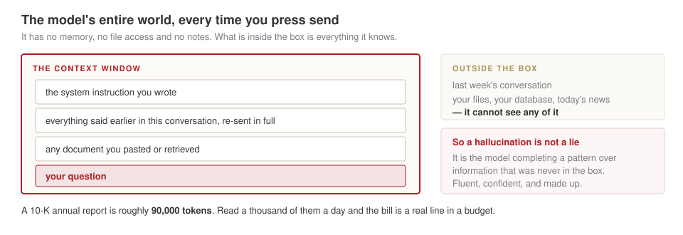{fig-align="center" width="95%"}

## [Part 5]{.section-kicker} A real release, taken apart {.section-slide background-color="#AF1F25"}

## OpenAI, gpt-oss, August 2025

::: {style="font-size:0.78em; line-height:1.45; border-left:4px solid #CDBA80; padding:0.4em 0 0.4em 0.9em; background:#f7f5ef"}
"Each model is a **Transformer** which leverages **mixture-of-experts** to reduce the number of **active parameters** needed to process input. gpt-oss-120b activates **5.1B parameters per token** … The models have **117b** and 21b **total parameters** …

We **tokenized** the data using … **o200k_harmony** … The models were **post-trained** … including a **supervised fine-tuning** stage and a high-compute **RL** stage. … The weights … are freely available … and come natively **quantized** in MXFP4. This allows for the gpt-oss-120B model to run within **80GB of memory** … Available under the flexible **Apache 2.0** license."

[Spec table: **context length 128k**.]{style="color:#7a7f85"}
:::

**Circle every word you can now explain.**

## Every word, taken apart

| in the release | what it is |
|---|---|
| **Transformer** | attention + neurons, stacked — the block you just saw |
| **117B total parameters** | the numbers learned in training |
| **mixture-of-experts** | many specialist sub-networks; only a few run per token |
| **5.1B active per token** | the cost of a small model, the capacity of a big one |
| **tokenized, o200k_harmony** | the ~200,000-piece vocabulary |
| **post-trained** | base model → assistant |
| **supervised fine-tuning** | trained on example conversations |
| **RL** | reinforcement learning: rewarded for good answers |
| **context length 128k** | the size of the box |
| **quantized, MXFP4, 80GB** | each number stored in 4 bits — fits on one GPU |
| **open-weight, Apache 2.0** | download it, run it on your own servers, use it commercially |

## Close

:::: {.columns}
::: {.column width="64%"}
**Homework 1**, due Tue 29 Sep:

- your starting point, in writing
- the question you want answered by December
- the tokenizer on five texts of yours
- ten glossary words, in your words
- three pitch-deck sentences to take apart
- GitHub repo, via the [setup page](../setup.qmd)

Questions: WhatsApp or Telegram.
:::
::: {.column width="36%"}
{width="78%" fig-align="center"}
:::
::::

## [Spare]{.section-kicker} If there is time {.section-slide background-color="#7a7f85"}

## Take it apart yourself {.lab background-color="#2471a3"}

[LAB · session.ipynb § B1 — `tiktoken`]{.kicker}

1. one sentence in **English**, **Italian**, **Russian**
2. `1,234,567.89`
3. your surname, a listed company, a start-up

## A taste of DeFi

::: {.callout-important title="Bet"}
A pool holds **10 ETH** and **30,000 USDC** — 3,000 per ETH on screen. You buy **1 ETH**. What do you pay?
:::

. . .

**ETH × USDC stays constant:** 10 × 30,000 = 300,000.

9 ETH left → 300,000 ÷ 9 = 33,333 USDC → you paid **3,333**, 11% above the screen.
