## Today

| | |
|---|---|
| **10:00** | last week in one slide · your starting point |
| **10:20** | finishing the network: learning rate, hidden layers, scale |
| **10:45** | the same machine, on text — and a real model’s knobs |
| **11:05** | break |
| **11:15** | inside: tokens, embeddings, attention, the transformer, temperature |
| **12:10** | training at scale, and running it |
| **12:30** | what it cannot do · the release, decoded |
| **12:50** | homework · three lines |

## Last week, in one slide

:::: {.columns}
::: {.column width="50%"}
**A neuron**: multiply each answer by a weight, add a bias, squash. Eight payments taught it "two red flags" in three rounds.

**The loss** is one number for how wrong it is — the average over all payments.
:::
::: {.column width="50%"}
**The formula**: $w \leftarrow w - \eta\,(p-y)\,x$ — for every weight, after every example.

**Backpropagation** finds each weight’s share of the blame, box by box, right to left.
:::
::::

## Your starting point {.statement}

[Homework 1: the question you want answered by December — in two minutes, as if to a manager.]{.muted}

## [Part 1]{.section-kicker} Finishing the network {.section-slide background-color="#AF1F25"}

## The learning rate {.clip background-color="#000000"}

<video class="clipvideo" width="1000" height="562" controls muted loop playsinline data-autoplay preload="auto" poster="media/w01_lr_poster.png"><source src="media/w01_lr.mp4" type="video/mp4"></video>

[Add payment I — a customer on holiday: large, abroad, genuine — and no rule is perfect. Too small a step crawls; too large jumps over the best answer.]{.explain}

## How every network learns

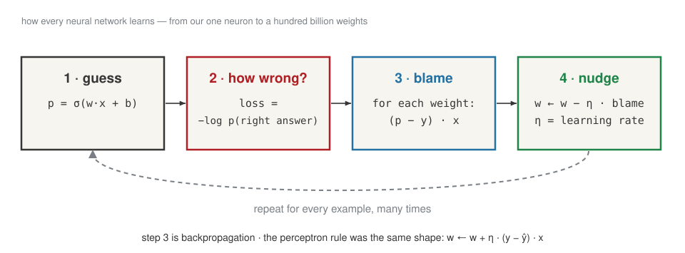{fig-align="center" width="86%"}

## A pattern one neuron cannot draw

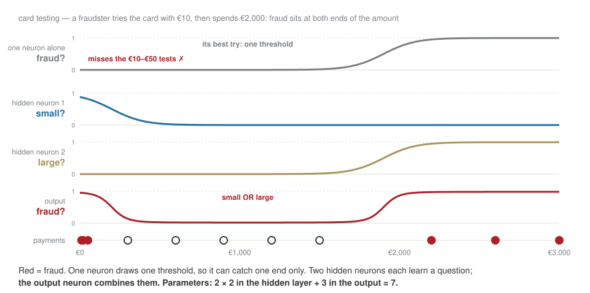{fig-align="center" width="86%"}

## More activation functions

{fig-align="center" width="86%"}

## From 4 numbers to 117 billion

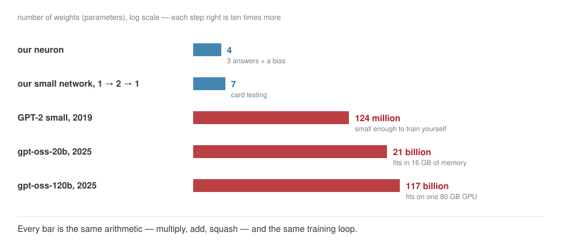{fig-align="center" width="80%"}

## [Part 2]{.section-kicker} The same machine, on text {.section-slide background-color="#AF1F25"}

## An LLM is the same machine

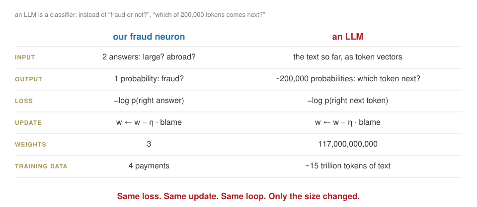{fig-align="center" width="86%"}

## The same nudge, on text {.clip background-color="#000000"}

<video class="clipvideo" width="1000" height="562" controls muted loop playsinline data-autoplay preload="auto" poster="media/w01_faders_poster.png"><source src="media/w01_faders.mp4" type="video/mp4"></video>

[A mixer: one knob per possible next token. Each sentence turns the right knob up a little — the step we took on payment E.]{.explain}

## Where the knobs end up

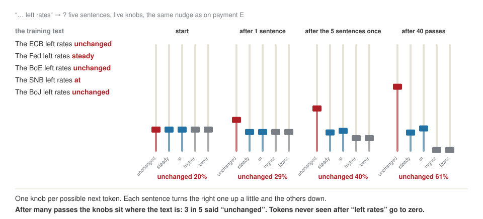{fig-align="center" width="88%"}

## A real model’s knobs

::: {.callout-important title="Bet"}
After "The ECB left rates", how sure is a real model that the next word is "unchanged"?
:::

. . .

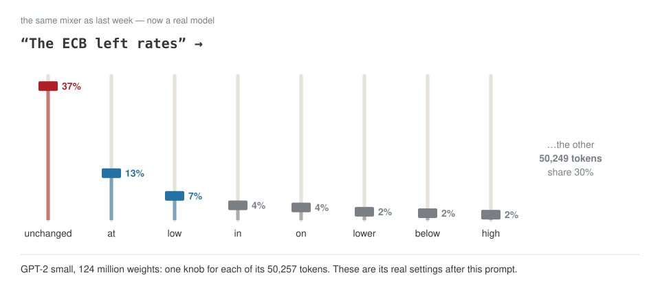{fig-align="center" width="84%"}

## Break — ten minutes. {.statement}

## [Part 3]{.section-kicker} Inside {.section-slide background-color="#AF1F25"}

## One prediction, end to end

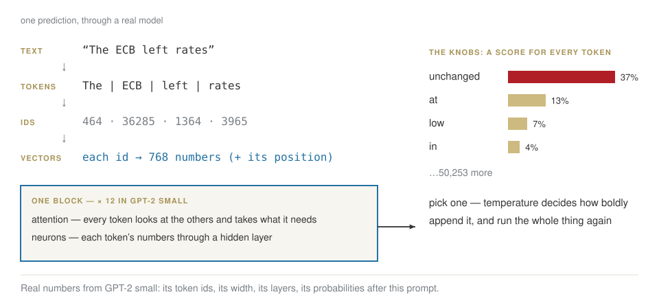{fig-align="center" width="86%"}

[Five steps, one at a time for the rest of the morning: tokens → vectors → attention → the block, stacked → the knobs.]{.explain}

## 1 · Tokens: how a tokenizer is learned

Find the pair of symbols that appears most often; give it a name; repeat.

| merge | pair seen most often | times | new piece | text length |
|---|---|---|---|---|
| start | | | | 127 |
| 1 | `a` + `n` | 6 | `an` | 121 |
| 2 | `s` + `_` | 5 | `s_` | 116 |
| 3 | `e` + `_` | 4 | `e_` | 112 |
| 4 | `r` + `a` | 4 | `ra` | 108 |
| 5 | `ra` + `t` | 4 | `rat` | 104 |
| 6 | `rat` + `e` | 4 | `rate` | 100 |
| 7 | `rate` + `s_` | 4 | `rates_` | 96 |
| 8 | `t` + `h` | 3 | `th` | 93 |

[On a text about rates, `rates_` becomes one piece after seven merges. Trained mostly on English, a tokenizer learns English pieces — so Russian costs more.]{.explain}

## Your tiny LLM, piece 1 {.lab background-color="#2471a3"}

[LAB · session.ipynb § 1]{.kicker}

1. Run the merges on the text about rates. Check the table.
2. Paste a paragraph of your own — English, then Russian. 30 merges each.
3. How many symbols per word, in each language?

## 2 · Vectors: meaning becomes a place

Each token becomes a list of numbers — 768 in GPT-2 — learned by the same nudge as every other weight.

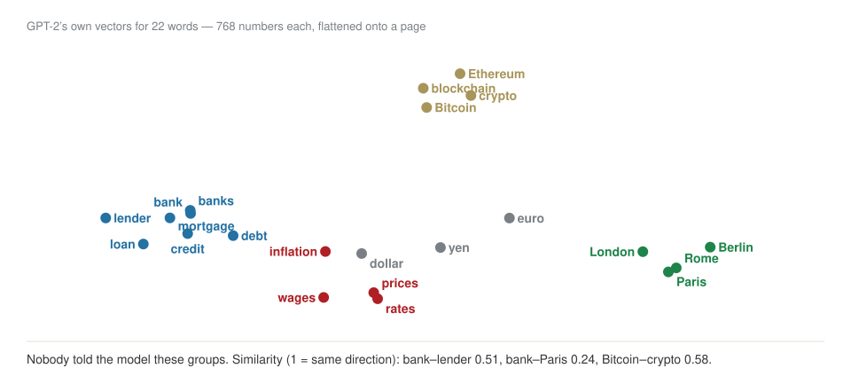{fig-align="center" width="80%"}

## 3 · Attention: the tokens talk to each other {.clip background-color="#000000"}

<video class="clipvideo" width="1000" height="562" controls muted loop playsinline data-autoplay preload="auto" poster="media/w02_attention_poster.png"><source src="media/w02_attention.mp4" type="video/mp4"></video>

[Each token asks a question (query), each token shows a label (key), and gives what it carries (value). Good match → more of it.]{.explain}

## The same, as a table

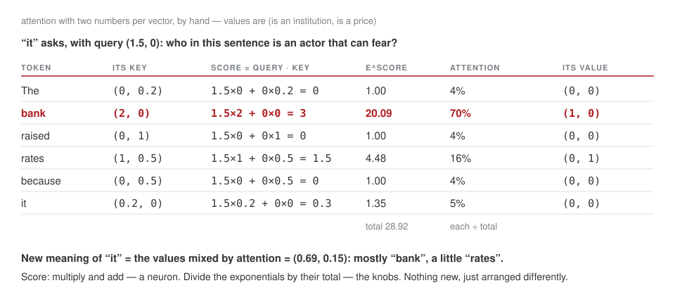{fig-align="center" width="86%"}

## And inside a real model

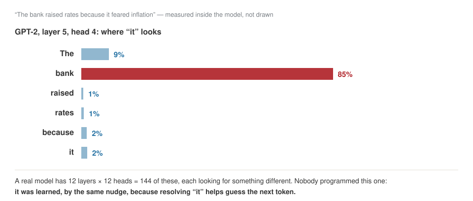{fig-align="center" width="84%"}

[Vaswani et al., *Attention Is All You Need*, 2017 — the paper behind every model since.]{.muted}

## 4 · The transformer: one block, stacked

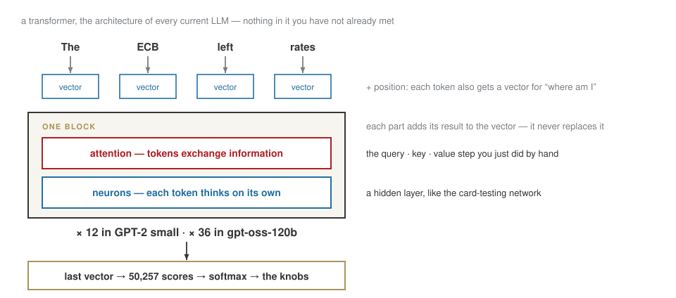{fig-align="center" width="86%"}

## 5 · The knobs, and how boldly it picks

Temperature divides every score before the softmax. On GPT-2’s real knobs, after "The ECB left rates":

::: {.bigtable}
| next token | T = 0.5 | T = 1 | T = 2 |
|---|---|---|---|
| **unchanged** | 83.9% | 37.1% | 2.4% |
| **at** | 10.2% | 13.0% | 1.4% |
| **low** | 2.7% | 6.7% | 1.0% |
| **in** | 1.0% | 4.1% | 0.8% |
| **on** | 0.8% | 3.5% | 0.7% |
:::

[At T = 2 the 50,257 tokens are spread so flat that "unchanged" drops to 2%. T = 0 always picks the top token: the same answer every time.]{.explain}

## One token at a time

**T = 0 (always the top knob):** *The ECB left rates* unchanged at 0.5 percent in June, but the ECB

**T = 1, three runs:**

- *The ECB left rates* up to 32 per cent in London unchanged at 20 basis points
- *The ECB left rates* unchanged last week down between 8 and 12 basis points. This
- *The ECB left rates* at its previous entry level in 2005. Close to a three

[Each word is picked, appended, and the whole machine runs again. Nothing is looked up: "0.5 percent in June" is a number that fits, not a fact.]{.explain}

## Look inside a real one {.lab background-color="#2471a3"}

[LAB · session.ipynb § 2–4]{.kicker}

1. Attention by hand, in numpy — the table you just saw.
2. Load GPT-2 in Colab. Your own prompt: read its top eight knobs.
3. Generate at T = 0, then three times at T = 1. Which sentences are facts?

## [Part 4]{.section-kicker} Training at scale, and running it {.section-slide background-color="#AF1F25"}

## Pre-training is compressing the internet

{fig-align="center" width="80%"}

## Three stages, the same loop

| stage | the "right answer" in the loop | what comes out |
|---|---|---|
| **pre-training** | the next token of internet text | a base model: it continues documents |
| **supervised fine-tuning** | the next token of good example conversations | an assistant |
| **reinforcement learning** | whatever earns a higher reward score | an assistant that works problems through — "reasoning" |

[The formula never changes: $w \leftarrow w - \eta \cdot$ blame. Only what counts as right does.]{.explain}

## The box has a size, and a price

{fig-align="center" width="80%"}

[Every token attends to every other: twice the context, four times the attention work. That is why long prompts cost more than they look.]{.explain}

## Big, but cheap to run

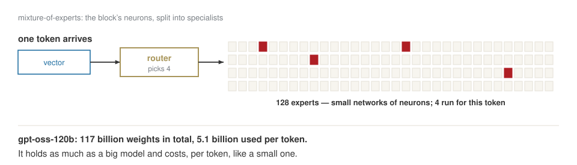{fig-align="center" width="84%"}

## Fitting it on one machine

::: {.bigtable}
| each of 117 billion weights stored in | memory needed |
|---|---|
| 16 bits (2 bytes) | ≈ 234 GB — several GPUs |
| ~4 bits (MXFP4) | ≈ 62 GB — one 80 GB GPU |
:::

[**Quantization**: store each number with less precision. A little accuracy for a lot of memory.]{.explain}

## [Part 5]{.section-kicker} What it cannot do {.section-slide background-color="#AF1F25"}

## Four limits that follow from the machine

| what you see | why, from what we built |
|---|---|
| a confident, invented number | there is always a top knob — even when the fact was never in the data |
| no knowledge after a date | the weights are frozen at the end of training |
| knows A → B, not B → A | it learned to continue text in one direction |
| bad at spelling and arithmetic | it sees tokens, not letters or digits |

[Every one of these is why, from week 4, we give it documents to read and tools to call.]{.explain}

## Two piles {.lab background-color="#2471a3"}

[LAB · session.ipynb § 5]{.kicker}

Ask your assistant about a real company. Split every sentence:

:::: {.columns}
::: {.column width="50%"}
**Verifiable** — a number, a date, a name, a source you can open
:::
::: {.column width="50%"}
**Plausible** — fluent, confident, and nothing to check it against
:::
::::

[Then check two from the left pile against the company’s own report.]{.muted}

## The release, decoded

::: {style="font-size:0.78em; line-height:1.45; border-left:4px solid #CDBA80; padding:0.4em 0 0.4em 0.9em; background:#f7f5ef"}
"Each model is a **Transformer** which leverages **mixture-of-experts** to reduce the number of **active parameters** needed to process input. gpt-oss-120b activates **5.1B parameters per token** … The models have **117b** and 21b **total parameters** …

We **tokenized** the data using … **o200k_harmony** … The models were **post-trained** … including a **supervised fine-tuning** stage and a high-compute **RL** stage. … The weights … are freely available … and come natively **quantized** in MXFP4. This allows for the gpt-oss-120B model to run within **80GB of memory** … Available under the flexible **Apache 2.0** license."

[Spec table: **context length 128k**.]{style="color:#7a7f85"}
:::

**Circle again. Which words are still dark?**

## Close

**Homework 2**, due Tue 6 Oct, in your Drive folder `week-02/`:

- GPT-2 on three prompts of yours: the knobs, and four generations
- your tokenizer on English and Russian
- another model release, decoded word by word
- a first look at next week’s data: 284,807 real card payments

. . .

**Before you leave:** three lines at the bottom of the notebook, in your words.

[Next week: real fraud data, from the raw file to a model — and whether the model is any good.]{.muted}
