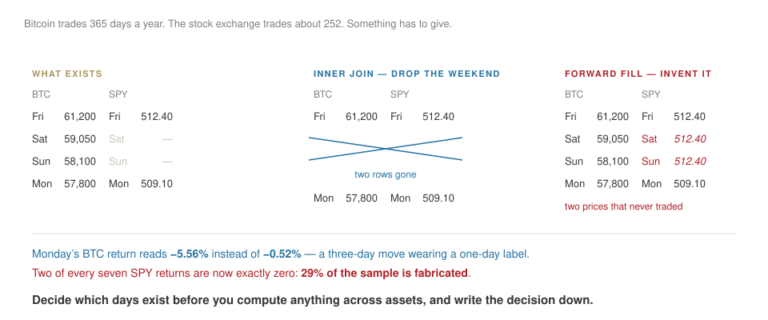

## Where we are

| | | |
|---|---|---|
| 1 | 23 Sep | who we are, the plan, how the model reads ✓ |
| **2** | **30 Sep** | **the checking habit, three assets, joins, and the errors that hide** |
| 3 | 7 Oct | a model, and an honest evaluation of it |
| 4–5 | 14–21 Oct | an LLM application, then agents and evals |

[Last week you saw what the model reads. Today you see what it gets wrong — a constant that looks fine, then the two mistakes that never raise an error.]{.red}

## [Block A]{.section-kicker} Why the same question gives different answers {.section-slide background-color="#AF1F25"}

## It is choosing, not looking up

{fig-align="center" width="95%"}

[**Temperature** decides how much it respects those odds — and nothing else about the model changes.]{.red}

## So where do hallucinations come from?

::: {.callout-important title="Bet before we look"}
The model invents a plausible figure for a company's 2025 revenue. Is that a bug, a lie, or the machine working exactly as designed?
:::

. . .

**Working as designed.** It completes patterns. When the pattern needs a number that was never in the box, it produces the *shape* of a number that would fit.

It has no way to feel the difference between recalling and inventing. **That is your job**, and it is the habit this whole course builds.

## The habit this course is really about {.lab background-color="#2471a3"}

[LAB · week-01/session.ipynb § B3 — 🔍 CHECK]{.kicker}

Run the model on a question about a real firm. Then take its answer apart, sentence by sentence, into two piles:

:::: {.columns}
::: {.column width="50%"}
**Verifiable**
a number you can look up, a date, a name, a claim with a source
:::
::: {.column width="50%"}
**Plausible but unverifiable**
fluent, confident, no way to check it, and quite possibly invented
:::
::::

[Do this on every answer, all term, until it is automatic.]{.red}

## And write that into the procedure, not the folklore

A process that an auditor will look at cannot say *"we asked the AI"*.

- the **exact prompt**, versioned like code
- `T = 0`, and the model **name and version** recorded with the output
- the **input** stored next to the answer

## [Block B]{.section-kicker} Four verbs, three assets {.section-slide background-color="#AF1F25"}

## Four verbs, and you can do most of data work

| | | in pandas |
|---|---|---|
| **filter** | keep some rows | `df[df.volume > 0]` |
| **derive** | make a new column | `df["ret"] = df.close.pct_change()` |
| **aggregate** | many rows into one number | `df.groupby(...).mean()` |
| **join** | put two tables side by side | `a.join(b)` |

[The assistant writes all four faster than you can. The job is not writing them. It is knowing what the result *should* look like before you see it.]{.red}

## Three assets, and one number that is wrong {.lab background-color="#2471a3"}

[LAB · week-01/session.ipynb § C — you drive]{.kicker}

1. Pull daily prices for BTC, an equity and an index.
2. Returns, summary statistics, one chart that answers a question. **Before each cell runs, say how many rows should come back.**
3. **🔍 CHECK** — the volatility cell was written by an assistant. It contains two errors. Find them.

[I will not touch the keyboard. When it breaks, read the error before asking me.]{.muted}

## The two planted errors, and why they matter

:::: {.columns}
::: {.column width="50%"}
**√252 applied to crypto**
Markets trade 252 days a year. Bitcoin trades 365. The formula is right, the constant is wrong, and the output looks perfectly reasonable.
:::
::: {.column width="50%"}
**Returns added up**
Cumulative return is not the sum of daily returns. Compounding is a product. Close enough to look right, wrong enough to matter.
:::
::::

::: {.callout-tip title="The sentence to remember"}
The assistant is fluent, not correct. It fails silently on constants and conventions — precisely where you would not think to look.
:::

## [Block C]{.section-kicker} The first error: two calendars that do not line up {.section-slide background-color="#AF1F25"}

## Bitcoin trades on Sunday. The stock exchange does not.

::: {.callout-important title="Bet before we compute"}
You join a year of BTC prices to a year of SPY prices and compute the correlation. What has already gone wrong, before any arithmetic?
:::

. . .

One series has 365 rows a year, the other about 252. **Something has to give**, and whichever way you resolve it changes the answer.

## Watch what the join does {.clip background-color="#000000"}

<video class="clipvideo" width="1000" height="562" controls muted loop playsinline data-autoplay preload="auto" poster="media/w02_calendars_poster.png"><source src="media/w02_calendars.mp4" type="video/mp4"></video>

Drop the weekend, or invent it. There is no third option, and neither is free.

## Two ways to resolve it, and what each costs

{fig-align="center" width="95%"}

## Break it yourself {.lab background-color="#2471a3"}

[LAB · session.ipynb § B]{.kicker}

1. Join BTC and SPY with `dropna()`. Count the rows you lost.
2. Join them with `ffill()`. Compute BTC's annualised volatility both ways.
3. Print the mean **Monday** return for BTC under each.

Then answer: **which of the two numbers would you put in a report, and what sentence goes underneath it?**

## [Block D]{.section-kicker} The second error: units {.section-slide background-color="#AF1F25"}

## A correlation between mismatched units is still a number

That is the whole problem. Nothing breaks. Nothing warns you.

| what you joined | what you got |
|---|---|
| returns as `0.012` against returns as `1.2` | a coefficient off by a hundred |
| a rate in percent against a rate in decimal | a chart that looks fine and is wrong |
| dollars against thousands of dollars | a ratio nobody notices until the Board does |

. . .

**The assistant cannot see units.** They are not in the data; they are in the documentation, and often only in someone's head.

## Three habits that catch it

1. **Print `head()` and read it.** Not glance — read. Is that number plausible as a daily return?
2. **Plot before you model.** A wrong unit is usually visible as a wrong axis.
3. **Compute one number a second way.** Cumulative return from first and last price, against the same thing from the return series. If they disagree, stop.

::: {.callout-tip title="The sentence to remember"}
The assistant is fluent about code and blind about meaning. Units, calendars and conventions are exactly where it fails silently.
:::

## Join something that is not a price {.lab background-color="#2471a3"}

[LAB · session.ipynb § C]{.kicker}

Bring in one external series — a FRED interest rate, or on-chain active addresses.

1. State its **frequency** and its **units** before you join.
2. Join it. Say which calendar the result is in.
3. Find one known event in the chart. If you cannot see it, the join is wrong.

## [Block E]{.section-kicker} Making it repeatable, and safe {.section-slide background-color="#AF1F25"}

## A number without a snapshot is an anecdote

Data changes under you. Yahoo revises. An API returns something different tomorrow.

- **Save the data behind every reported number**, with the date you pulled it.
- **Pin your versions.** `pandas 2.2.1`, not "latest".
- **Set the seed** anywhere randomness enters.

[The test: can someone else, on another machine, get your number? If the answer needs you in the room, it is not a result yet.]{.red}

## And the rule that has no exceptions {.statement}

## Nothing confidential goes into an AI tool.

Not client names, not unpublished figures, not personal data. Not "just to check the formatting".

[If you would not email it to a stranger, do not paste it into a chat box.]{.muted}

## Close

**Homework 2** — one question you actually want answered, a reproducible notebook, a one-page memo with the decisive chart, and an AI-use disclosure.

Due Tuesday 6 October, 23:59.

. . .

The memo is the part that matters. **One question, one chart, one answer**, for someone who will not open your notebook.

[Next week: a model, and how to tell whether it is any good.]{.muted}
