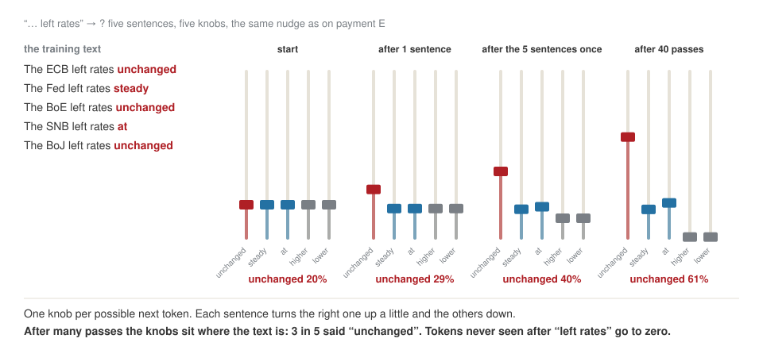
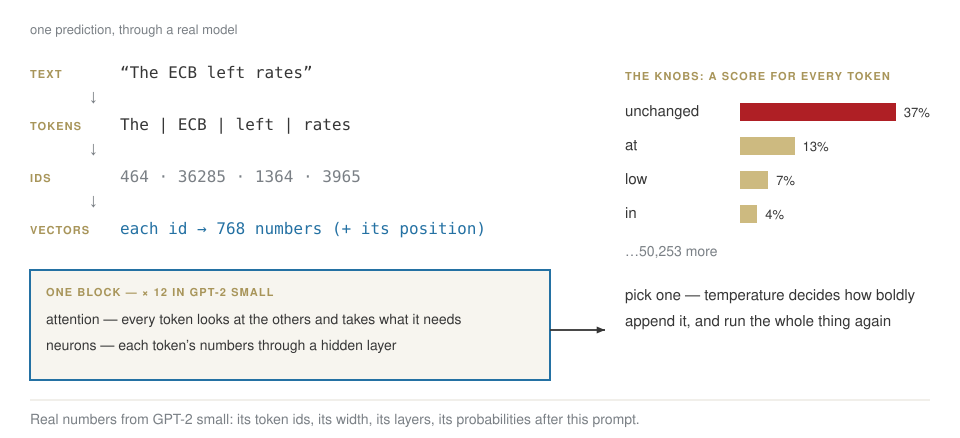
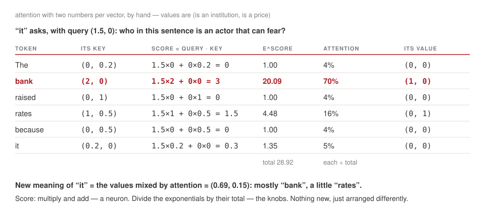

## Today

| | |
|---|---|
| **10:00** | last week · your homework: the question, and the three pitch sentences |
| **10:20** | the release again — today, one bold word at a time |
| **10:30** | "117b parameters": finishing the network |
| **10:50** | "Transformer": the same machine, on text · tokens · meaning as a place |
| **11:05** | break |
| **11:15** | "Transformer", inside: attention, the block, the knobs, temperature |
| **12:00** | "post-trained, SFT, RL": how a model is made |
| **12:25** | "MoE · quantized · 128k · Apache 2.0": what it costs to run, and who owns it |
| **12:40** | what it cannot do · the release, decoded · homework |

## Last week, in one slide

**The question:** is payment E (large, abroad, same device) fraud? Nobody writes the rule — the machine learns it from eight past payments.

::: {style="font-size:1.05em"}
| step | in words | on payment E |
|---|---|---|
| **1 · guess** | a neuron weighs each red flag, adds them up, and squashes the total into a probability | 0.5 × large + 1 × abroad − 1 → **p(fraud) = 0.62** |
| **2 · how wrong** | the **loss**: one number, small when the right answer got a high probability | it *was* fraud; 0.62 is not sure enough |
| **3 · blame** | each weight gets its share of the mistake; in a bigger network, **backpropagation** passes the blame back, layer by layer | "large" and "abroad" were on: blamed · "device" was off: not blamed |
| **4 · nudge** | new weight = old weight − learning rate × blame | 0.5 → 0.88 · 1 → 1.38 → **p = 0.84** |
| **repeat** | every payment, many rounds | average loss **0.45 → 0.03** |
:::

[That loop — guess, how wrong, blame, nudge — is all of training. An LLM runs it on 117 billion weights instead of 4.]{.explain}

## Last week, in your notebook {.lab background-color="#2471a3"}

[LAB · session.ipynb § 0]{.kicker}

1. Run the first cell: the four steps on payment E. Find 0.62 and 0.84.
2. Run the second: all eight payments, 200 rounds. Watch the loss fall to 0.03.

## Your homework {.statement}

[The question you want answered by December — in two minutes, as if to a manager. Then the three pitch sentences: which is impossible, and what did you ask the vendor?]{.muted}

## Back to the release

::: {style="font-size:0.78em; line-height:1.45; border-left:4px solid #CDBA80; padding:0.4em 0 0.4em 0.9em; background:#f7f5ef"}
"Each model is a **Transformer** which leverages **mixture-of-experts** to reduce the number of **active parameters** needed to process input. gpt-oss-120b activates **5.1B parameters per token** … The models have **117b** and 21b **total parameters** …

We **tokenized** the data using … **o200k_harmony** … The models were **post-trained** … including a **supervised fine-tuning** stage and a high-compute **RL** stage. … The weights … are freely available … and come natively **quantized** in MXFP4. This allows for the gpt-oss-120B model to run within **80GB of memory** … Available under the flexible **Apache 2.0** license."

[Spec table: **context length 128k**.]{style="color:#7a7f85"}
:::

**Last week we named every bold word. Today we open each one — in the order the machine needs them.**

## Today’s map

| in the release | what it answers for you | today |
|---|---|---|
| **117b total parameters** | how big is it — and what is a parameter? | Part 1 |
| **Transformer · tokenized** | what happens between your prompt and its answer? | Parts 2–3 |
| **post-trained · SFT · RL** | how did it become an assistant — and what does "reasoning" mean? | Part 4 |
| **MoE · 5.1B active · quantized · 80GB** | what does it cost to run? | Part 5 |
| **context 128k** | how much can it read at once — and at what price? | Part 5 |
| **Apache 2.0** | who owns it, and what may you do with it? | Part 5 |

[Each of these is also a question you can ask a vendor.]{.explain}

## [Part 1 · “117b total parameters”]{.section-kicker} Finishing the network {.section-slide background-color="#AF1F25"}

## The learning rate {.clip background-color="#000000"}

<video class="clipvideo" width="1000" height="562" controls muted loop playsinline data-autoplay preload="auto" poster="media/w01_lr_poster.png"><source src="media/w01_lr.mp4" type="video/mp4"></video>

[Add payment I — a customer on holiday: large, abroad, genuine — and no rule is perfect. Too small a step crawls; too large jumps over the best answer.]{.explain}

## How every network learns

{fig-align="center" width="86%"}

## A pattern one neuron cannot draw

{fig-align="center" width="86%"}

## From 4 numbers to 117 billion

{fig-align="center" width="80%"}

## [Part 2 · “Transformer”]{.section-kicker} The same machine, on text {.section-slide background-color="#AF1F25"}

## An LLM is the same machine

{fig-align="center" width="86%"}

## The same nudge, on text {.clip background-color="#000000"}

<video class="clipvideo" width="1000" height="562" controls muted loop playsinline data-autoplay preload="auto" poster="media/w01_faders_poster.png"><source src="media/w01_faders.mp4" type="video/mp4"></video>

[A mixer: one knob per possible next token. Each sentence turns the right knob up a little — the step we took on payment E.]{.explain}

## Where the knobs end up

{fig-align="center" width="88%"}

## A real model’s knobs

::: {.callout-important title="Bet"}
After "The ECB left rates", how sure is a real model that the next word is "unchanged"?
:::

. . .

{fig-align="center" width="84%"}

## Break — ten minutes. {.statement}

## [Part 3 · “Transformer”, “tokenized”]{.section-kicker} Inside {.section-slide background-color="#AF1F25"}

## One prediction, end to end

{fig-align="center" width="86%"}

[Five steps, one at a time for the rest of the morning: tokens → vectors → attention → the block, stacked → the knobs.]{.explain}

## 1 · Tokens: how a tokenizer is learned

Find the pair of symbols that appears most often; give it a name; repeat.

| merge | pair seen most often | times | new piece | text length |
|---|---|---|---|---|
| start | | | | 127 |
| 1 | `a` + `n` | 6 | `an` | 121 |
| 2 | `s` + `_` | 5 | `s_` | 116 |
| 3 | `e` + `_` | 4 | `e_` | 112 |
| 4 | `r` + `a` | 4 | `ra` | 108 |
| 5 | `ra` + `t` | 4 | `rat` | 104 |
| 6 | `rat` + `e` | 4 | `rate` | 100 |
| 7 | `rate` + `s_` | 4 | `rates_` | 96 |
| 8 | `t` + `h` | 3 | `th` | 93 |

[On a text about rates, `rates_` becomes one piece after seven merges. Trained mostly on English, a tokenizer learns English pieces — so Russian costs more.]{.explain}

## Your tiny LLM, piece 1 {.lab background-color="#2471a3"}

[LAB · session.ipynb § 1]{.kicker}

1. Run the merges on the text about rates. Check the table.
2. Paste a paragraph of your own — English, then Russian. 30 merges each.
3. How many symbols per word, in each language?

## Tokens are what you pay for

::: {.bigtable}
| same sentence | words | tokens |
|---|---|---|
| The ECB left rates unchanged at 2%. | 7 | 9 |
| ЕЦБ оставил ставки без изменений на уровне 2%. | 8 | 13 |
:::

[Same meaning, 44% more tokens in Russian: 44% more on the bill, 44% less text in the same window. Price lists are per million tokens, never per word. Try it: session.ipynb § 1.]{.explain}

## 2 · Vectors: meaning becomes a place

Each token becomes a list of numbers — 768 in GPT-2 — learned by the same nudge as every other weight.

{fig-align="center" width="80%"}

## 3 · Attention: a word reads the room

On the last slide, **"bank" has one place on the map** — the same in *"the river bank"* and *"the bank raised rates"*. Half the time, that is wrong.

**Attention** fixes it. Before going on, every word looks at the other words in the sentence and **borrows meaning from the ones that matter to it**.

[As you do in a meeting: someone says "it", you glance round the table at who "it" could be, and listen most to them.]{.explain}

::: {.callout-important title="Bet"}
*"The bank raised rates because **it** …"* — of everything "it" borrows, what share comes from "bank"?
:::

## Attention, slowly

<video class="clipvideo" width="1000" height="562" controls muted playsinline preload="auto" poster="media/w02_attention_white_poster.png"><source src="media/w02_attention_white.mp4" type="video/mp4"></video>

## The same, as a table

{fig-align="center" width="86%"}

[Nothing new: *relevance* is multiply-and-add, a neuron; *share* is the same squash as the knobs. Run it: session.ipynb § 2.]{.explain}

## And inside a real model

{fig-align="center" width="84%"}

[Nobody told GPT-2 to link "it" to "bank": the weights found it, like the red flags. GPT-2 asks 12 such questions at once, in each of 12 layers.]{.explain}

[Vaswani et al., *Attention Is All You Need*, 2017 — the paper behind every model since.]{.muted}

## 4 · The transformer: one block, stacked

{fig-align="center" width="86%"}

## 5 · The knobs, and how boldly it picks

Temperature divides every score before the softmax. On GPT-2’s real knobs, after "The ECB left rates":

::: {.bigtable}
| next token | T = 0.5 | T = 1 | T = 2 |
|---|---|---|---|
| **unchanged** | 83.9% | 37.1% | 2.4% |
| **at** | 10.2% | 13.0% | 1.4% |
| **low** | 2.7% | 6.7% | 1.0% |
| **in** | 1.0% | 4.1% | 0.8% |
| **on** | 0.8% | 3.5% | 0.7% |
:::

[At T = 2 the 50,257 tokens are spread so flat that "unchanged" drops to 2%. T = 0 always picks the top token: the same answer every time.]{.explain}

## One token at a time

**T = 0 (always the top knob):** *The ECB left rates* unchanged at 0.5 percent in June, but the ECB

**T = 1, three runs:**

- *The ECB left rates* up to 32 per cent in London unchanged at 20 basis points
- *The ECB left rates* unchanged last week down between 8 and 12 basis points. This
- *The ECB left rates* at its previous entry level in 2005. Close to a three

[Each word is picked, appended, and the whole machine runs again. Nothing is looked up: "0.5 percent in June" is a number that fits, not a fact.]{.explain}

## Look inside a real one {.lab background-color="#2471a3"}

[LAB · session.ipynb § 2–4]{.kicker}

1. Attention by hand, in numpy — the table you just saw.
2. Load GPT-2 in Colab. Your own prompt: read its top eight knobs.
3. Generate at T = 0, then three times at T = 1. Which sentences are facts?

## [Part 4 · “post-trained”, “SFT”, “RL”]{.section-kicker} How a model is made {.section-slide background-color="#AF1F25"}

## Pre-training is compressing the internet

{fig-align="center" width="80%"}

## Stage 1 · Pre-training: read, guess, nudge

:::: {.columns}
::: {.column width="55%"}
**The loop**: take a piece of text, hide the next token, guess, nudge every weight. Repeat.

**The data**: "a text-only dataset with **trillions of tokens**, with a focus on STEM, coding, and general knowledge. Knowledge cutoff: **June 2024**."

**The bill**: **2.1 million H100-hours** — about a thousand top GPUs for three months.
:::
::: {.column width="45%"}
::: {.callout-important title="Bet"}
What comes out is a **base model**. Ask it *"What is the capital of France?"* Does it answer?
:::
:::
::::

[Quotes and numbers: the gpt-oss model card, OpenAI, August 2025.]{.muted}

## A base model is not an assistant {.lab background-color="#2471a3"}

[LAB · session.ipynb § 4]{.kicker}

GPT-2 is only pre-trained: a base model. Before you run the cell, write down: does it answer *"What is the capital of France?"*

[It does not answer — it **continues a document**. On the internet a question is often followed by more questions: a quiz, a forum, an exam paper. That is what it writes.]{.explain}

## Stage 2 · Supervised fine-tuning: imitate good conversations

:::: {.columns}
::: {.column width="50%"}
People write tens of thousands of example conversations:

> **User:** Summarise this contract in three points.
> **Assistant:** 1. … 2. … 3. …

The same loop again — now the "next token" to guess is the ideal assistant's reply.
:::
::: {.column width="50%"}
**What it learns**: the format, the tone, when to refuse. A persona.

**What it does not learn**: new facts. The knowledge is still the compressed internet from stage 1.
:::
::::

[When you talk to an assistant, you talk to a statistical imitation of the people who wrote those examples.]{.explain}

## Stage 3 · Reinforcement learning: try, score, reinforce

:::: {.columns}
::: {.column width="50%"}
**Problems with a checkable answer** — maths, code, logic. The model tries each one many times; the attempts that reach the right answer are nudged up.

Nobody writes the steps. The model discovers that **writing its reasoning out first** gets more answers right.
:::
::: {.column width="50%"}
**Where no answer can be checked** — tone, helpfulness — a second model, trained on human preferences ("A or B?"), gives the score.

"A **high-compute RL** stage" = they spent heavily here. That is what "reasoning model" means.
:::
::::

[For you: the "thinking" is tokens. You wait for them, and you pay for them.]{.explain}

## Three stages, the same loop

| stage | the "right answer" in the loop | what comes out |
|---|---|---|
| **pre-training** | the next token of internet text | a base model: it continues documents |
| **supervised fine-tuning** | the next token of good example conversations | an assistant |
| **reinforcement learning** | whatever earns a higher reward score | an assistant that works problems through — "reasoning" |

[The formula never changes: $w \leftarrow w - \eta \cdot$ blame. Only what counts as right does.]{.explain}

## [Part 5 · “MoE”, “quantized”, “128k”, “Apache 2.0”]{.section-kicker} What it costs to run, and who owns it {.section-slide background-color="#AF1F25"}

## The box has a size, and a price

{fig-align="center" width="80%"}

[Every token attends to every other: twice the context, four times the attention work. That is why long prompts cost more than they look.]{.explain}

## Big, but cheap to run

{fig-align="center" width="84%"}

## Fitting it on one machine

::: {.bigtable}
| each of 117 billion weights stored in | memory needed |
|---|---|
| 16 bits (2 bytes) | ≈ 234 GB — several GPUs |
| ~4 bits (MXFP4) | ≈ 62 GB — one 80 GB GPU |
:::

[**Quantization**: store each number with less precision. A little accuracy for a lot of memory.]{.explain}

## Open weights, Apache 2.0: who owns it

| | a closed model, through an API | an open-weight model (gpt-oss) |
|---|---|---|
| **you get** | an answer per call | the 117 billion numbers themselves |
| **you pay** | per token, forever | the hardware to run it |
| **your data** | goes to the vendor | stays on your machine |
| **it changes** | when the vendor decides | never, unless you change it |

[Apache 2.0: you may use it commercially, modify it, sell what you build. **Open weights is not open source**: the training data and code stay private.]{.explain}

## [Part 6]{.section-kicker} What it cannot do {.section-slide background-color="#AF1F25"}

## Four limits that follow from the machine

| what you see | why, from what we built |
|---|---|
| a confident, invented number | there is always a top knob — even when the fact was never in the data |
| no knowledge after a date | the weights are frozen at the end of training |
| knows A → B, not B → A | it learned to continue text in one direction |
| bad at spelling and arithmetic | it sees tokens, not letters or digits |

[Every one of these is why, from week 4, we give it documents to read and tools to call.]{.explain}

## Two piles {.lab background-color="#2471a3"}

[LAB · session.ipynb § 5]{.kicker}

Ask your assistant about a real company. Split every sentence:

:::: {.columns}
::: {.column width="50%"}
**Verifiable** — a number, a date, a name, a source you can open
:::
::: {.column width="50%"}
**Plausible** — fluent, confident, and nothing to check it against
:::
::::

[Then check two from the left pile against the company’s own report.]{.muted}

## The release, decoded

::: {style="font-size:0.78em; line-height:1.45; border-left:4px solid #CDBA80; padding:0.4em 0 0.4em 0.9em; background:#f7f5ef"}
"Each model is a **Transformer** which leverages **mixture-of-experts** to reduce the number of **active parameters** needed to process input. gpt-oss-120b activates **5.1B parameters per token** … The models have **117b** and 21b **total parameters** …

We **tokenized** the data using … **o200k_harmony** … The models were **post-trained** … including a **supervised fine-tuning** stage and a high-compute **RL** stage. … The weights … are freely available … and come natively **quantized** in MXFP4. This allows for the gpt-oss-120B model to run within **80GB of memory** … Available under the flexible **Apache 2.0** license."

[Spec table: **context length 128k**.]{style="color:#7a7f85"}
:::

**Circle again. Which words are still dark?**

## Close

**Homework 2**, due Tue 6 Oct, in your Drive folder `week-02/`:

- GPT-2 on three prompts of yours: the knobs, and four generations
- your tokenizer on English and Russian
- another model release, decoded word by word
- a first look at next week’s data: 284,807 real card payments

. . .

**Before you leave:** three lines at the bottom of the notebook, in your words.

[Next week: real fraud data, from the raw file to a model — and whether the model is any good.]{.muted}
