## Today

| | |
|---|---|
| **10:00** | last week · your homework |
| **10:20** | the question changes: from "fraud?" to "which word next?" |
| **10:40** | open the box: the architecture of a GPT · tokens · vectors |
| **11:05** | break |
| **11:15** | attention · neurons · the knobs |
| **12:00** | where the 117 billion numbers live — and what they cost |
| **12:15** | how the numbers get their values: three stages of training |
| **12:40** | who owns it · what it cannot do · the release, decoded |

## Last week, in one slide

**The question:** is payment E (large, abroad, same device) fraud? Nobody writes the rule — the machine learns it from eight past payments.

::: {style="font-size:1.05em"}
| step | in words | on payment E |
|---|---|---|
| **1 · guess** | a neuron weighs each red flag, adds them up, and squashes the total into a probability | 0.5 × large + 1 × abroad − 1 → **p(fraud) = 0.62** |
| **2 · how wrong** | the **loss**: one number, small when the right answer got a high probability | it *was* fraud; 0.62 is not sure enough |
| **3 · blame** | each weight gets its share of the mistake; in a bigger network, **backpropagation** passes the blame back, layer by layer | "large" and "abroad" were on: blamed · "device" was off: not blamed |
| **4 · nudge** | new weight = old weight − learning rate × blame | 0.5 → 0.88 · 1 → 1.38 → **p = 0.84** |
| **repeat** | every payment, many rounds | average loss **0.45 → 0.03** |
:::

## Last week, in your notebook {.lab background-color="#2471a3"}

[LAB · session.ipynb § 0]{.kicker}

1. Run the first cell: the four steps on payment E. Find 0.62 and 0.84.
2. Run the second: all eight payments, 200 rounds. Watch the loss fall to 0.03.

## Your homework {.statement}

[The question you want answered by December — in two minutes, as if to a manager. Then the three pitch sentences: which is impossible, and what did you ask the vendor?]{.muted}

## Back to the release

::: {style="font-size:0.78em; line-height:1.45; border-left:4px solid #CDBA80; padding:0.4em 0 0.4em 0.9em; background:#f7f5ef"}
"Each model is a **Transformer** which leverages **mixture-of-experts** to reduce the number of **active parameters** needed to process input. gpt-oss-120b activates **5.1B parameters per token** … The models have **117b** and 21b **total parameters** …

We **tokenized** the data using … **o200k_harmony** … The models were **post-trained** … including a **supervised fine-tuning** stage and a high-compute **RL** stage. … The weights … are freely available … and come natively **quantized** in MXFP4. This allows for the gpt-oss-120B model to run within **80GB of memory** … Available under the flexible **Apache 2.0** license."

[Spec table: **context length 128k**.]{style="color:#7a7f85"}
:::

**Last week we named every bold word. Today we build the machine they describe — a network from last week, plus one new idea — and each word will find its place in it.**

## [Part 1 · an LLM is last week’s network]{.section-kicker} The question changes {.section-slide background-color="#AF1F25"}

## An LLM is the same machine

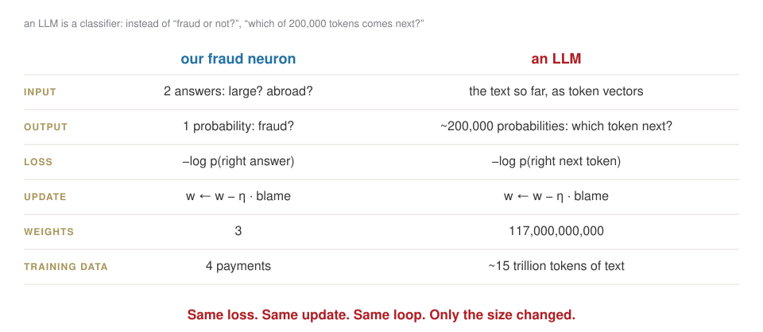{fig-align="center" width="86%"}

## A real model’s knobs

::: {.callout-important title="Bet"}
After "The ECB left rates", how sure is a real model that the next word is "unchanged"?
:::

. . .

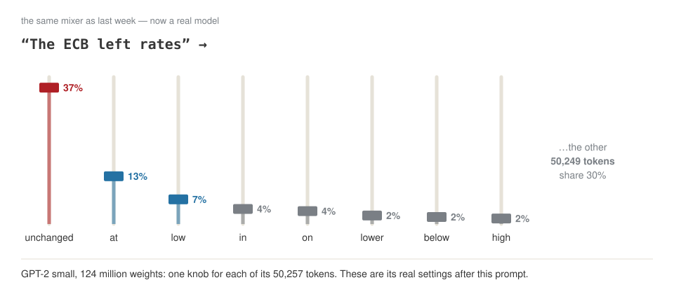{fig-align="center" width="84%"}

## Writing is picking, again and again

<video class="clipvideo" width="1000" height="562" controls muted playsinline preload="auto" poster="media/w02_generate_white_poster.png"><source src="media/w02_generate_white.mp4" type="video/mp4"></video>

## [Part 2 · “Transformer”]{.section-kicker} Open the box {.section-slide background-color="#AF1F25"}

## A sentence, through a GPT

<video class="clipvideo" width="1000" height="562" controls muted playsinline preload="auto" poster="media/w02_arch_white_poster.png"><source src="media/w02_arch_white.mp4" type="video/mp4"></video>

## The map for the rest of the morning

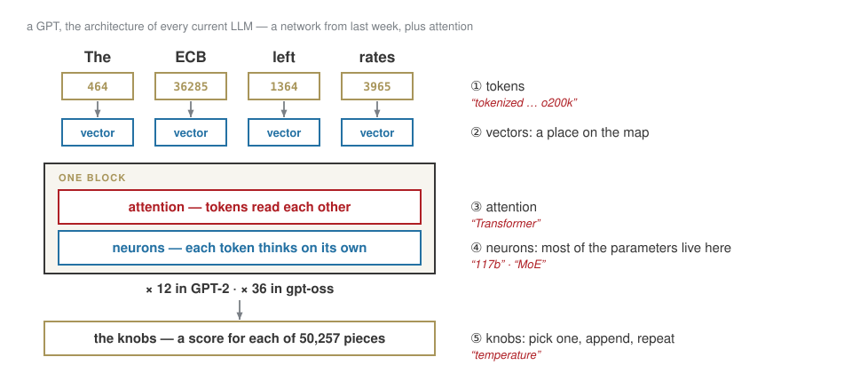{fig-align="center" width="92%"}

[Five boxes. The neurons you know from last week; attention is the one new idea. Each box is a word of the release.]{.explain}

## The real thing: GPT-2, every layer

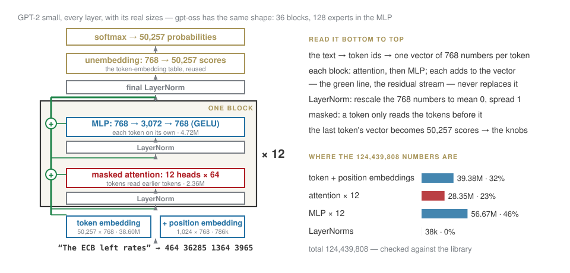{fig-align="center" width="95%"}

## ① Tokens

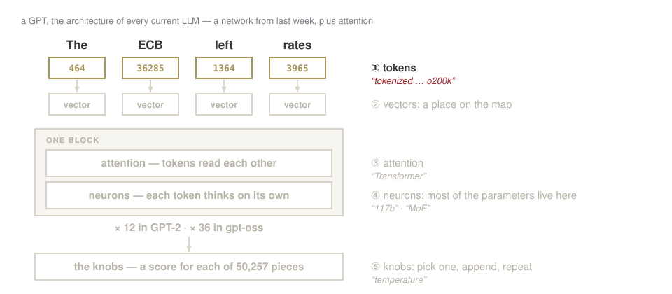{fig-align="center" width="92%"}

[The text is cut into pieces, and each piece becomes a number. The model never sees a word.]{.explain}

## How a tokenizer is built

<video class="clipvideo" width="1000" height="562" controls muted playsinline preload="auto" poster="media/w02_bpe_white_poster.png"><source src="media/w02_bpe_white.mp4" type="video/mp4"></video>

## The recipe, in four lines

1. Start from single letters.
2. Count which pair of neighbours appears most often.
3. Glue it into one new piece; add it to the vocabulary.
4. Repeat — until the vocabulary has the size you want: about **200,000** pieces for gpt-oss.

[Frequent words end up as one piece; rare ones stay in fragments. The text it learned from was mostly English — so Russian is cut finer: the same sentence costs 9 tokens in English, 13 in Russian. You pay per token. Your own texts: session.ipynb § 1.]{.explain}

## ② Vectors

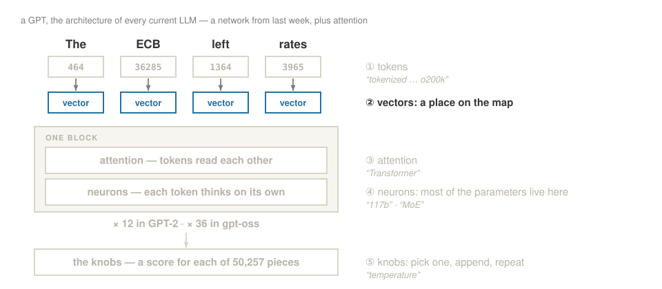{fig-align="center" width="92%"}

[Each token becomes a list of numbers — 768 in GPT-2. Read them as coordinates: a place on a map of meaning.]{.explain}

## How the map is built

<video class="clipvideo" width="1000" height="562" controls muted playsinline preload="auto" poster="media/w02_embed_white_poster.png"><source src="media/w02_embed_white.mp4" type="video/mp4"></video>

## The recipe

1. Every word starts at a random place.
2. Guess which words appear near it; see how wrong; nudge its place — last week's loop.
3. Repeat on the whole text.

[Words that keep the same company end up close. That list of numbers — its place — is the word's **embedding**. Nobody draws the map; the text does.]{.explain}

## A real map: GPT-2's own

Each token becomes a list of numbers — 768 in GPT-2 — learned by the same nudge as every other weight.

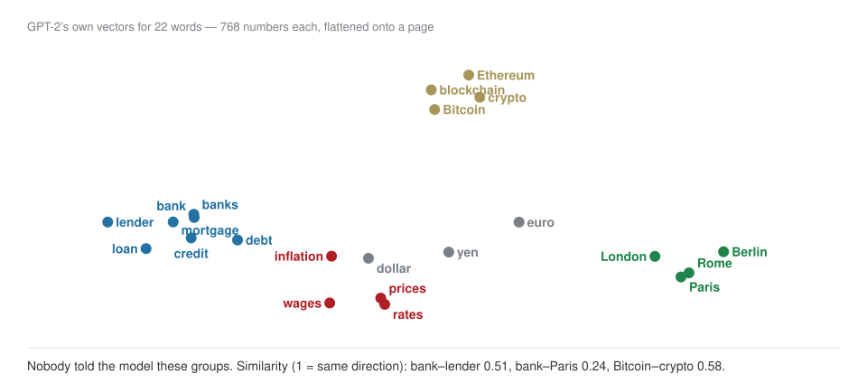{fig-align="center" width="80%"}

## Step ② for real

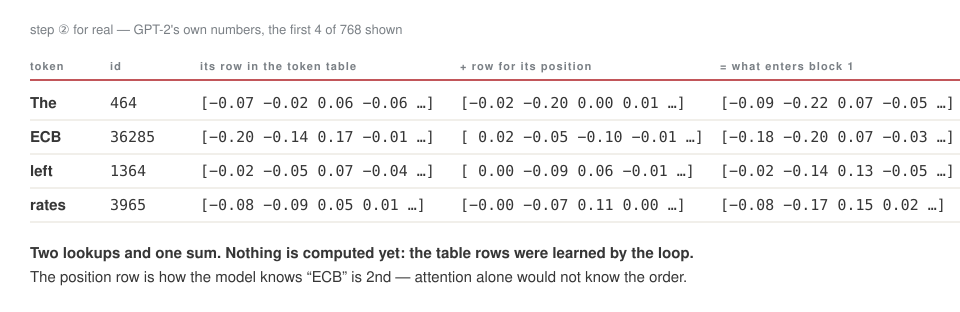{fig-align="center" width="95%"}

## One place per word is not enough

*"The **bank** raised rates."* · *"The river flooded the **bank**."*

[On the map, "bank" has one place — in between money and rivers, right for neither sentence. A word's meaning depends on its neighbours: the places must be allowed to **move** once the model sees the sentence. That is the next box.]{.explain}

## Break — ten minutes. {.statement}

## ③ Attention

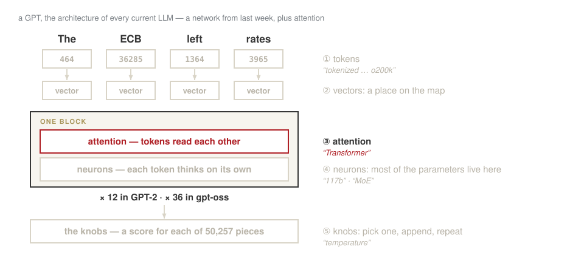{fig-align="center" width="92%"}

[Every vector looks at the others and moves towards the ones that matter to it. The one new idea since last week.]{.explain}

## The context moves the word

<video class="clipvideo" width="1000" height="562" controls muted playsinline preload="auto" poster="media/w02_context_white_poster.png"><source src="media/w02_context_white.mp4" type="video/mp4"></video>

## Step ③ for real

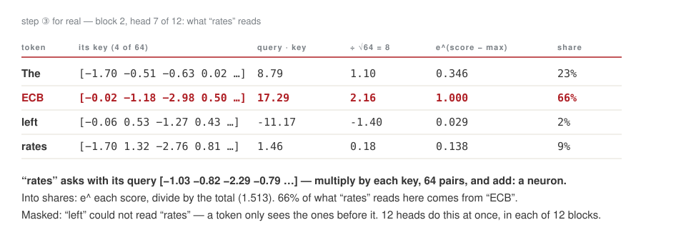{fig-align="center" width="95%"}

[The clip's three steps, with GPT-2's own numbers: a score for each earlier token, shares of 100%, add the mix to the vector.]{.explain}

## Your turn: where does "it" go?

::: {.callout-important title="Bet"}
*"The bank raised rates because **it** …"* — "it" has no meaning of its own. Which neighbour will it move towards, and with what share?
:::

## "It", slowly

<video class="clipvideo" width="1000" height="562" controls muted playsinline preload="auto" poster="media/w02_attention_white_poster.png"><source src="media/w02_attention_white.mp4" type="video/mp4"></video>

[The same three steps: bank 70%, rates 16%. The numbers by hand: session.ipynb § 2.]{.muted}

## And inside a real model

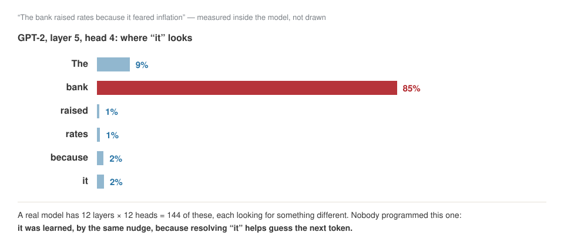{fig-align="center" width="84%"}

[Vaswani et al., *Attention Is All You Need*, 2017 — the paper behind every model since.]{.muted}

## ④ Neurons

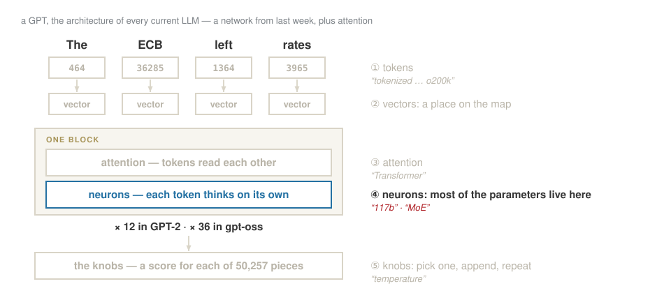{fig-align="center" width="92%"}

[After attention, each token goes through an ordinary network — last week’s, on its own. Most of the 117 billion numbers live here.]{.explain}

## What the neurons add: questions nobody wrote

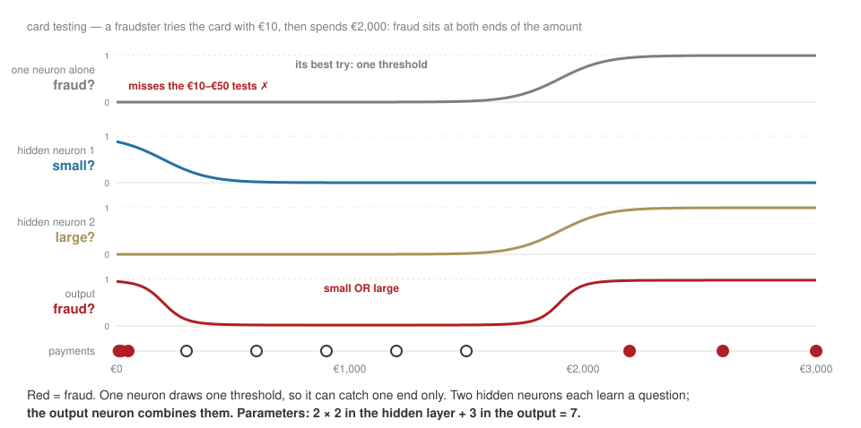{fig-align="center" width="86%"}

[In an LLM the neurons invent questions too — about grammar, meaning, facts.]{.explain}

## One block, stacked

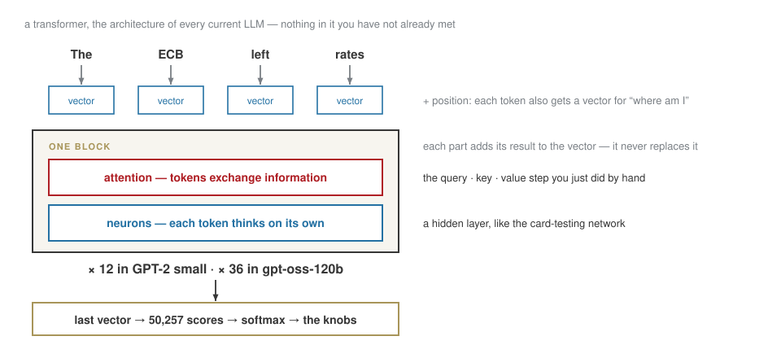{fig-align="center" width="86%"}

[Attention, then neurons: one block. Stack it 36 times and each layer builds questions on the last. That stack is what the release calls a **Transformer**.]{.explain}

## Step ④ for real

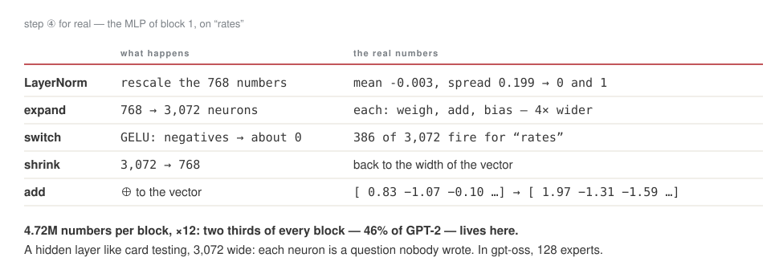{fig-align="center" width="95%"}

## What the stack adds

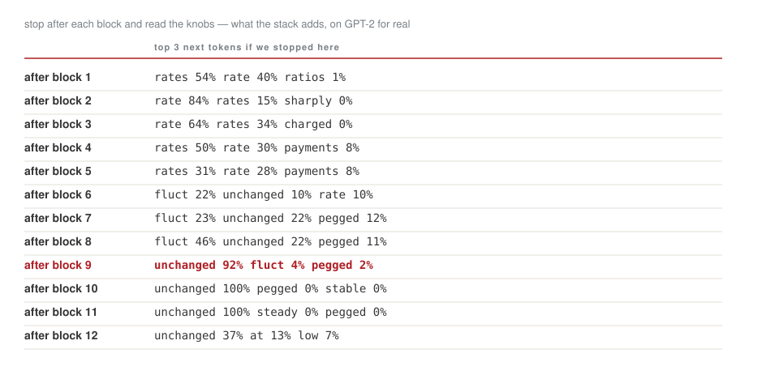{fig-align="center" width="80%"}

[Block by block the guess sharpens: "rate", then "fluct" (the start of *fluctuate*), then "unchanged" at 92% after block 9. The last blocks spread it back to 37%.]{.explain}

## ⑤ The knobs

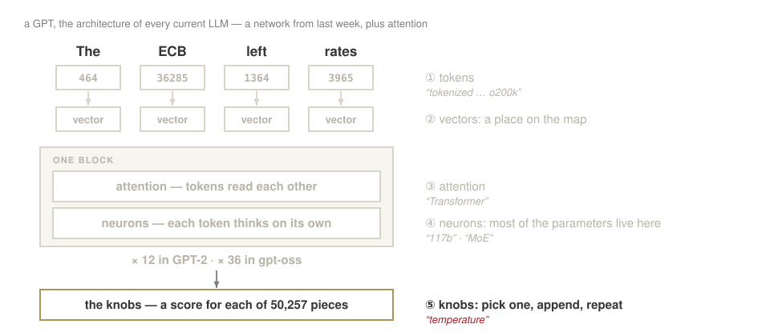{fig-align="center" width="92%"}

[The last token's vector becomes a score for every possible next piece. Pick one, append it, run the whole stack again.]{.explain}

## Step ⑤ for real

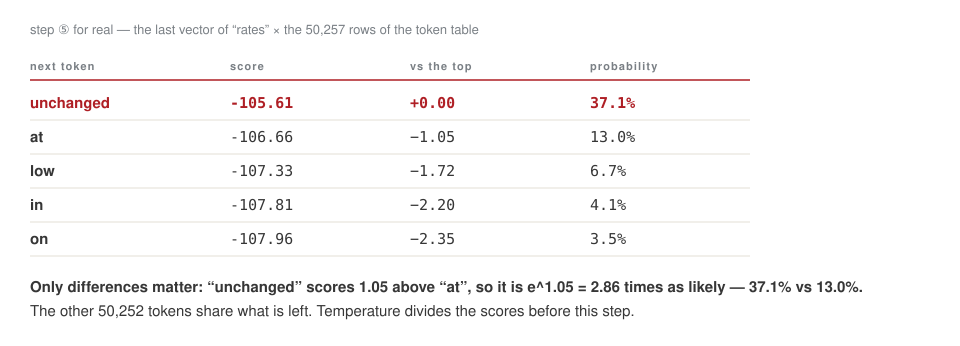{fig-align="center" width="95%"}

## How boldly it picks: temperature

Temperature divides every score before the softmax. On GPT-2’s real knobs, after "The ECB left rates":

::: {.bigtable}
| next token | T = 0.5 | T = 1 | T = 2 |
|---|---|---|---|
| **unchanged** | 83.9% | 37.1% | 2.4% |
| **at** | 10.2% | 13.0% | 1.4% |
| **low** | 2.7% | 6.7% | 1.0% |
| **in** | 1.0% | 4.1% | 0.8% |
| **on** | 0.8% | 3.5% | 0.7% |
:::

[At T = 2 the 50,257 tokens are spread so flat that "unchanged" drops to 2%. T = 0 always picks the top token: the same answer every time.]{.explain}

## One token at a time

**T = 0 (always the top knob):** *The ECB left rates* unchanged at 0.5 percent in June, but the ECB

**T = 1, three runs:**

- *The ECB left rates* up to 32 per cent in London unchanged at 20 basis points
- *The ECB left rates* unchanged last week down between 8 and 12 basis points. This
- *The ECB left rates* at its previous entry level in 2005. Close to a three

[Each word is picked, appended, and the whole machine runs again. Nothing is looked up: "0.5 percent in June" is a number that fits, not a fact.]{.explain}

## Look inside a real one {.lab background-color="#2471a3"}

[LAB · session.ipynb § 2–4]{.kicker}

1. Attention by hand, in numpy — the table you just saw.
2. Load GPT-2 in Colab. Your own prompt: read its top eight knobs.
3. Generate at T = 0, then three times at T = 1. Which sentences are facts?

## [Part 3 · “117b”, “MoE”, “5.1B active”, “quantized”]{.section-kicker} Where the 117 billion numbers live {.section-slide background-color="#AF1F25"}

## From 4 numbers to 117 billion

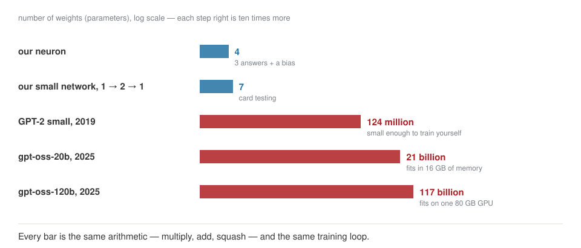{fig-align="center" width="80%"}

## Big, but cheap to run

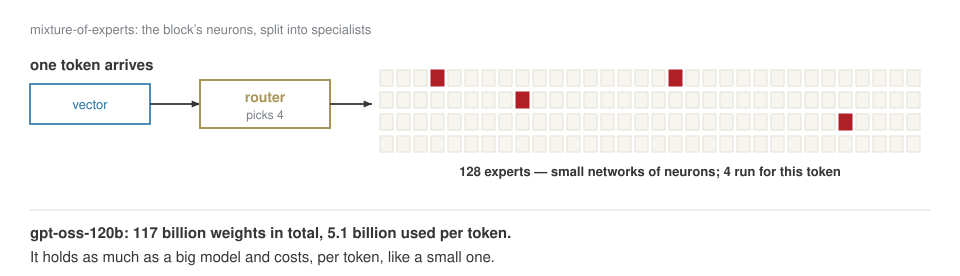{fig-align="center" width="84%"}

## Fitting it on one machine

::: {.bigtable}
| each of 117 billion weights stored in | memory needed |
|---|---|
| 16 bits (2 bytes) | ≈ 234 GB — several GPUs |
| ~4 bits (MXFP4) | ≈ 62 GB — one 80 GB GPU |
:::

[**Quantization**: store each number with less precision. How, and what it costs — for real, on GPT-2.]{.explain}

## Quantization, by hand

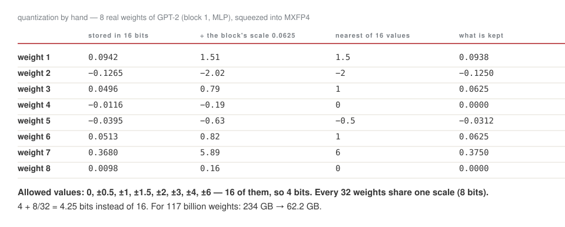{fig-align="center" width="95%"}

## Does it still work?

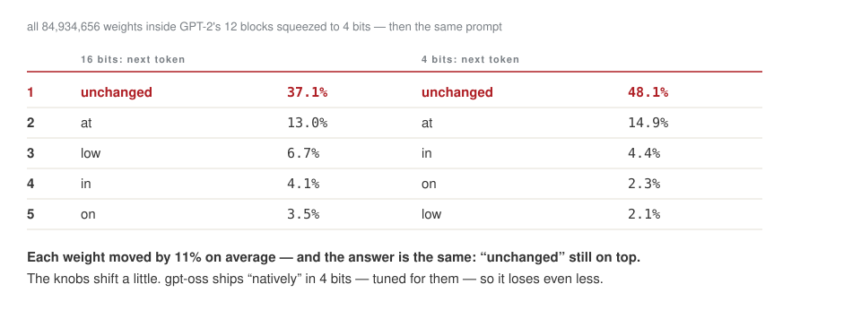{fig-align="center" width="95%"}

## [Part 4 · “post-trained”, “SFT”, “RL”]{.section-kicker} How the numbers get their values {.section-slide background-color="#AF1F25"}

## How every network learns

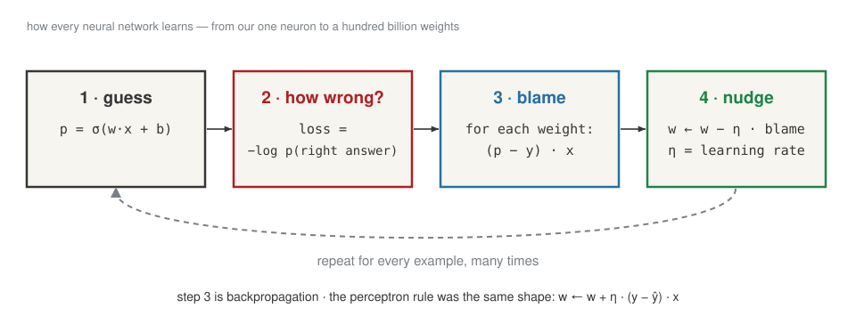{fig-align="center" width="86%"}

## The learning rate {.clip background-color="#000000"}

<video class="clipvideo" width="1000" height="562" controls muted loop playsinline data-autoplay preload="auto" poster="media/w01_lr_poster.png"><source src="media/w01_lr.mp4" type="video/mp4"></video>

[Add payment I — a customer on holiday: large, abroad, genuine — and no rule is perfect. Too small a step crawls; too large jumps over the best answer.]{.explain}

## Training turns counts into knobs

Five sentences in the training text, all ending "… left rates", then:

::: {.bigtable}
| next word | times in the text | share | the knob, after 40 passes |
|---|---|---|---|
| **unchanged** | 3 of 5 | 60% | 61% |
| **at** | 1 of 5 | 20% | 21% |
| **steady** | 1 of 5 | 20% | 17% |
| **higher**, **lower** | never | 0% | 1% |
:::

[Nobody set the knobs: the loop nudged them until they matched how often each word follows this context. On trillions of tokens, that is pre-training.]{.explain}

## Pre-training is compressing the internet

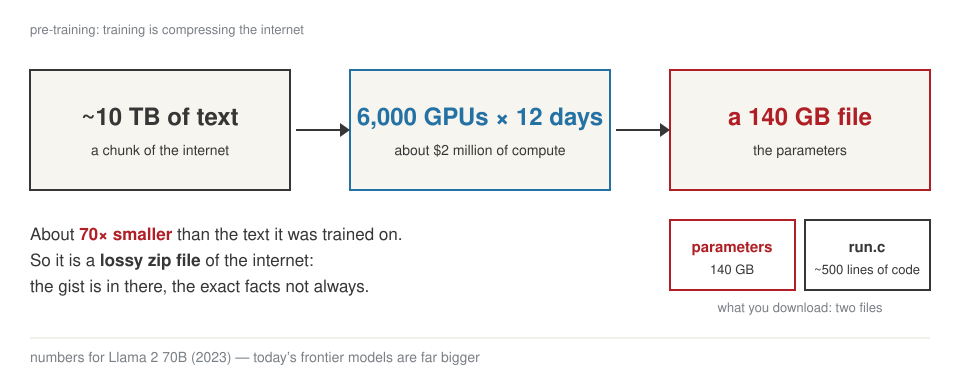{fig-align="center" width="80%"}

## Stage 1 · Pre-training: read, guess, nudge

:::: {.columns}
::: {.column width="55%"}
**The loop**: take a piece of text, hide the next token, guess, nudge every weight. Repeat.

**The data**: "a text-only dataset with **trillions of tokens**, with a focus on STEM, coding, and general knowledge. Knowledge cutoff: **June 2024**."

**The bill**: **2.1 million H100-hours** — about a thousand top GPUs for three months.
:::
::: {.column width="45%"}
::: {.callout-important title="Bet"}
What comes out is a **base model**. Ask it *"Should I buy Bitcoin today?"* What does it write?
:::
:::
::::

[Quotes and numbers: the gpt-oss model card, OpenAI, August 2025.]{.muted}

## Same model, before and after post-training

<video class="clipvideo" width="1000" height="562" controls muted playsinline preload="auto" poster="media/w02_basechat_white_poster.png"><source src="media/w02_basechat_white.mp4" type="video/mp4"></video>

[Try it yourself, both models: session.ipynb § 4.]{.muted}

## Stage 2 · Supervised fine-tuning: imitate good conversations

:::: {.columns}
::: {.column width="50%"}
People write tens of thousands of example conversations:

> **User:** Summarise this contract in three points.
> **Assistant:** 1. … 2. … 3. …

The same loop again — now the "next token" to guess is the ideal assistant's reply.
:::
::: {.column width="50%"}
**What it learns**: the format, the tone, when to refuse. A persona.

**What it does not learn**: new facts. The knowledge is still the compressed internet from stage 1.
:::
::::

[When you talk to an assistant, you talk to a statistical imitation of the people who wrote those examples.]{.explain}

## Stage 3 · Reinforcement learning: try, score, reinforce

:::: {.columns}
::: {.column width="50%"}
**Problems with a checkable answer** — maths, code, logic. The model tries each one many times; the attempts that reach the right answer are nudged up.

Nobody writes the steps. The model discovers that **writing its reasoning out first** gets more answers right.
:::
::: {.column width="50%"}
**Where no answer can be checked** — tone, helpfulness — a second model, trained on human preferences ("A or B?"), gives the score.

"A **high-compute RL** stage" = they spent heavily here. That is what "reasoning model" means.
:::
::::

[For you: the "thinking" is tokens. You wait for them, and you pay for them.]{.explain}

## Three stages, the same loop

| stage | the "right answer" in the loop | what comes out |
|---|---|---|
| **pre-training** | the next token of internet text | a base model: it continues documents |
| **supervised fine-tuning** | the next token of good example conversations | an assistant |
| **reinforcement learning** | whatever earns a higher reward score | an assistant that works problems through — "reasoning" |

[The formula never changes: $w \leftarrow w - \eta \cdot$ blame. Only what counts as right does.]{.explain}

## [Part 5 · “128k”, “Apache 2.0”]{.section-kicker} Running it, and owning it {.section-slide background-color="#AF1F25"}

## The box has a size, and a price

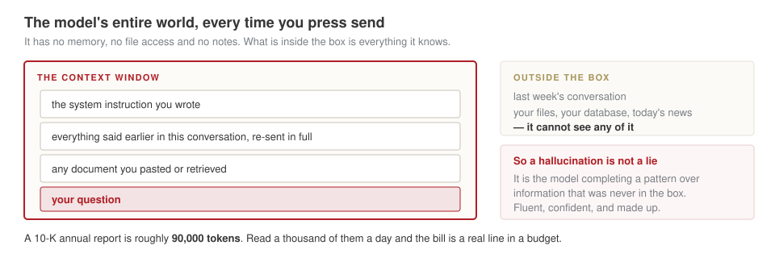{fig-align="center" width="80%"}

[Every token attends to every other: twice the context, four times the attention work. That is why long prompts cost more than they look.]{.explain}

## Open weights, Apache 2.0: who owns it

| | a closed model, through an API | an open-weight model (gpt-oss) |
|---|---|---|
| **you get** | an answer per call | the 117 billion numbers themselves |
| **you pay** | per token, forever | the hardware to run it |
| **your data** | goes to the vendor | stays on your machine |
| **it changes** | when the vendor decides | never, unless you change it |

[Apache 2.0: you may use it commercially, modify it, sell what you build. **Open weights is not open source**: the training data and code stay private.]{.explain}

## [Part 6]{.section-kicker} What it cannot do {.section-slide background-color="#AF1F25"}

## Four limits that follow from the machine

| what you see | why, from what we built |
|---|---|
| a confident, invented number | there is always a top knob — even when the fact was never in the data |
| no knowledge after a date | the weights are frozen at the end of training |
| knows A → B, not B → A | it learned to continue text in one direction |
| bad at spelling and arithmetic | it sees tokens, not letters or digits |

[Every one of these is why, from week 4, we give it documents to read and tools to call.]{.explain}

## Two piles {.lab background-color="#2471a3"}

[LAB · session.ipynb § 5]{.kicker}

Ask your assistant about a real company. Split every sentence:

:::: {.columns}
::: {.column width="50%"}
**Verifiable** — a number, a date, a name, a source you can open
:::
::: {.column width="50%"}
**Plausible** — fluent, confident, and nothing to check it against
:::
::::

[Then check two from the left pile against the company’s own report.]{.muted}

## The release, decoded

::: {style="font-size:0.78em; line-height:1.45; border-left:4px solid #CDBA80; padding:0.4em 0 0.4em 0.9em; background:#f7f5ef"}
"Each model is a **Transformer** which leverages **mixture-of-experts** to reduce the number of **active parameters** needed to process input. gpt-oss-120b activates **5.1B parameters per token** … The models have **117b** and 21b **total parameters** …

We **tokenized** the data using … **o200k_harmony** … The models were **post-trained** … including a **supervised fine-tuning** stage and a high-compute **RL** stage. … The weights … are freely available … and come natively **quantized** in MXFP4. This allows for the gpt-oss-120B model to run within **80GB of memory** … Available under the flexible **Apache 2.0** license."

[Spec table: **context length 128k**.]{style="color:#7a7f85"}
:::

**Circle again. Which words are still dark?**

## Close

**Homework 2**, due Tue 6 Oct, in your Drive folder `week-02/`:

- GPT-2 on three prompts of yours: the knobs, and four generations
- your tokenizer on English and Russian
- another model release, decoded word by word
- a first look at next week’s data: 284,807 real card payments

. . .

**Before you leave:** three lines at the bottom of the notebook, in your words.

[Next week: real fraud data, from the raw file to a model — and whether the model is any good.]{.muted}
