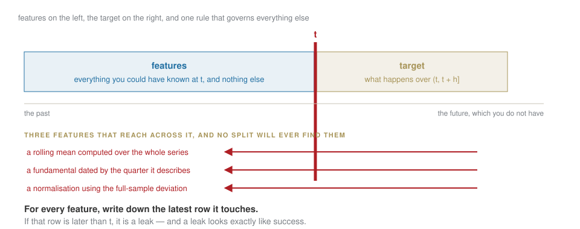
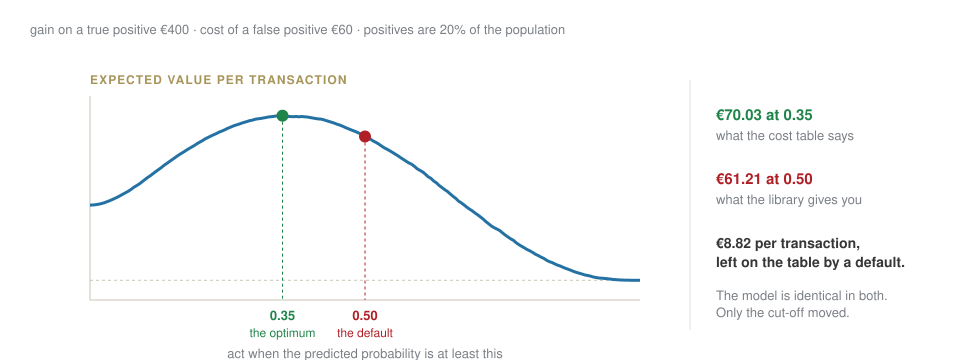

## Where we are

| | | |
|---|---|---|
| 1–2 | 23–30 Sep | the model, the checking habit, the data, the silent errors ✓ |
| **3** | **7 Oct** | **train something, and find out if it is any good** |
| 4–5 | 14–21 Oct | an LLM application, then agents and evals |

[Today you will build a model that scores 0.71 and is worthless, and one that scores 0.53 and is worth money. Telling them apart is the entire skill.]{.red}

## Last week, in one slide

:::: {.columns}
::: {.column width="50%"}
An LLM is our neuron's training loop at scale: **tokens** become **vectors**; **attention** lets each token take what it needs from the others; the **block** is stacked dozens of times.

At the end, one **knob** per token — and **temperature** decides how boldly it picks.
:::
::: {.column width="50%"}
Pre-training, fine-tuning and RL are the same loop with different right answers.

It invents by design: there is always a top knob, even when the fact was never in the data.
:::
::::

## Three ways to write the same decision

::: {.r-stack}
{width="100%"}

{.fragment width="100%"}

{.fragment width="100%"}

{.fragment width="100%"}

{.fragment width="100%"}
:::

## A rule you can write down beats a model that guesses it. {.statement}

[Most of what gets pitched as AI is a 1.0 problem with a 3.0 budget. Today you find out which is which, in euros.]{.muted}

## Run all three, on the same transactions {.lab background-color="#2471a3"}

[LAB · week-01/session.ipynb § A2 — one decision, three kinds of software]{.kicker}

Twenty thousand card payments, one cost table, the three columns of that figure:

1. the rule blocks 240 of them. **Bet how much of the fraud it catches** before you run it.
2. the model gets the **same budget** — 240 blocks, no more — and only chooses differently.
3. then the fraud that is in the *words* and in neither of the first two.

[Then the cell that decides the architecture: what 3.0 costs on every transaction, against 3.0 on only what 2.0 flagged.]{.red}

## Three words, and the whole of supervised learning

| | |
|---|---|
| **feature** | what you know **at** time `t` |
| **target** | what happens **after** `t` |
| **horizon** | how long after |

$$\text{features at } t \;\longrightarrow\; \text{model} \;\longrightarrow\; \text{target over } (t, t+h]$$

[If a feature contains anything from after `t`, everything downstream is theatre. That is the failure this session is built around.]{.red}

## Before the model: what does nothing score?

::: {.callout-important title="Bet before we compute"}
You predict whether tomorrow is an up day. Your model gets **54%**. Good, bad, or unknowable from that number alone?
:::

. . .

**Unknowable.** If 54% of days are up days, predicting "up" every time also scores 54%, and it took no data and no model.

The **base rate** is the number to beat. A model that does not beat it is a cost with a dashboard.

[Which closes the third claim from week 1 — *"99.2% accuracy"*. On whose test set, of what size, against what base rate? Without those three, the number means nothing.]{.red}

## Two models, two splits {.lab background-color="#2471a3"}

[LAB · session.ipynb § B]{.kicker}

Same features, same target, same model. Only the split changes.

1. Fit with a **random** split. Write the score down.
2. Fit with a **time-ordered** split. Write that one down too.
3. Stare at the gap before I explain it.

## Why the first number lied {.clip background-color="#000000"}

<video class="clipvideo" width="1000" height="562" controls muted loop playsinline data-autoplay preload="auto" poster="media/w03_splits_poster.png"><source src="media/w03_splits.mp4" type="video/mp4"></video>

Shuffle a time series and the model trains on days that come *after* the day it is tested on.

## The wall {.statement}

## Nothing to the right of the wall may be used to fit what is on the left.

[Everything else in evaluation is a detail. This is the rule.]{.muted}

## And leakage that no split can catch

{fig-align="center" width="95%"}

## Do it on purpose {.lab background-color="#2471a3"}

[LAB · session.ipynb § C]{.kicker}

Add one leaked feature deliberately — a rolling statistic computed over everything.

1. Watch the score jump.
2. Fix the feature so it uses only the past.
3. Watch it fall back.

[The point is the feeling. A leak looks exactly like success, and this is the only safe place to learn what that feels like.]{.red}

## [Block D]{.section-kicker} A probability is not a decision {.section-slide background-color="#AF1F25"}

## The model says 0.61. Now what?

A prediction becomes a decision only when you add two things the model does not contain: **what each mistake costs**, and **the probability above which you act**.

{fig-align="center" width="95%"}

## And one more question, which the model cannot answer

**Is 0.61 actually 61%?**

Take every day the model said "about 0.6". Did roughly six in ten of them happen? If yes it is **calibrated** and you can do arithmetic with it. If not, the number is a ranking, not a probability, and the expected-value calculation above is meaningless.

::: {.callout-tip title="The sentence to remember"}
Accuracy tells you how often it is right. Calibration tells you whether its confidence means anything. You need both, and only one of them is on the dashboard by default.
:::

## Turn it into a decision {.lab background-color="#2471a3"}

[LAB · session.ipynb § D]{.kicker}

1. Put costs on the two errors — your numbers, defended out loud.
2. Sweep the threshold and plot expected value against it.
3. Read off the threshold that maximises it, and say how far you could be wrong about the costs before the answer changes.

## Close

**Homework 3** — a model against a baseline, evaluated time-aware, plus a section titled **"What would have to be true for this to be useful"**: the decision rule, the KPI, and what each error costs.

Due Tuesday 13 October, 23:59.

. . .

[That section is worth more than the model. Anyone can fit a classifier; almost nobody writes down what would make it worth running.]{.red}

[Next week: the same honesty, applied to language models.]{.muted}
