## Last week, in one slide

:::: {.columns}
::: {.column width="50%"}
An LLM is our neuron's training loop at scale: **tokens** become **vectors**; **attention** lets each token take what it needs from the others; the **block** is stacked dozens of times.

At the end, one **knob** per token — and **temperature** decides how boldly it picks.
:::
::: {.column width="50%"}
Pre-training, fine-tuning and RL are the same loop with different right answers.

It invents by design: there is always a top knob, even when the fact was never in the data.
:::
::::

## Today

| | |
|---|---|
| **10:00** | your homework: the fraud share, the release you decoded |
| **10:15** | **look** — eight years of Bitcoin, Ether and the S&P 500 |
| **11:00** | break |
| **11:10** | **predict** — a model we do not open, judged from the outside |
| **12:00** | **an LLM, called from code** — the same question, the same test |
| **12:40** | from a probability to a decision · homework · three lines |

[One notebook all morning: **week-03/session.ipynb**. You drive; I don't touch the keyboard.]{.muted}

## 0.17% of card payments are fraud. {.statement}

[Your number from homework 2. A model that says "never fraud" is 99.83% accurate and catches nothing. That number is the **base rate**, and today every score gets one next to it.]{.muted}

## [Part 1]{.section-kicker} Look {.section-slide background-color="#AF1F25"}

## The question for the morning

### Is crypto risk predictable — and which part of it?

We will not answer it with a model. We answer it with four small questions, asked in order:

1. what is in the table?
2. how big are the moves?
3. how often does the "impossible" happen?
4. **does yesterday tell us anything about today?**

[Exploration is not "make charts". It is asking the data small questions until you know which question is worth a model.]{.explain}

## The table, and the worst day {.lab background-color="#2471a3"}

[LAB · session.ipynb § E1–E2]{.kicker}

::: {.callout-important title="Bet"}
SPY has empty days, Bitcoin has none. Out of every seven days, how many is SPY missing?
:::

::: {.callout-important title="Bet"}
Bitcoin's worst single day since 2018: how much did it lose, and when?
:::

[▶ **Your turn** — twice: the stock-market holidays of 2025, then Ether's worst and best days.]{.red}

## How often is "impossible"?

::: {.callout-important title="Bet"}
In eight and a half years, how many days did Bitcoin move more than 4 standard deviations? The bell curve says 0.2.
:::

. . .

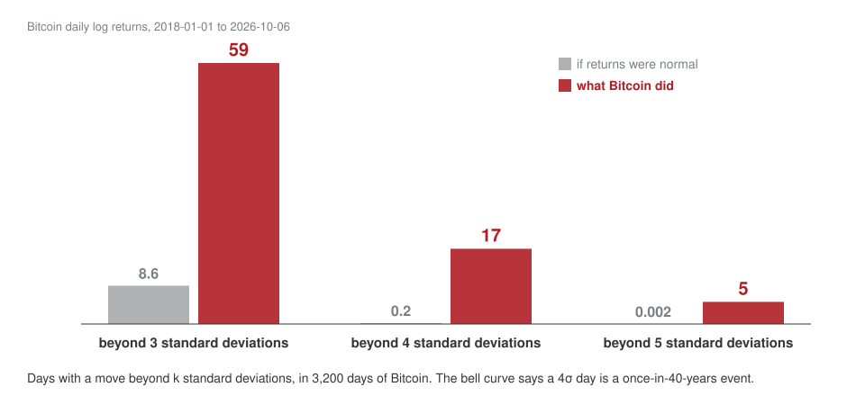{fig-align="center" width="88%"}

## Two questions that sound alike

:::: {.columns}
::: {.column width="50%"}
### Direction
Bitcoin went **up** today.

Is it more likely to go up tomorrow?
:::
::: {.column width="50%"}
### Size
Bitcoin moved **a lot** today, either way.

Is it more likely to move a lot tomorrow?
:::
::::

::: {.callout-important title="Bet"}
Which one has memory — direction, size, both, neither?
:::

## The answer

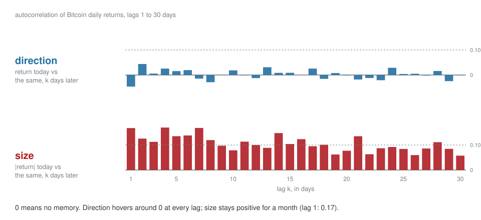{fig-align="center" width="86%"}

[The **autocorrelation** compares a series with itself, *k* days earlier.]{.explain}

## Calm follows calm. Storms follow storms. {.statement}

[It is called **volatility clustering**, and we found it before training anything. It already tells us which question a model can help with — and which one it cannot.]{.muted}

## What clustering looks like

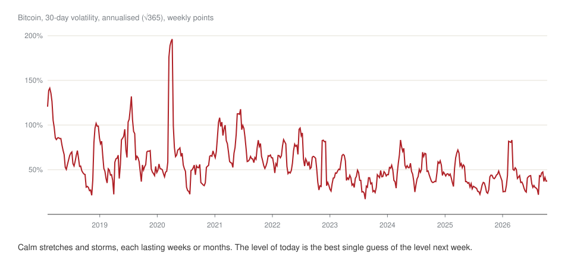{fig-align="center" width="86%"}

[▶ **Your turn** — does the S&P 500 cluster too? Same table, one line changed. Bet first: more or less than Bitcoin?]{.red}

## Not a constant: Bitcoin and the stock market

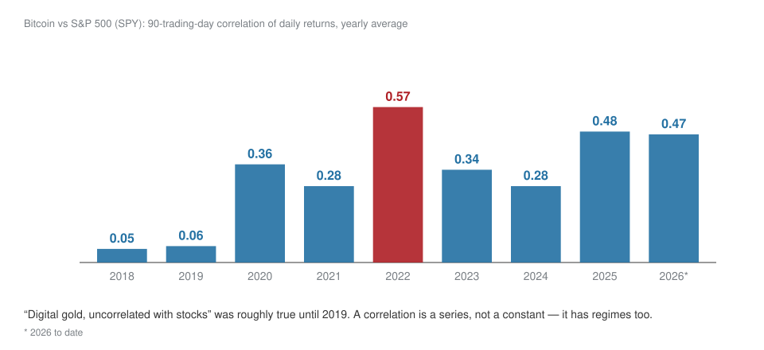{fig-align="center" width="95%"}

## 🔍 The assistant's summary table {.lab background-color="#2471a3"}

[LAB · session.ipynb § CHECK]{.kicker}

Asked for *"annualised volatility and total return of BTC and ETH since 2018"*:

```python
simple = px[["BTC-USD", "ETH-USD"]].pct_change().dropna()
summary = pd.DataFrame({
    "annual vol":   simple.std() * np.sqrt(252),
    "total return": simple.sum(),
})
```

It runs. It looks professional. **Two errors.** Ten minutes; one hint after five.

## What the two errors cost

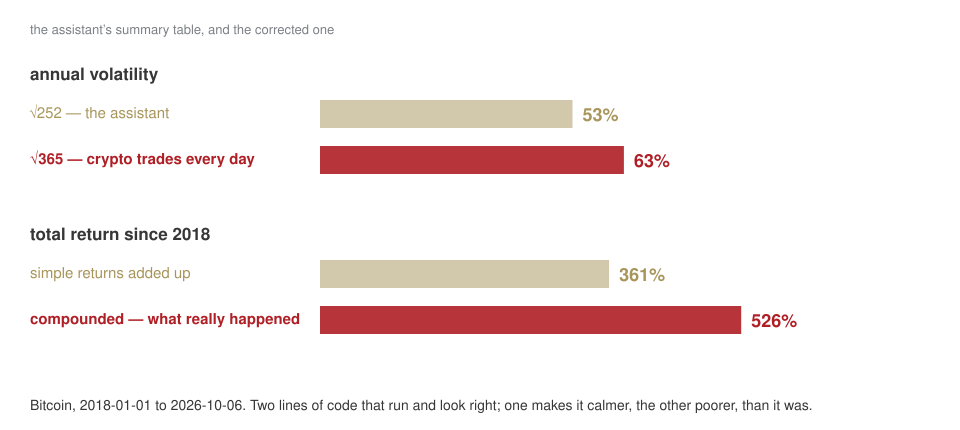{fig-align="center" width="92%"}

## [Part 2]{.section-kicker} Predict {.section-slide background-color="#AF1F25"}

## Three ways to write the same decision

::: {.r-stack}
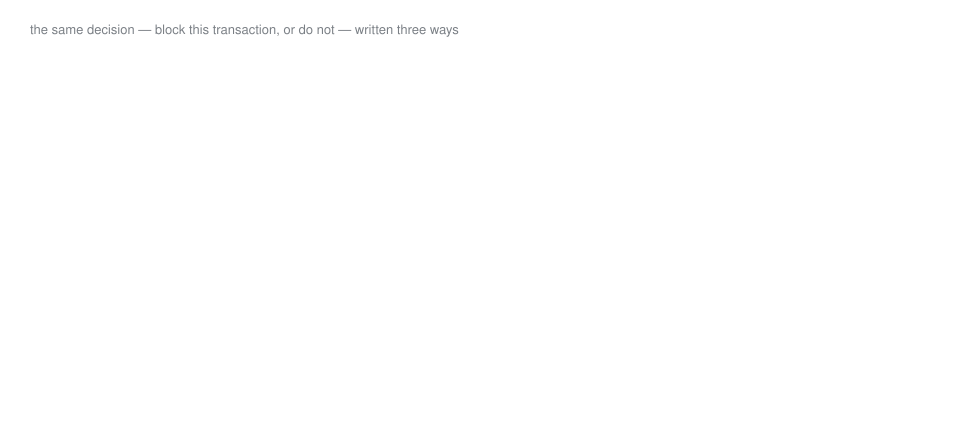{width="100%"}

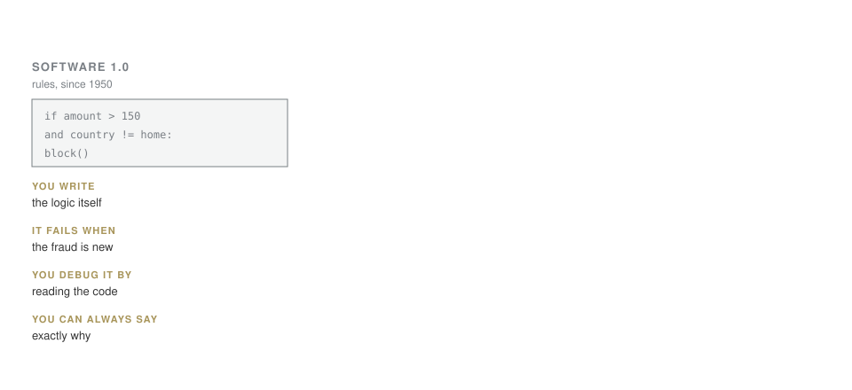{.fragment width="100%"}

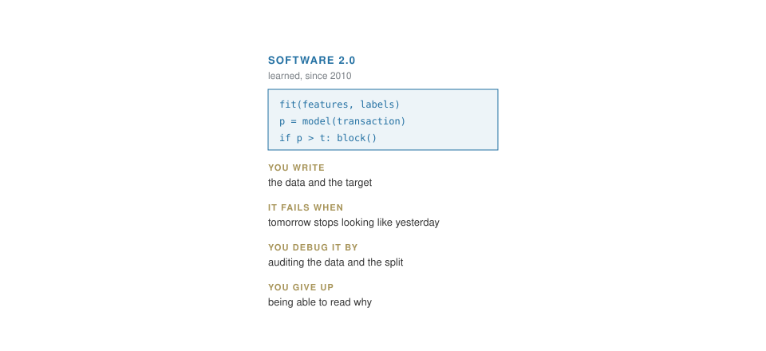{.fragment width="100%"}

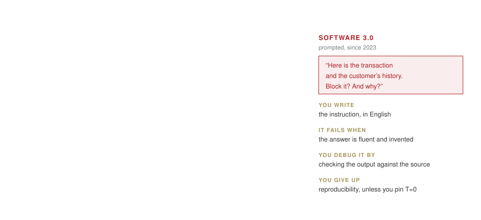{.fragment width="100%"}

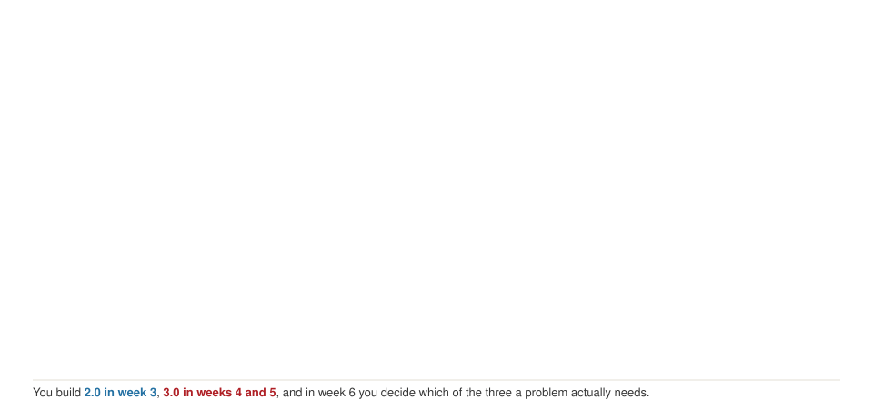{.fragment width="100%"}
:::

[Today all three on one question: a one-line **rule**, a **model** trained on data, and an **LLM**. Same test for all three.]{.explain}

## Two targets, nine features

$$\text{features at day } t \;\longrightarrow\; \text{model} \;\longrightarrow\; \text{what happens over } (t,\ t+7]$$

:::: {.columns}
::: {.column width="50%"}
**Will Bitcoin be up next week?**

`y_dir`
:::
::: {.column width="50%"}
**Will next week be more volatile than usual?**

`y_vol` — "usual" is the median of the past year
:::
::::

[After Part 1 you can already guess how this ends. Write your guess down before the model runs.]{.red}

## The wall

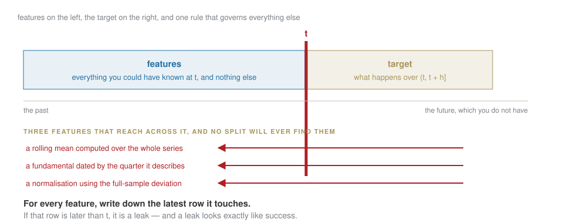{fig-align="center" width="95%"}

[For every feature, write the latest day it uses. For the target, recompute one date by hand. One minute each, every time.]{.explain}

## Before the model: what does nothing score?

::: {.callout-important title="Bet"}
In what share of weeks did Bitcoin go up?
:::

. . .

**53%.** "Always say up" is right 53% of the time, with no data and no model.

[That is the **base rate**. And for volatility there is a smarter baseline anyone can write: **"next week will be like this week."** A model has to beat both.]{.explain}

## The black box: a random forest

:::: {.columns}
::: {.column width="55%"}
**Hundreds of decision trees.** Each is a flowchart of yes/no questions on the features — *"is this week's volatility above 1.3 × usual?"* — grown on a slightly different sample of the past.

They **vote**. The share of votes is the probability.
:::
::: {.column width="45%"}
It finds curves and interactions on its own.

**What it cannot do is tell you whether it is right.**

That is the split's job — and ours.
:::
::::

[We open it in week 9. Today we judge it from the outside — which is what you will do with every vendor's model.]{.muted}

## Two splits {.lab background-color="#2471a3"}

[LAB · session.ipynb § M3]{.kicker}

Same features, same targets, same forest. Only the split changes.

1. **Honest:** learn on 2019–2023, judge on 2024 → today.
2. **The assistant's default:** `train_test_split` — shuffle the days, keep 30% aside.

::: {.callout-important title="Bet"}
Four numbers: AUC for direction and for volatility, honest and shuffled.
:::

[AUC: does the model rank the 1s above the 0s? 0.5 is a coin, 1.0 is perfect.]{.muted}

## Why the shuffled number lies {.clip background-color="#000000"}

<video class="clipvideo" width="1000" height="562" controls muted loop playsinline data-autoplay preload="auto" poster="media/w03_splits_poster.png"><source src="media/w03_splits.mp4" type="video/mp4"></video>

Shuffled, the model trains on Wednesday and Friday and is tested on Thursday. It is not predicting — it is remembering its neighbours.

## What came out

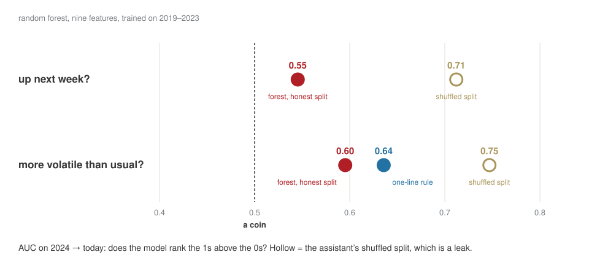{fig-align="center" width="88%"}

[Shuffled beats honest on both: that gap is leakage, not skill. Direction is a coin, as Part 1 said. Volatility is predictable — and the one-line rule beats the forest.]{.explain}

## Same data, same model. The question decides. {.statement}

[Whether ML has anything to offer depends on the question you ask it. Choosing the question is the manager's job — and looking first is how you choose.]{.muted}

## What did the black box look at?

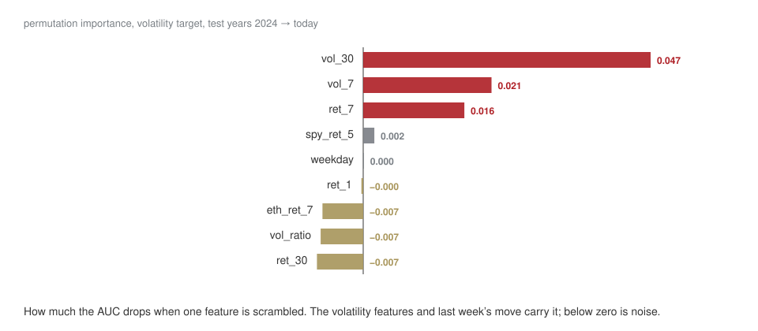{fig-align="center" width="88%"}

[A black box that agrees with what you saw by eye is one you can start to trust.]{.explain}

## Leak it on purpose {.lab background-color="#2471a3"}

[LAB · session.ipynb § your turn after M4]{.kicker}

The assistant offers to *"smooth"* the volatility: `rolling(7, center=True)`.

1. Add it as a feature. Keep the **honest** split.
2. Watch the AUC go from 0.60 to 0.69.
3. One sentence: why did the honest split not protect you?

[A leak looks exactly like success. This is the only safe place to learn what that feels like.]{.red}

## [Part 3]{.section-kicker} An LLM, called from code {.section-slide background-color="#AF1F25"}

## From tool to component

:::: {.columns}
::: {.column width="50%"}
### Until now: a tool
You type into a chat. It answers. You copy.

Nothing is measured; every answer is a one-off.
:::
::: {.column width="50%"}
### From today: a component
Your code calls it, with arguments **you** set:

- the **prompt** — what you ask
- the **system** message — who it is, what it may not do
- the **temperature** — last week's knob
- the **model**
:::
::::

[A component can be run 40 times, scored, compared with a rule — and priced. That is weeks 4 and 5, in miniature.]{.explain}

## The key is a password to a bank account {.statement}

[Never in a cell, a screenshot or a chat. In Colab it lives in 🔑 **Secrets**. Today I type mine into a hidden box: it stays in this runtime's memory and is gone when you close it.]{.muted}

## Same question, five answers {.lab background-color="#2471a3"}

[LAB · session.ipynb § L0–L1]{.kicker}

*"Will Bitcoin go up or down next week? Commit to a direction."* — once at temperature 0, four times at 1.

::: {.callout-important title="Bet"}
At temperature 1, will the five answers agree on the direction?
:::

[▶ **Your turn** — rewrite the **system** message until it behaves like the analyst you would hire: base rate first, no direction. Then try to make it break its own rule.]{.red}

## The LLM writes the note to the CFO {.lab background-color="#2471a3"}

[LAB · session.ipynb § L2]{.kicker}

We hand it our results table and ask: *is this model worth deploying?*

🔍 Read the note with the table next to it:

- does it quote the **shuffled** numbers as performance?
- does it call 0.55 on direction "predictive"?
- does it notice the **rule beats the forest**?

[Then change one number in the table and run again. A note that does not move when the numbers move was not written from the numbers.]{.red}

## The LLM as a forecaster {.lab background-color="#2471a3"}

[LAB · session.ipynb § L3]{.kicker}

On **40 dates** of the test years: the last 30 daily returns, **no name, no dates** — *"probability that next week is more volatile than usual?"*

Scored with the same AUC, on the same 40 dates, as the rule and the forest.

::: {.callout-important title="Bet"}
The LLM: below the forest, between the two, or above the rule?
:::

[Forty dates is a small test: ±0.1 of AUC can be luck. And the bill — calls, tokens, dollars — is printed under the score. The rule costs nothing.]{.muted}

## The wall, seen from an LLM

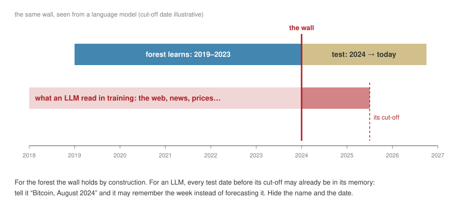{fig-align="center" width="88%"}

[▶ **Your turn** — tell it "Bitcoin" and the date, and run the 40 forecasts again. If the score jumps, ask what it already knows about those weeks.]{.red}

## Three black boxes, one discipline {.statement}

[A rule, a forest, an LLM: base rate, honest test, same dates, same score, and the price of each answer. The discipline does not change with the model.]{.muted}

## [If there is time]{.section-kicker} A probability is not a decision {.section-slide background-color="#AF1F25"}

## Hedge or not

A treasury desk holds Bitcoin. Hedging next week costs **1**. An unhedged high-volatility week costs **2** — or **4**.

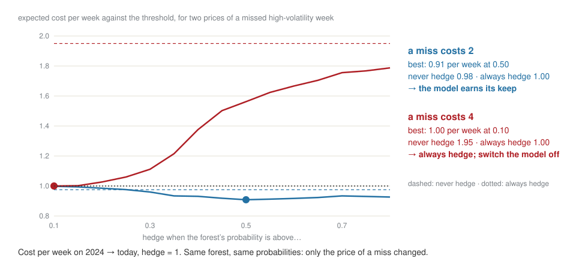{fig-align="center" width="88%"}

## Close

**Homework 3** — your own asset: look first, then a random forest against the base rate and a one-line rule, on the future. Then a section titled **"What would have to be true for this to be useful"**.

Due Tuesday 13 October, 23:59 · Drive, `ese-ai-fintech/week-03/`.

. . .

**Three lines** at the bottom of the notebook: one on looking, one on the split, one on the black boxes.

[Next week: the LLM as a component, properly — structured answers, documents, retrieval.]{.muted}
