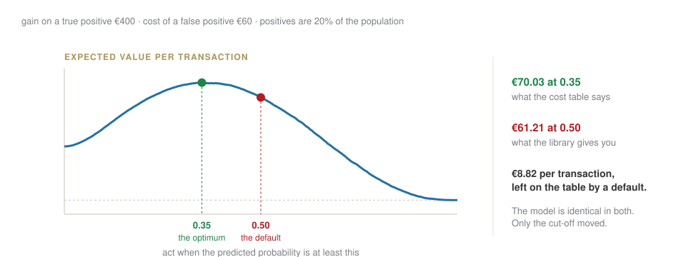

## Where we are

| | | |
|---|---|---|
| 1–2 | 23–30 Sep | the network, the LLM, the checking habit ✓ |
| **3** | **7 Oct** | **explore a real dataset, then train a model and find out if it is any good** |
| 4–5 | 14–21 Oct | an LLM application, then agents and evals |

[Today a model will score 0.74 and be worthless, and a one-line rule will beat it. Telling the two apart is the entire skill.]{.red}

## Last week, in one slide

:::: {.columns}
::: {.column width="50%"}
An LLM is our neuron's training loop at scale: **tokens** become **vectors**; **attention** lets each token take what it needs from the others; the **block** is stacked dozens of times.

At the end, one **knob** per token — and **temperature** decides how boldly it picks.
:::
::: {.column width="50%"}
Pre-training, fine-tuning and RL are the same loop with different right answers.

It invents by design: there is always a top knob, even when the fact was never in the data.
:::
::::

## Today

| | |
|---|---|
| **10:00** | your homework: the fraud share, and the release you decoded |
| **10:20** | **Part 1 — explore**: eight years of BTC, ETH and the S&P 500 |
| **11:20** | break |
| **11:30** | **Part 2 — predict**: features, the wall, a random forest, two splits |
| **12:30** | from a probability to a decision |
| **12:50** | homework · three lines |

[One notebook all morning: **week-03/session.ipynb**. You drive; I don't touch the keyboard.]{.muted}

## How the notebook works

| | |
|---|---|
| **grey cell** | a worked example — run it, read it, ask |
| **✍️ BET** | write a number *before* the next cell runs |
| **▶ YOUR TURN** | the next piece of the analysis is yours, with the assistant if you like. Solution folded underneath |
| **🔍 CHECK** | a cell an assistant really wrote. It runs. It is wrong |

## 0.17% of card payments are fraud. {.statement}

[Your number from homework 2. A model that says "never fraud" is 99.83% accurate and catches nothing. Keep that number in mind all morning: it is called the **base rate**, and every score today gets one next to it.]{.muted}

## [Part 1]{.section-kicker} Explore {.section-slide background-color="#AF1F25"}

## The question for the morning

### Is crypto risk predictable — and which part of it?

Exploration is not "make charts". It is asking the data small questions, **in an order**, until you know which question is worth a model.

| order | small question | what it decides |
|---|---|---|
| 1 | what is in the table? | how to join crypto and stocks |
| 2 | how big are the moves? | which scale, which units |
| 3 | how often is "impossible"? | whether the bell curve is allowed |
| 4 | does yesterday tell us about today? | **what is worth predicting** |

## What is in the table {.lab background-color="#2471a3"}

[LAB · session.ipynb § E1]{.kicker}

3,200 days of BTC, ETH and SPY since January 2018.

::: {.callout-important title="Bet"}
SPY has missing values, BTC has none. Out of every 7 days, how many is SPY missing?
:::

[Crypto trades 7 days a week, stocks 5. **Every join between the two is a decision** — drop the weekends, or carry Friday forward. Neither is wrong; not deciding is.]{.red}

## How big are the moves {.lab background-color="#2471a3"}

[LAB · session.ipynb § E2–E3]{.kicker}

::: {.callout-important title="Bet"}
BTC's worst single day since 2018: how much did it lose, and roughly when?
:::

. . .

::: {.bigtable}
| | days beyond 4 standard deviations |
|---|---|
| if returns were normal | **0.2** |
| BTC, 2018–2026 | **17** |
:::

[**Fat tails.** Big days are rare, but eighty-five times less rare than the textbook bell curve says. A "99% VaR" built on that curve underestimates exactly the days that matter.]{.explain}

## Two questions that sound alike

:::: {.columns}
::: {.column width="50%"}
### Direction
BTC went **up** today.

Is it more likely to go up tomorrow?
:::
::: {.column width="50%"}
### Size
BTC moved **a lot** today, either way.

Is it more likely to move a lot tomorrow?
:::
::::

::: {.callout-important title="Bet"}
Which one has memory — direction, size, both, neither?
:::

[We measure memory with the **autocorrelation**: the correlation of a series with itself, *k* days earlier. 0 means no memory.]{.muted}

## The answer, on eight years of BTC

::: {.bigtable}
| lag | direction (return) | size (absolute return) |
|---|---|---|
| 1 day | −0.05 | **0.17** |
| 2 days | 0.04 | **0.13** |
| 3 days | 0.01 | **0.11** |
| 4 days | 0.03 | **0.17** |
| 5 days | 0.02 | **0.14** |
:::

[Computed in the notebook, 7 Oct 2026. The size column stays positive for weeks.]{.muted}

## Calm follows calm. Storms follow storms. {.statement}

[The **direction** of tomorrow has no memory. Its **size** does. This is called *volatility clustering* — and we found it before training anything.]{.muted}

## Not a constant: BTC and the stock market

::: {.bigtable}
| year | 2018 | 2019 | 2020 | 2021 | 2022 | 2023 | 2024 | 2025 | 2026 |
|---|---|---|---|---|---|---|---|---|---|
| BTC–SPY correlation | 0.05 | 0.06 | 0.36 | 0.28 | **0.57** | 0.34 | 0.28 | 0.48 | 0.47 |
:::

"Digital gold, uncorrelated with stocks" was roughly true before 2020 and has not been true since.

[A correlation is a series, not a number. It has regimes too — and a portfolio built on the 2019 number learned that in 2022.]{.explain}

## 🔍 The assistant's summary table {.lab background-color="#2471a3"}

[LAB · session.ipynb § CHECK]{.kicker}

Asked for *"annualised volatility and total return of BTC and ETH since 2018"*:

```python
simple = px[["BTC-USD", "ETH-USD"]].pct_change().dropna()
summary = pd.DataFrame({
    "annual vol":   simple.std() * np.sqrt(252),
    "total return": simple.sum(),
})
```

It runs. It looks professional. **Two errors.** Ten minutes, one hint after five.

## [Part 2]{.section-kicker} Predict {.section-slide background-color="#AF1F25"}

## Three ways to write the same decision

::: {.r-stack}
{width="100%"}

{.fragment width="100%"}

{.fragment width="100%"}

{.fragment width="100%"}

{.fragment width="100%"}
:::

## Three words, and the whole of supervised learning

| | |
|---|---|
| **feature** | what you know **at** day `t` |
| **target** | what happens **after** `t` |
| **horizon** | how long after — today, **7 days** |

$$\text{features at } t \;\longrightarrow\; \text{model} \;\longrightarrow\; \text{target over } (t, t+7]$$

Two targets, the same nine features:

- `y_dir` — will BTC be **up** over the next 7 days?
- `y_vol` — will the next 7 days be **more volatile than usual**?

[After Part 1 you can already guess how this ends. Write your guess down.]{.red}

## The wall

{fig-align="center" width="95%"}

[For every feature, write the latest day it uses. For the target, recompute one date by hand. One minute each, every time.]{.explain}

## Before the model: what does nothing score?

::: {.callout-important title="Bet"}
Share of 7-day windows in which BTC went up?
:::

. . .

::: {.bigtable}
| target | share of 1s | "always say the majority" |
|---|---|---|
| up next week | 53% | **53%** |
| high-vol next week | 46% | **54%** |
:::

[That is the **base rate** — the number to beat. A model that does not beat it is a cost with a dashboard.]{.explain}

## The black box: a random forest

:::: {.columns}
::: {.column width="55%"}
**Hundreds of decision trees.** Each is a flowchart of yes/no questions on the features — *"is this week's vol above 1.3× usual?"* — grown on a slightly different sample of the past.

They **vote**. The share of votes is the probability.
:::
::: {.column width="45%"}
It finds interactions and curves on its own, which a regression does not.

**What it cannot do is tell you whether it is right.**

That is the split's job — and ours.
:::
::::

[We open it in week 9. Today we only judge it from the outside — which is exactly what you will do with every vendor model.]{.muted}

## Two models, two splits {.lab background-color="#2471a3"}

[LAB · session.ipynb § M3]{.kicker}

Same features, same target, same forest. Only the split changes.

1. **Honest**: learn on 2019–2023, judge on 2024 → today.
2. **The assistant's default**: `train_test_split` — shuffle the days, keep 30% for testing.

::: {.callout-important title="Bet"}
Write both AUCs for direction and for volatility before you run.
:::

## Why the shuffled number lies {.clip background-color="#000000"}

<video class="clipvideo" width="1000" height="562" controls muted loop playsinline data-autoplay preload="auto" poster="media/w03_splits_poster.png"><source src="media/w03_splits.mp4" type="video/mp4"></video>

Shuffle a time series and the model trains on Wednesday and Friday, then is tested on Thursday. It is not predicting — it is remembering its neighbours.

## What came out

::: {.bigtable}
| | base rate | AUC, shuffled | AUC, honest | the rule "next week like this week" |
|---|---|---|---|---|
| **direction** | 53% | 0.70 | **0.55** | — |
| **volatility** | 54% | 0.74 | **0.60** | **0.64** |
:::

[Computed in the notebook, 7 Oct 2026; your live run may differ in the second decimal. AUC: 0.5 is a coin, 1.0 is perfect.]{.muted}

## Read it in this order

1. **Shuffled > honest, on both.** The gap is leakage, not skill. On direction it turns a coin into a "signal".
2. **Direction ≈ a coin.** Hundreds of trees, nine features, nothing to say about next week's direction — what Part 1 told us for free.
3. **Volatility is predictable** — and **the one-line rule beats the forest.**

[You only know the rule wins because you built the rule first. Most AI pitches never do.]{.red}

## Same data, same model. The question decides. {.statement}

[Whether ML has anything to offer depends on the question you ask it. Choosing the question is the manager's job — and the exploration is how you choose.]{.muted}

## What did the black box look at?

We cannot read 300 trees. We can ask: **if I scramble one feature, how much worse does it get?**

That is *permutation importance*, measured on the test years.

- the volatility features dominate (`vol_30`, `vol_7`), with the size of last week's move (`ret_7`) behind them — Part 1 again;
- a black box that agrees with what you saw by eye is one you can start to trust;
- one that leans on `weekday` is one you should not.

## And leakage that no split can catch {.lab background-color="#2471a3"}

[LAB · session.ipynb § YOUR TURN after M4]{.kicker}

The assistant offers to *"smooth"* the volatility feature: `rolling(7, center=True)`.

1. Add it. Keep the **honest** split.
2. Watch the score jump.
3. One sentence: why did the honest split not protect you?

[A leak looks exactly like success. This is the only safe place to learn what that feels like.]{.red}

## [Block D]{.section-kicker} A probability is not a decision {.section-slide background-color="#AF1F25"}

## The model says 0.61. Now what?

A prediction becomes a decision only when you add two things the model does not contain: **what each mistake costs**, and **the probability above which you act**.

{fig-align="center" width="95%"}

## Hedge or not {.lab background-color="#2471a3"}

[LAB · session.ipynb § M5]{.kicker}

A treasury desk holds BTC. Hedging next week costs **1**; an unhedged high-vol week costs **2**.

1. **Bet** the threshold, then sweep it.
2. The model must beat **both** "never hedge" and "always hedge" — not just look clever.
3. Now make a miss cost **4**. Run again.

[The model did not change. The business did — and with it, whether the model is worth running at all.]{.red}

## Close

**Homework 3** — your own asset, explored first, then a model against a baseline and a one-line rule, evaluated on the future, plus a section titled **"What would have to be true for this to be useful"**.

Due Tuesday 13 October, 23:59.

. . .

**Three lines** at the bottom of the notebook: one on exploration, one on the split, one on the black box.

[Next week: the same honesty, applied to language models.]{.muted}
