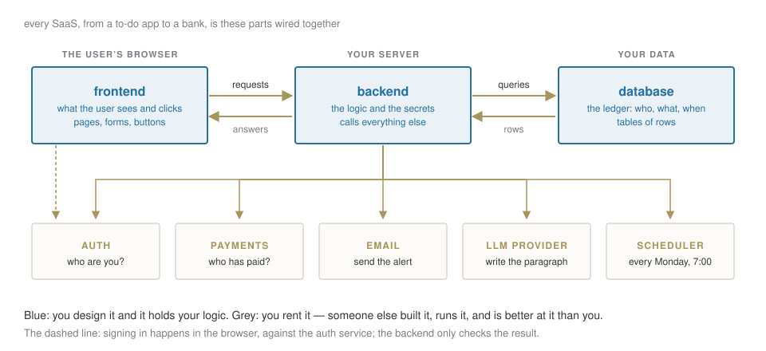
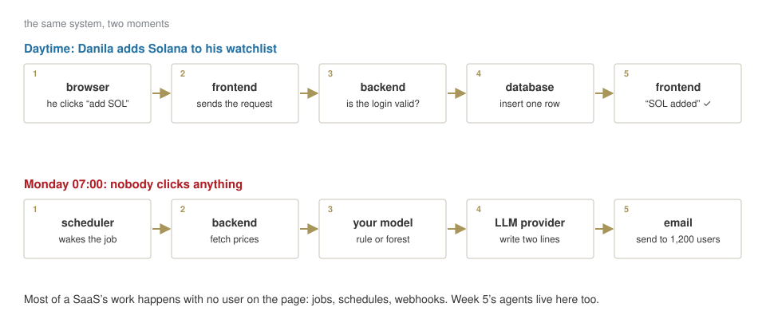
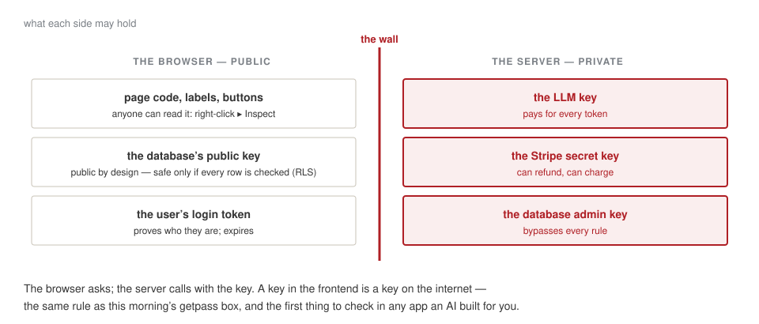
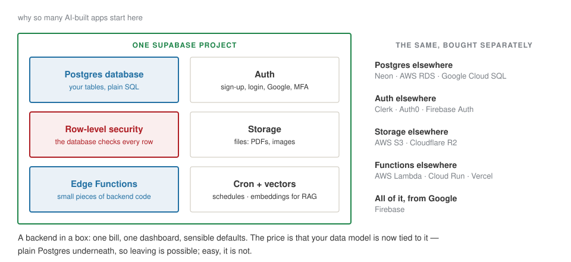
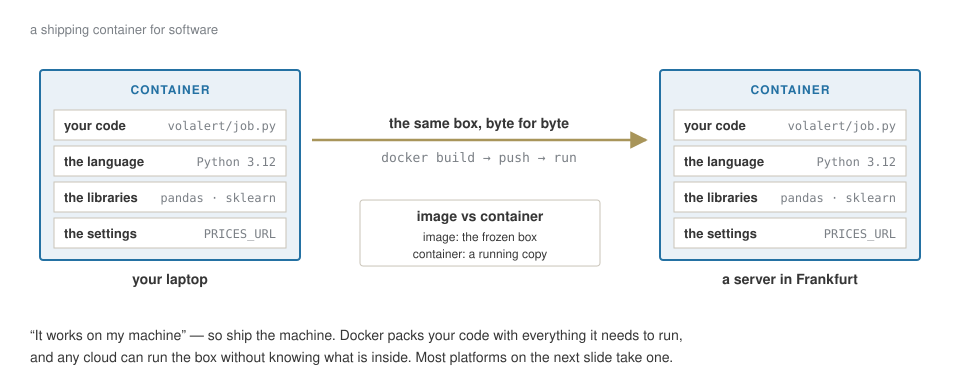
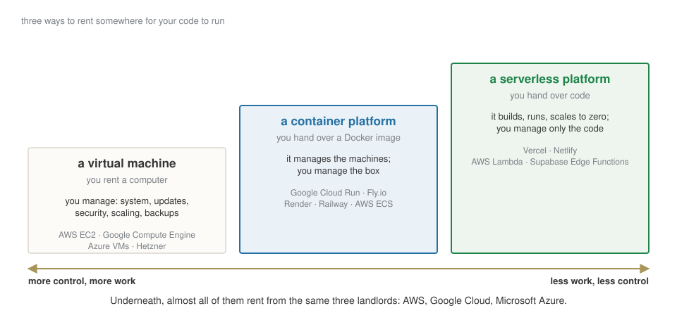
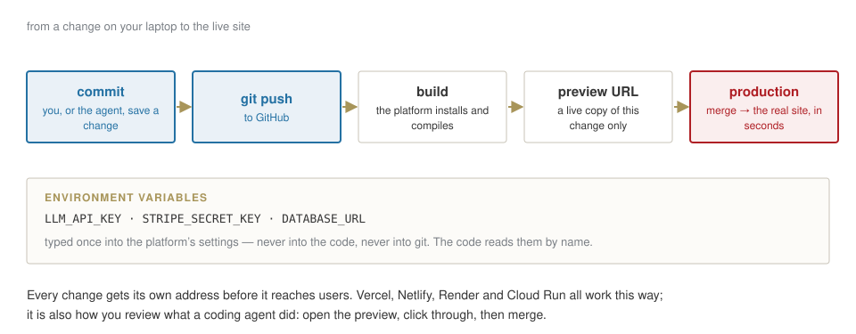
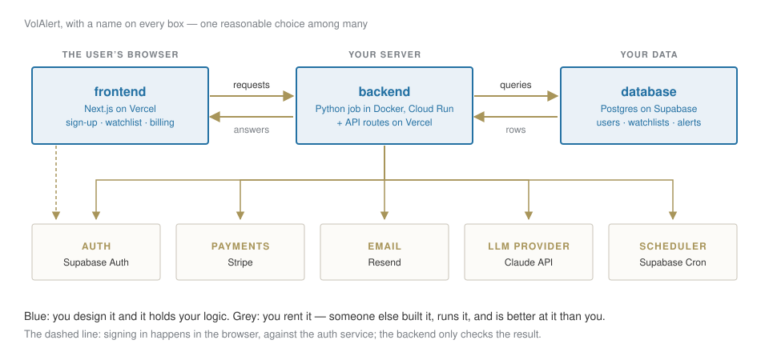
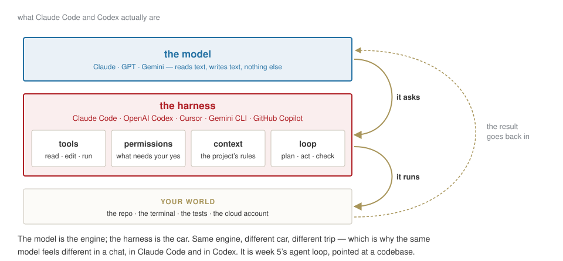
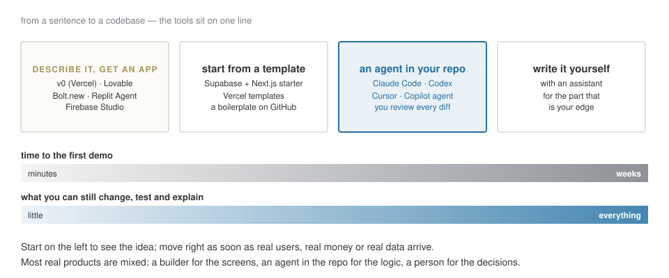

## Why this deck

This morning you built a model and judged it. A model is not a product.

Your capstone will be a small product, and in December you will have to say what it is made of, what it costs, and what could go wrong. Today: **the parts of any software-as-a-service, who builds each one, and which one you must never hand over**.

[You will not write most of it. An agent will write some, services will rent you the rest. Your job is to know what each part does — so that you can judge what you are given.]{.explain}

## One product, all the way through

### VolAlert — every Monday, an email: *is next week going to be rough for what you hold?*

:::: {.columns}
::: {.column width="50%"}
**What the user sees**

1. signs up with Google
2. picks the assets they follow
3. pays €9 a month after a free month
4. every Monday at 7:00, an email: *"SOL: high-volatility week likely (0.71). ETH: calm."* plus two lines of explanation
:::
::: {.column width="50%"}
**What we already have**

- the rule and the forest from this morning
- an LLM that can write two lines, from code

**What we do not have**

everything else. That is this deck.
:::
::::

## A SaaS is a few parts you write and many parts you rent. {.statement}

[The skill is not building every part. It is knowing which part is yours.]{.muted}

## The map

{fig-align="center" width="95%"}

## The same system, two moments

{fig-align="center" width="95%"}

## [Part 1]{.section-kicker} The parts you write {.section-slide background-color="#AF1F25"}

## Frontend — the shop window

:::: {.columns}
::: {.column width="55%"}
Everything the user **sees and clicks**: pages, forms, buttons, the chart of their watchlist.

It runs **in the user's browser**, on their machine — not on yours. You send it once; it runs there.

Today it is usually written in **React**, most often with **Next.js**. Builders like v0 and Lovable produce exactly this part.
:::
::: {.column width="45%"}
::: {.callout-important title="The one rule"}
Anything in the frontend is **public**. Anyone can right-click ▸ Inspect and read it — including any key you were careless enough to put there.
:::
:::
::::

## Backend — the back office

:::: {.columns}
::: {.column width="55%"}
The **logic** and the **secrets**. It runs on a server you control (or rent).

It decides who may do what, calls the database, calls the LLM, sends the emails, charges the card. In VolAlert, it is also where **this morning's model** runs every Monday.

Written in anything: **Python** (FastAPI) for us; JavaScript in the same Next.js project; small **functions** that run only when called.
:::
::: {.column width="45%"}
**A useful test.** For every feature, ask: *could a user cheat if this ran in their browser?*

"Is this person a paying customer?" — backend.

"Which colour is the button?" — frontend.
:::
::::

## Where the keys live

{fig-align="center" width="95%"}

## Database — the ledger

:::: {.columns}
::: {.column width="50%"}
Where everything that must be **remembered** lives: users, their watchlists, every alert sent, every payment.

Almost always **Postgres** today: tables of rows, queried with **SQL**.
:::
::: {.column width="50%"}
**Why not a spreadsheet?** Because a thousand users write to it at the same time; because a payment and its alert must be saved **together or not at all**; because the database can enforce rules a spreadsheet cannot.

**You design the tables.** That is a product decision, not a technical one: what you can ask later depends on what you store now.
:::
::::

## Row-level security: the rule the database checks itself

::: {.bigtable}
| `watchlists` | user_id | asset | added |
|---|---|---|---|
| | danila | SOL-USD | 7 Oct |
| | maria | BTC-USD | 2 Oct |
| | danila | ETH-USD | 1 Oct |
:::

Rule written once, in the database: **a user may read only the rows where `user_id` is theirs.** Now even if the frontend asks for everything, Danila gets two rows and never sees Maria's.

[In 2025 security researchers found many apps generated by AI builders with this rule switched off: every user's data, readable by anyone with the public key. The app looked finished. The first question to ask of any AI-built app: **is row-level security on, on every table?**]{.red}

## [Part 2]{.section-kicker} The parts you rent {.section-slide background-color="#AF1F25"}

## Auth — who are you, and what may you do

:::: {.columns}
::: {.column width="50%"}
Two different questions:

- **authentication** — *who are you?* Password, a magic link by email, "Sign in with Google", a second factor.
- **authorization** — *what may you do?* Read your own watchlist, not Maria's. Use the paid features only if you paid.
:::
::: {.column width="50%"}
**Never build the first one yourself.** Password storage, resets, Google sign-in, MFA, account takeover: it is a speciality, and the services are better at it than any team you will hire.

Supabase Auth · Clerk · Auth0 · Firebase Auth.

**The second one is yours.** Who may see what is your business rule — written in the backend and in row-level security.
:::
::::

## Supabase, opened

{fig-align="center" width="95%"}

## The rest of the rent list

| you need to… | rent it from | why not build it |
|---|---|---|
| take payments, monthly | **Stripe**; Paddle or Lemon Squeezy if you want them to handle EU VAT for you | cards, fraud, refunds, invoices, tax |
| send email | Resend · Postmark · Amazon SES | landing in the inbox, not in spam, is a craft |
| know what users do | PostHog · Google Analytics | — |
| know when it breaks | Sentry | you will not be watching at 3 a.m. |
| run things on a schedule | Supabase Cron · Vercel Cron · GitHub Actions | — |

[Each is a few lines of code in your backend and a key in your settings. Each is also a company that now holds some of your users' data — which is a GDPR question, not a technical one.]{.muted}

## The LLM provider

:::: {.columns}
::: {.column width="50%"}
**Directly** from who trains the model: Anthropic, OpenAI, Google. What you did this morning.

**Through your cloud**: Claude and others on AWS Bedrock, Google Vertex AI, Microsoft Azure. Same models, billed on the cloud account you already have, with its contracts and its **EU regions**.
:::
::: {.column width="50%"}
Three rules, whichever you pick:

1. called only from the **backend** — the key never leaves the server;
2. every call **logged**: tokens in, tokens out, cost — this morning's `USAGE`;
3. the cost per user per month written down **before** you set the price. If two lines of explanation cost more than the €9, the product does not exist. (Week 5.)
:::
::::

## [Part 3]{.section-kicker} Where it runs {.section-slide background-color="#AF1F25"}

## Docker — ship the machine

{fig-align="center" width="95%"}

## Three ways to rent a place to run

{fig-align="center" width="95%"}

## The landlords {.statement}

[AWS, Google Cloud, Microsoft Azure. Vercel, Supabase, Render and most of the names in this deck are, underneath, renting from them — and adding the part that makes it easy.]{.muted}

## Deploy — from a change to the live site

{fig-align="center" width="95%"}

## VolAlert, with a name on every box

{fig-align="center" width="86%"}

[Why a separate Python job for the model? Because the forest needs pandas and scikit-learn, and a Docker image on Cloud Run is the simplest place for them. Everything else stays in the Next.js project on Vercel and in Supabase.]{.explain}

## [Part 4]{.section-kicker} Who writes the code {.section-slide background-color="#AF1F25"}

## The code can now be written by a model. The decisions cannot. {.statement}

[Which raises two questions: what exactly is the thing writing it — and how much of the product should you let it write?]{.muted}

## Model, harness, your world

{fig-align="center" width="95%"}

## What the harness adds — and why it matters to you

| | what it is | why you care |
|---|---|---|
| **tools** | read files, edit them, run commands, search | it can test what it wrote — or delete what it should not |
| **permissions** | which actions need your yes | the difference between an assistant and an incident |
| **context** | a rules file in the repo: `CLAUDE.md`, `AGENTS.md` | your conventions, written once, read every time |
| **sandbox** | where it runs: your laptop, a container, the cloud | what it can reach if it goes wrong |
| **loop** | plan → act → check the result → again | it can work for an hour unattended — check what it did, not what it says it did |

[Claude Code and Codex are harnesses: the same idea, from Anthropic and OpenAI. Cursor and GitHub Copilot put one inside an editor. The model inside can often be swapped; the habits you build around it cannot.]{.explain}

## From a sentence to a codebase

{fig-align="center" width="95%"}

## What the builders do well, and where they stop

:::: {.columns}
::: {.column width="50%"}
**v0, Lovable, Bolt, Replit** — in minutes:

- the screens, good-looking, responsive;
- a Supabase project wired in, with auth;
- a live URL to show an investor or a user on Friday.

That is real value: an idea you can **click** beats a slide.
:::
::: {.column width="50%"}
**What is still yours, and they will not tell you is missing:**

- row-level security on every table;
- what happens when a payment fails halfway;
- the model inside: base rate, honest test, cost per user;
- logs, alerts, backups;
- GDPR, and the AI Act for the LLM part.

The demo is the first 80% of the look and the first 20% of the work.
:::
::::

## What stays yours

1. **The question** — what the product decides, and for whom. (This morning: direction or volatility.)
2. **The data** — what you store, where, for how long, and who may read which row.
3. **The test** — base rate, honest split, the rule to beat; for an LLM, the same dates and the same score.
4. **The money** — price per user against cost per user, written before launch.
5. **The checklist** — keys on the server, row-level security on, every change through a preview.

[Everything else can be generated, rented or delegated. These five are what makes it your product — and what the capstone is graded on.]{.red}

## Your turn {.paper background-color="#f7f5ef"}

[PAPER · ten minutes]{.kicker}

Take your capstone idea, or VolAlert if you have none yet.

1. Draw the map: frontend, backend, database, and the rented boxes you need.
2. On each box, write **one name** — a service you would use — and **who builds it**: you, an agent, a builder, a vendor.
3. Mark in red the one box where a mistake would cost the most. That is where your review goes.

## Three sentences to keep

**A SaaS is a few parts you write and many you rent; the secrets live on the server.**

**Docker ships the machine; platforms run it for you; the cloud landlords are underneath.**

**Builders and agents write the code; the question, the data, the test and the money stay yours.**
