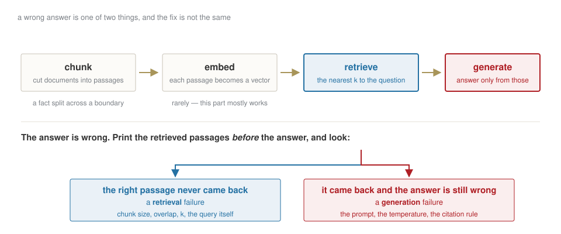
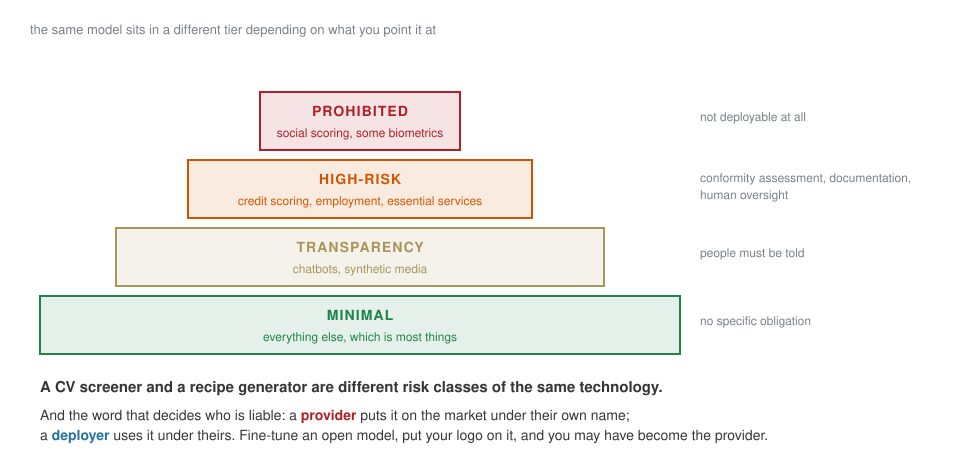

## Where we are

| | | |
|---|---|---|
| 1–3 | 23 Sep – 7 Oct | data, a model, and an honest evaluation ✓ |
| **4** | **14 Oct** | **call a model from code; make it cite your documents** |
| 5 | 21 Oct | agents, tools, evals · the product lens |
| — | 1 Nov | **case brief, 40%** — on what you build today and next week |

[From today you are building the thing you will be assessed on.]{.red}

## Last week, in one slide

:::: {.columns}
::: {.column width="50%"}
A **feature** is what you know at *t*; the **target** is what happens after. The **base rate** is the score to beat.

A shuffled split let the future leak into training. **Nothing to the right of the wall** may fit what is on the left.
:::
::: {.column width="50%"}
A probability is not a decision: the **threshold** comes from the cost of each kind of error.

Calibration: when the model says 70%, does it happen 70% of the time?
:::
::::

## [Block A]{.section-kicker} Four knobs, and they are the whole API {.section-slide background-color="#AF1F25"}

## What you control on every call

| | |
|---|---|
| **system prompt** | who the model is, and what it must never do |
| **the prompt** | what you are asking, this time |
| **temperature** | `0` when the answer must be reproducible |
| **schema** | the shape the answer must have, validated |

. . .

And three numbers come back with every response, whether you look or not:

**tokens in · tokens out · latency.** Log all three from the first call. In week 10 you will need them to say what this costs at volume, and by then nobody remembers.

## Structured output guarantees the type, not the truth {.statement}

## A valid JSON object can be entirely wrong.

[The schema stops your code crashing. It does nothing about whether the number in the field is real.]{.muted}

## First calls {.lab background-color="#2471a3"}

[LAB · session.ipynb § A]{.kicker}

1. The same prompt at `T = 0` three times, then at `T = 1` three times. Look at what changed.
2. Ask for free text. Then ask for a JSON schema. Compare how much code you need after each.
3. Print tokens and latency for every call, and keep printing them all term.

## [Block B]{.section-kicker} Making it answer from documents it has never seen {.section-slide background-color="#AF1F25"}

## The problem, stated plainly

The model has never read your contract, your filing, or last month's board pack. It was trained before they existed, and it cannot open a file.

::: {.callout-important title="Bet before we build"}
Two ways to fix this: paste the whole document into the prompt, or retrieve just the relevant part. When does the first one stop working?
:::

. . .

At about the point where it becomes expensive, slow, and worse — models attend badly to the middle of very long inputs. **Retrieval is the alternative**, and it is four steps.

## Four steps, and each one can fail differently

{fig-align="center" width="95%"}

## Why the nearest passage is the right one {.clip background-color="#000000"}

<video class="clipvideo" width="1000" height="562" controls muted loop playsinline data-autoplay preload="auto" poster="media/w04_retrieval_poster.png"><source src="media/w04_retrieval.mp4" type="video/mp4"></video>

Not one word in common, and still the three nearest. That is what an embedding buys you.

## Build it, with two bugs planted {.lab background-color="#2471a3"}

[LAB · session.ipynb § B]{.kicker}

Corpus: risk sections from three filings, two whitepapers, a MiCA summary.

1. Chunk it. **Bug one is in the chunking** — a fact gets cut in half.
2. Embed and retrieve. Print the passages that came back, every time, before the answer.
3. Generate with citations. **Bug two is in the prompt** — the model is allowed to use what it already knows.

## Ten questions you already know the answer to {.lab background-color="#2471a3"}

[LAB · session.ipynb § B6]{.kicker}

Write ten questions with answers **you computed independently** of the system.

Run them. Record hits and misses. For each miss, write `retrieval` or `generation` next to it.

[That table is your evidence section in the case brief. Build it now, not the night before.]{.red}

## [Block C]{.section-kicker} The EU AI Act, in thirty minutes {.section-slide background-color="#AF1F25"}

## It regulates the use, not the technology

{fig-align="center" width="95%"}

## Close

**Homework 4** — extend the retrieval system with a corpus of your own, write ten test questions with expected answers, record hits and misses, and explain each miss as retrieval or generation.

Due Tuesday 20 October, 23:59.

. . .

[Next week the model stops answering and starts **acting** — and everything that can go wrong, does.]{.muted}
