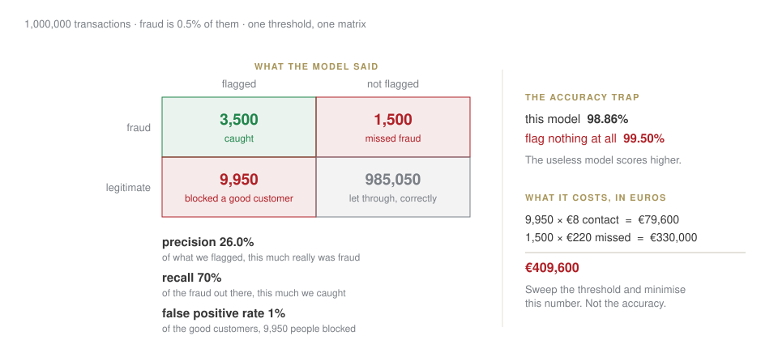

## Today

| | |
|---|---|
| 10:00–10:45 | **you present the case brief**, then written feedback |
| 10:45–12:00 | where AI earns money in fintech — fraud, credit, and what a regulator wants |
| 12:10–12:50 | **capstone scoping**: three candidates, one chosen, data checked |

[By 13:00 you will have a capstone topic whose data you have already loaded. Not a topic you like the sound of.]{.red}

## Last week, in one slide

:::: {.columns}
::: {.column width="50%"}
An **agent** is a model calling tools in a loop. It fails three ways: it retries for ever, it obeys a document, nobody counts the cost.

The defence is in your code, never in the prompt: the model is never the last check on its own output.
:::
::: {.column width="50%"}
An **evaluation** is a fixed set of questions run on every change; an LLM judge is biased, and still useful.

Cost per query is arithmetic; value per query is judgement. The case brief is due Sunday.
:::
::::

## [Block B]{.section-kicker} Fraud: where accuracy stops meaning anything {.section-slide background-color="#AF1F25"}

## 99.5% accurate, and completely useless

Fraud is about **0.5%** of transactions.

::: {.callout-important title="Bet before we compute"}
A model that flags nothing at all. What is its accuracy?
:::

. . .

**99.5%.** It has learned the base rate and nothing else. Accuracy on rare events measures how rare the event is.

## Three numbers that do mean something

{fig-align="center" width="95%"}

[They trade off. Catch more fraud and you block more good customers. **There is no setting that is good at everything**, and pretending otherwise is how these projects fail.]{.red}

## So the threshold is a business decision

$$\text{cost} = (\text{blocked good} \times \text{cost of contact}) + (\text{missed fraud} \times \text{amount})$$

Put your numbers in. Sweep the threshold. **The minimum is your answer**, and it moves when the business changes.

::: {.callout-tip title="The sentence to remember"}
Nobody in the room can tell you the right threshold. The cost table can, and building that table is the actual work.
:::

## Price it {.lab background-color="#2471a3"}

[LAB · session.ipynb § B1]{.kicker}

1. Fit on imbalanced data with a **stratified** split. Say why unstratified would be worse here.
2. Sweep the threshold, build the cost table at production volume.
3. Read off the threshold. Then say how wrong the costs could be before it moves.

## [Block C]{.section-kicker} Credit: you must be able to say why {.section-slide background-color="#AF1F25"}

## A rejection needs a reason, by law

**GDPR Article 22**: no solely automated decision with legal or similarly significant effect, without safeguards — including meaningful human review.

**Adverse action**: the applicant is entitled to know what drove it.

. . .

So "the model said 0.31" is not a deployable answer. You need the **largest contributions** to that particular decision, in words a person can act on.

## And removing the protected field does not work {.statement}

## Postcode carries income. Income carries almost everything.

[A feature you are allowed to use can reconstruct the one you are not. Dropping the column is not a control; measuring the outcome is.]{.muted}

## Two definitions of fair, and you cannot have both

:::: {.columns}
::: {.column width="50%"}
**Equal approval rates**
The same share approved in each group.
:::
::: {.column width="50%"}
**Equal calibration**
A score of 0.7 means the same thing in each group.
:::
::::

. . .

When the base rates genuinely differ, **these are mathematically incompatible**. Not a bug, not a modelling failure — a theorem.

[Which means someone has to choose, and write down why. That someone is a person, not a model.]{.red}

## [Block D]{.section-kicker} Your capstone {.section-slide background-color="#AF1F25"}

## Three candidates, and only one test that matters

Bring three. For each, answer four questions:

| | |
|---|---|
| **data** | can you load it **today**, in this room? |
| **method** | is it something we cover by week 9? |
| **scope** | does it fit four weekends? |
| **value** | is it still interesting if the answer is *no*? |

. . .

[The last one is the filter people skip. If "the model does not work" makes your project worthless, the project was a bet, not a question.]{.red}

## Load the data before you choose {.lab background-color="#2471a3"}

[LAB · session.ipynb § C]{.kicker}

For your leading candidate, right now:

1. load it — shape, date range, missing values
2. save a dated snapshot
3. if the loader prints `[SYNTHETIC]`, **the check has failed** and this is not yet a proposal

[A topic whose data you have not loaded is a wish. You have four weekends; spending one discovering the data does not exist is a weekend you needed.]{.red}

## Close

**Homework 6** — a one-page capstone proposal: question, data sources, method, deliverable, risks, and a week-by-week plan to the portfolio.

Due Tuesday 10 November, 23:59. **Signed off at the start of next session** — bring it ready to defend.
