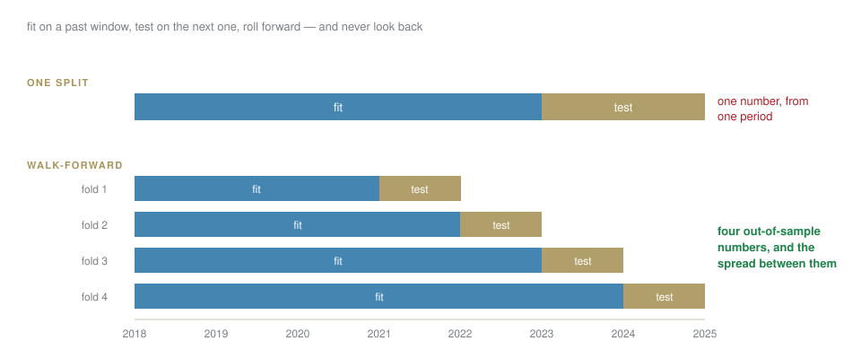

## Today

A backtest is the easiest thing in this course to build and the easiest to get wrong. You will build one in six steps, then break it four ways.

::: {.callout-important title="Bet before we start"}
You will see a strategy with a Sharpe ratio of 5. What is the single most likely explanation?
:::

. . .

**A bug.** Hold that thought for forty minutes.

## The pipeline, and the one line that matters

| | |
|---|---|
| 1 | **signal** — computed from data known at the close of day `t` |
| 2 | **position** — held from day `t+1`  ⟵ `signal.shift(1)` |
| 3 | **returns** — position × the return it actually earned |
| 4 | **costs** — subtracted on every change of position |
| 5 | **equity** — the cumulative product |
| 6 | **statistics** — Sharpe, drawdown, turnover |

[Step 2 is the whole session. Everything else is arithmetic.]{.red}

## Build it {.lab background-color="#2471a3"}

[LAB · session.ipynb § B]{.kicker}

Momentum, vectorised, with costs. Six lines of pandas and a chart.

Then read the Sharpe ratio out loud, and be suspicious of it.

## [Block C]{.section-kicker} Four ways a backtest lies {.section-slide background-color="#AF1F25"}

## One: the position earns the return that produced it {.clip background-color="#000000"}

<video class="clipvideo" width="1000" height="562" controls muted loop playsinline data-autoplay preload="auto" poster="media/w07_lookahead_poster.png"><source src="media/w07_lookahead.mp4" type="video/mp4"></video>

The same data, one missing `shift(1)`.

## Two: survivorship

You take today's index members and run them back ten years.

. . .

**Everything that failed is missing.** The firms that went bankrupt were never in your universe, so your strategy never held them. The result is a portfolio of survivors, which was not available to anyone at the time.

[The test: does your universe come from a list that was true **on each date**, or from a list that is true today?]{.red}

## Three: you tried a hundred things

Test enough parameters and one of them looks brilliant by chance.

$$\text{expected best Sharpe from } N \text{ tries} \;\approx\; \frac{\sqrt{2\ln N}}{\sqrt{\text{years}}}$$

. . .

Twenty tries over five years: about **1.1**, from pure noise. So a Sharpe of 1.2 after twenty attempts is **not evidence of anything**.

[Count your attempts, and report the number next to the result.]{.red}

## The only honest home for a parameter search

{fig-align="center" width="95%"}

## Four: one regime wearing a full-sample average

2017 and 2022 were different worlds. An average over both describes neither.

[Split the equity curve by period and show each. If the whole result came from one eighteen-month stretch, **say so** — that is the finding, not a footnote.]{.red}

## Break yours {.lab background-color="#2471a3"}

[LAB · session.ipynb § C]{.kicker}

1. Remove the `shift(1)`. Record the Sharpe.
2. Put it back. Record it again.
3. Run twenty parameter combinations and plot the distribution of results.
4. Split by year.

**Keep all four numbers.** The pitfall checklist in your homework is this, filled in.

## [Block D]{.section-kicker} A signal from language {.section-slide background-color="#AF1F25"}

## The temptation, and the trap inside it

You have a language model. Score the news, trade the sentiment.

::: {.callout-important title="Bet before we build"}
What is the look-ahead risk that is unique to news, and does not exist for prices?
:::

. . .

**Timestamps.** A headline about Monday's crash was published Monday evening, or revised Tuesday, or carries the date of the event rather than the date of publication.

[Date every feature by **when it was readable**, never by what it is about. In news data this is the default mistake, not an edge case.]{.red}

## Test it the same way as everything else {.lab background-color="#2471a3"}

[LAB · session.ipynb § D]{.kicker}

Add one LLM-derived feature to the backtest.

1. Against the baseline **without** it.
2. With the timestamp done properly.
3. Then with the timestamp done naively — and watch what that alone is worth.

## Model risk, in twenty minutes

The firm's answer to "what if the model is wrong?"

| | |
|---|---|
| **inventory** | every model, with a named owner |
| **validation** | someone who did not build it, checking it |
| **monitoring** | inputs and outputs watched for drift |
| **kill-switch** | who stops it, how fast, and **whether that has been tested** |

[The last clause is the one that is usually missing. An untested kill-switch is a diagram.]{.red}

## Close

**Homework 7** — one strategy, backtested with costs and walk-forward validation, a completed pitfall checklist, and one LLM-derived feature tested against the baseline.

Due Tuesday 17 November, 23:59. **No live trading. Educational simulation only.**
