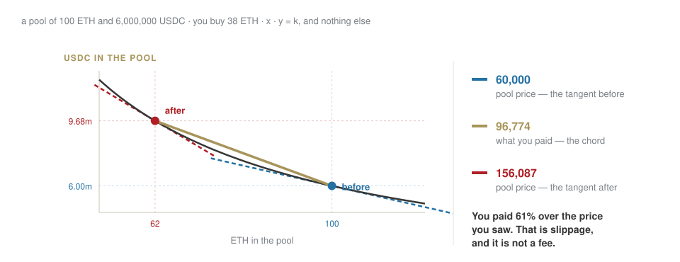
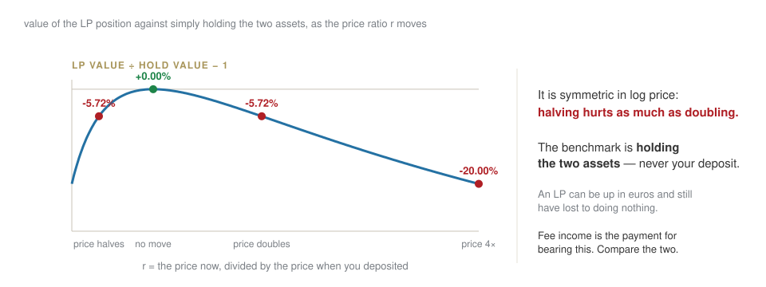

## Today, from the ledger up

| | |
|---|---|
| 10:20–11:00 | wallet, transaction, block, fee, smart contract — what each **actually is** |
| 11:00–11:50 | `x · y = k`, and everything that follows from it |
| 12:00–12:30 | real protocol data, and an LLM summary you check |
| 12:30–13:00 | protocol risk, then MiCA |

[No enthusiasm and no dismissal today. It is a database with unusual properties, and the properties have consequences you can compute.]{.red}

## Five words, defined once

| | |
|---|---|
| **ledger** | a shared table everyone holds a copy of |
| **wallet** | the key that may edit certain rows |
| **transaction** | a signed edit |
| **block** | a batch of edits, chained to the last by a hash |
| **fee** | what you pay to have your edit included |

. . .

A **smart contract** is a row that owns money and runs code when called.

[Which means the code is the counterparty. There is nobody to ring.]{.red}

## And one distinction the press keeps losing {.statement}

## A stablecoin is a claim. A governance token is not.

[One is a promise that someone holds a euro for you. The other is a vote. Under MiCA they are not even the same category.]{.muted}

## [Block B]{.section-kicker} A market with no order book {.section-slide background-color="#AF1F25"}

## There is no buyer on the other side

A pool holds 100 ETH and 6,000,000 USDC. You want to buy ETH. **Nobody is selling** — there is no counterparty, no bid, no ask.

::: {.callout-important title="Bet before we look"}
What determines the price you pay?
:::

. . .

One rule, and only one:

$$x \cdot y = k$$

Take ETH out, the pool has less; put USDC in, it has more. **The product must not change**, and that alone fixes the price.

## Watch a trade slide along it {.clip background-color="#000000"}

<video class="clipvideo" width="1000" height="562" controls muted loop playsinline data-autoplay preload="auto" poster="media/w08_amm_poster.png"><source src="media/w08_amm.mp4" type="video/mp4"></video>

You moved the price by trading. That gap is slippage, and it is not a fee.

## Three prices, and people confuse them daily

{fig-align="center" width="95%"}

## Simulate it {.lab background-color="#2471a3"}

[LAB · session.ipynb § B]{.kicker}

1. Write the pool in five lines. Buy 1 ETH, then 10, then 30. Plot execution price against size.
2. Now be the liquidity provider: deposit, let the price move, withdraw.
3. Compare what you have against simply **holding** the two assets.

## Impermanent loss, and why the benchmark matters

{fig-align="center" width="95%"}

[Fee yield ≈ fee × (daily volume ÷ TVL) × 365. Compare the two, or you are not analysing anything.]{.red}

## [Block C]{.section-kicker} The numbers a protocol reports {.section-slide background-color="#AF1F25"}

## Four words, and one of them is misleading

| | |
|---|---|
| **TVL** | capital parked. Not revenue, not profit, and double-counted across layers |
| **fees** | what users paid |
| **revenue** | what the protocol kept |
| **take rate** | revenue ÷ fees — the one that behaves like a business metric |

::: {.callout-tip title="The habit"}
TVL is the headline and the weakest of the four. The same collateral can be counted in three protocols at once. Ask what would happen to it if the token price halved.
:::

## Pull it, then check the summary {.lab background-color="#2471a3"}

[LAB · session.ipynb § C]{.kicker}

1. Pull TVL, fees and revenue from DefiLlama. Compute the take rate yourself.
2. Ask the model to summarise the protocol's governance forum.
3. **Then check three claims from that summary against the source.** Record which held.

[Step 3 is the exercise. Steps 1 and 2 are the setup for it.]{.red}

## Five risks, and the order is deliberate

| | |
|---|---|
| **smart contract** | the code is the counterparty; audits reduce, never remove |
| **oracle** | the price feed the contract trusts. Wrong for ten minutes is enough |
| **governance** | who can change the parameters, how fast, with what quorum |
| **depeg** | the backing trades below the token: a collateral problem becomes a liquidity problem |
| **concentration** | a top-three share that turns a withdrawal into an event |

## MiCA, in thirty minutes

| | |
|---|---|
| **ART** | asset-referenced token — references a basket |
| **EMT** | e-money token — references one currency; what most "stablecoins" are |
| **other** | everything else, with lighter obligations |
| **CASP** | providing services around them needs authorisation |

. . .

[The question MiCA asks is not "is this crypto?" but **"what is the holder owed, and by whom?"** Answer that and the category follows.]{.red}

## Close

**Homework 8** — one protocol through three lenses: business model, data, risk. With at least one quantitative element: an LP simulation, a TVL and fee analysis, or a token-flow analysis.

Due Tuesday 24 November, 23:59.
