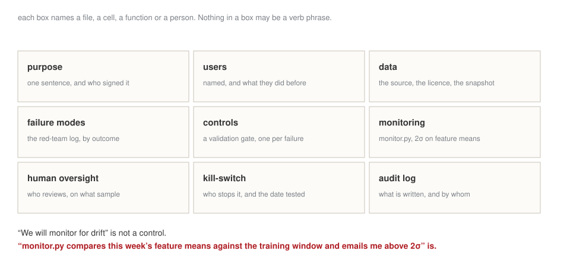

## Today is about your capstone, not about ethics in general

| | |
|---|---|
| 10:20–11:10 | what your model relies on, and how it treats people |
| 11:20–12:20 | **red-team your own pipeline**, as code, with the results written down |
| 12:20–12:50 | the risk and controls canvas — nine boxes, all of them specific |

[Everything today produces an artefact that goes into the portfolio. Nothing today is a discussion.]{.red}

## [Block A]{.section-kicker} What is it relying on? {.section-slide background-color="#AF1F25"}

## Two different questions, often confused

:::: {.columns}
::: {.column width="50%"}
**Global**
What does the model rely on, across a period?

*For the model card, and for the validator.*
:::
::: {.column width="50%"}
**Local**
Why did it say **that**, on **that** day?

*For the person affected, and for the regulator.*
:::
::::

. . .

A SHAP value is a feature's share of the distance between **one** prediction and the average prediction — **on the rows you chose to explain**.

[Change the rows and the explanation changes. Compute it on the period you are reporting, not on whatever was in memory.]{.red}

## The trap in writing it up

The explainer's base value is in **log-odds**, not probability.

"The model started at 0.4 and this feature added 0.3" is wrong if 0.4 was a log-odd. **Convert before you write the sentence**, or the sentence is false in a document with your name on it.

## [Block B]{.section-kicker} How does it treat people? {.section-slide background-color="#AF1F25"}

## Measure three things, by group

| | |
|---|---|
| **approval rate** | who gets through |
| **error rates, by type** | who gets the false rejections, who gets the false approvals |
| **calibration** | does a score of 0.7 mean the same thing in each group? |

. . .

Then the result that is not negotiable: **when base rates differ, equal approval rates, equal error rates and equal calibration cannot all hold.**

[It is a theorem, not a modelling failure. Someone chooses which to satisfy, writes down why, and owns it.]{.red}

## And every mitigation is paid for by somebody {.statement}

## Name who pays, in the same sentence as the fix.

[Raise approvals for one group and either more bad loans are written, or the bar rises for someone else. A mitigation with no cost attached has not been thought through.]{.muted}

## [Block C]{.section-kicker} Red-team {.section-slide background-color="#AF1F25"}

## A list of things that should break it, run as code

Not a conversation. A file, with outcomes recorded.

| | |
|---|---|
| **adversarial input** | empty, enormous, wrong type, wrong encoding, hostile text |
| **corrupted data** | a column of nulls, a shifted date, a wrong unit |
| **leakage audit** | perturb row `t+k`, see whether the feature at `t` changes |
| **prompt injection** | a document that instructs your pipeline |

## Three outcomes, and only one is acceptable

:::: {.columns}
::: {.column width="33%"}
**Crash**
Bad, but honest — you find out.
:::
::: {.column width="33%"}
**Silent**
Worst. A wrong number, delivered confidently.
:::
::: {.column width="33%"}
**Refused**
A deliberate refusal, with a message saying why. **This one.**
:::
::::

::: {.callout-tip title="The leakage audit in one line"}
Perturb the data at `t+k` and recompute the feature at `t`. If it changed, there is a leak — and **no split will ever find it**, because the leak is inside the feature.
:::

## Attack yours {.lab background-color="#2471a3"}

[LAB · session.ipynb § C]{.kicker}

Run the harness against **your own capstone pipeline**.

1. Record every outcome: crash, silent, refused.
2. Fix the silent ones first. They are the dangerous class.
3. Add a validation gate for each — one line, one message.
4. Re-run and record again.

[That before-and-after log is a required part of the portfolio. Write it as you go; it cannot be reconstructed afterwards.]{.red}

## [Block D]{.section-kicker} The canvas {.section-slide background-color="#AF1F25"}

## Nine boxes, every one a specific noun

{fig-align="center" width="95%"}

## Three questions to finish

- **Kill-switch**: who stops it, how fast, and **has that been tested?**
- **Override**: who can change an output, and where is that written down?
- **Audit log**: when either happens, what is recorded, and by whom?

[An untested kill-switch is a diagram. Test it once, today, and note the date.]{.red}

## Close

**Homework 9** — the near-final capstone prototype, a completed risk and controls canvas, and the red-team log: what you attacked, what happened, what you fixed.

Due Tuesday 1 December, 23:59.

[Next week we turn the prototype into a decision with numbers, and you rehearse.]{.muted}
