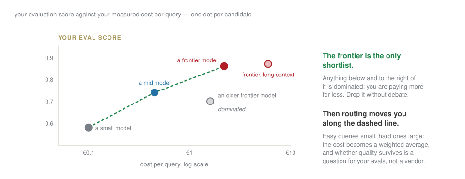
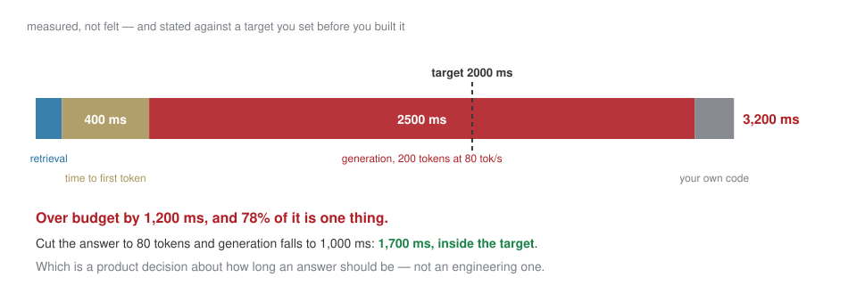

## The last session

| | |
|---|---|
| 10:20–11:10 | prototype → production, as three decisions with numbers |
| 11:20–11:40 | readiness, roles, roadmap |
| 11:40–12:40 | **studio** — your repo on the screen, then rehearsal |
| 12:40–13:00 | the portfolio, and three lines you write for yourself |

[Ten weeks ago you had not called an API. Today you cost one at volume and defend the number.]{.red}

## Last week, in one slide

:::: {.columns}
::: {.column width="50%"}
An explanation describes the **model**, not the world; compute it on the period you report.

Measure errors **by group**; every mitigation is paid for by somebody — name who.
:::
::: {.column width="50%"}
**Red-team** your own pipeline: a list of things that should break it, run as code, with a before-and-after log.

The risk and controls canvas: nine boxes, every one a specific noun.
:::
::::

## [Block B]{.section-kicker} Three decisions, each with a number {.section-slide background-color="#AF1F25"}

## One: what does a query cost?

$$\text{cost} = \frac{\text{tokens}_{\text{in}} \times p_{\text{in}} + \text{tokens}_{\text{out}} \times p_{\text{out}}}{1{,}000{,}000}$$

::: {.callout-important title="Bet before we compute"}
In a document pipeline — retrieval, long context, a short answer — which of the two terms dominates?
:::

. . .

**Input, and not by a little.** You send thousands of tokens of retrieved passages to get back two hundred. Everyone optimises the answer length; the bill is on the question.

## Two things that change the arithmetic

:::: {.columns}
::: {.column width="50%"}
**Cached input**
The reusable prefix — system prompt plus fixed context — billed at a discount when the provider serves it from cache.

*Restructure the prompt so the fixed part comes first.*
:::
::: {.column width="50%"}
**Routing**
Easy queries to a small model, hard ones to a frontier model.

*Cost becomes a weighted average. Whether quality survives is a question for your evals, not for a vendor.*
:::
::::

## And which model — also a chart

{fig-align="center" width="95%"}

## Two: is it worth it?

$$\text{break-even value per query} = \text{cost per query}$$

Below that line the system **loses money on every call**, and volume makes it worse rather than better.

. . .

[Cost per query is arithmetic and you will get it right. Value per query is judgement, it is the number nobody can hand you, and it is the one the Board will ask about first.]{.red}

## Three: is it fast enough?

{fig-align="center" width="95%"}

## Price your own {.lab background-color="#2471a3"}

[LAB · session.ipynb § B]{.kicker}

1. Measure real tokens in and out from **your** logs — not an estimate.
2. Cost one query, then a thousand a day, then ten thousand.
3. Build the **sensitivity table**: across volume, across tiers, with and without caching.
4. **Plot the chart**: your eval score against your measured cost, one dot per model you tried. Drop everything that is dominated.
5. State your break-even value per query, and say whether you believe it.

::: {.callout-tip title="The honest form of an estimate"}
One number is a guess with a decimal point. A sensitivity table is an estimate, because it shows what would have to be true for it to be wrong.
:::

## [Block C]{.section-kicker} Readiness, and gates that can fail {.section-slide background-color="#AF1F25"}

## Score four things, nought to two

| | |
|---|---|
| **data** | does it exist, is it clean, are you allowed to use it |
| **technology** | can it be deployed and monitored where you work |
| **people** | is there an owner after you leave the room |
| **governance** | is there a policy this fits inside |

. . .

**A zero with a high weight is not a low score. It is a gate.** Say so, and say what would clear it.

## And a roadmap whose steps can fail {.statement}

## Every stage needs a KPI that decides, and a way back.

[A roadmap where every arrow points forward is a wish. "Pilot with ten users; proceed if the eval score holds above 0.8 and the cost stays under X; otherwise roll back to the manual process" is a plan.]{.muted}

## [Block D]{.section-kicker} Studio {.section-slide background-color="#AF1F25"}

## Your repository, on the screen, read by me {.lab background-color="#2471a3"}

[60 minutes — the review you would get from a colleague]{.kicker}

The standard is one sentence: **a stranger with your repo and no API key gets the same numbers.**

1. `Runtime ▸ Restart and run all`, from clean. It either works or we fix it now.
2. Is every reported number backed by a committed snapshot?
3. Does the README say what this is, in a paragraph a non-technical reader finishes?
4. Then rehearse the presentation, out loud, with the clock running.

## The portfolio — 60%

Due **Sunday 6 December, 23:59**. Presented **Wednesday 9 December, 10:00**.

| | |
|---|---|
| decision memo | 2,000 words |
| the prototype | working, reproducible, in the repo |
| evidence | evaluations, and the red-team log |
| risk | the canvas, completed |
| roadmap | with gates, KPIs and a rollback |

[The last commit before the deadline is the one that is marked. Commit early and often; the history is part of the work, and I read it.]{.red}

## What you can do now that you could not in September

- read a data source, and say what is wrong with it
- fit a model and say honestly whether it is worth running
- build a system that answers from your documents, and prove it with a table
- write a loop that uses tools, and stop it before it costs you money
- attack your own work and write down what broke
- cost it at volume, and say what it is worth

. . .

[None of that was on a slide. You built all of it, and every line of it you can explain.]{.red}

## Three lines, for yourself {.statement}

## What I can do. What I would not trust. What I do next.

[Write them now, before you leave the room. In six months they will be the most useful page in the repository.]{.muted}
