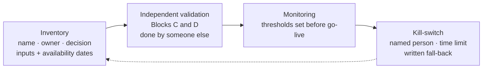

<!-- card 1 -->
# One day in a backtest

```
   close t-1          close t                close t+1
      |                  |                       |
      |   return r_t     |     return r_{t+1}    |
      |----------------->|---------------------->|
                         ^                       ^
                  signal computed          this is what
                  from prices ≤ t          the signal earns

   position[t+1] = signal[t]        →   pos = signal.shift(1)
   net[t+1]      = pos[t+1] · r[t+1]  −  |pos[t+1] − pos[t]| · cost
```

**A signal that needs the close of day *t* can only earn the return of day *t+1*.**

---

<!-- card 2 -->
# The two bugs the assistant writes

| as written | what it does | fix |
|---|---|---|
| `pos = sig` | today's position knows today's close | `pos = sig.shift(1)` |
| `cost * pos.abs()` | pays the fee every day a position is held | `cost * pos.diff().abs()` |

Look-ahead pushes the Sharpe **up**; cost-on-holding pushes it **down**.

**Two bugs that partly cancel are worse than one: nobody looks.**

---

<!-- card 3 -->
# Survivorship: whose list?

```
   2018 universe:  T00 T01 T02 T03 T04 T05 T06 T07 T08 T09 T10 T11
                    †   †   †   †
                  2019 2020 2022 2022        (LUNA · FTT · ...)

   "top coins today":         T04 ... T11   ← applied back to 2018
   point-in-time on each day:  everyone alive that day
```

**The result is a property of the date the list was written, not of the assets.**

---

<!-- card 4 -->
# Multiple testing (Harvey, Liu & Zhu 2016)

$$
\mathbb{E}\big[\max_{N}\ \widehat{SR}\big] \;\approx\; \frac{\sqrt{2\ln N}}{\sqrt{T_{\text{years}}}}
\qquad\text{when every true Sharpe is } 0
$$

$N = 200$ rules, $T = 3$ years → expected best Sharpe ≈ **1.9** from pure noise.

**Every parameter you tried counts, including the ones the assistant tried for you — report N, or use a walk-forward.**

---

<!-- card 5 -->
# One average, several markets

```
   2018   2019   2020   2021   2022   2023   2024   2025
   bear   chop   covid   bull   bear   recov. bull   ?
    ▼      ~      ▼▲     ▲      ▼      ▲      ▲

   full-sample Sharpe  =  weighted average of these
   trend rule:   loves 2021 · 2023–24     hates 2022 · chop
```

**A rule whose edge sits in one regime is a bet that the regime returns — say so.**

---

<!-- card 6 -->
# Point-in-time for text

```
   Monday          Tuesday 07:00            Tuesday close
   BTC −6%         "Bitcoin slumps 6% ..."   position for Wednesday
   event_date      published                 feature date ≥ published
        ✗ join here                ✓ join here, then shift(1)
```

| question | show |
|---|---|
| point-in-time | timestamp when the text was readable |
| beyond the price | AUC of price + text vs price alone |
| after costs | net Sharpe at a stated cost |

**Join on availability, never on the event.**

---

<!-- card 7 -->
# Model risk in four artefacts



**Model risk is Blocks C and D, owned by somebody other than the builder, on a schedule.**
